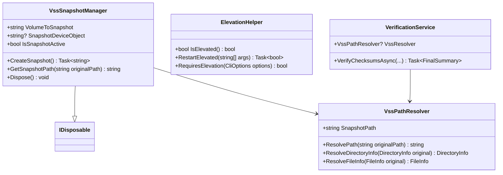
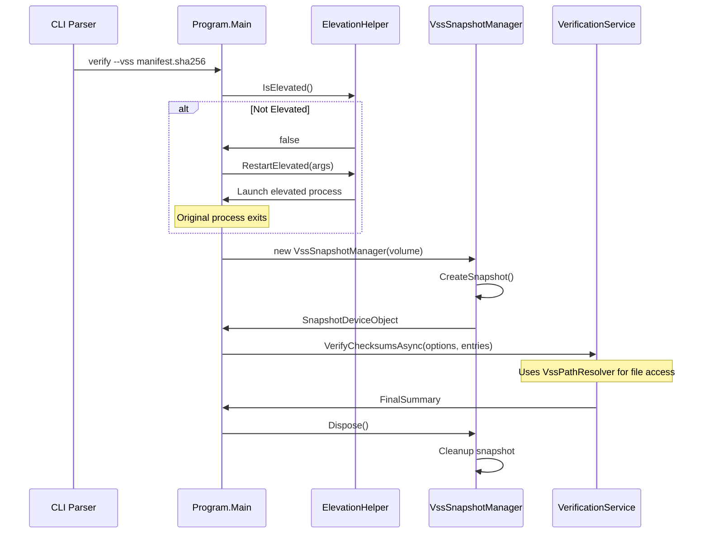

# VSS Snapshot Mode Design

## Overview

This design document outlines the implementation of VSS (Volume Shadow Copy Service) snapshot mode for the Verity file integrity verification tool. This feature will enable Verity to create volume shadow copies of filesystems to perform verification and manifest creation operations on files that are currently in use or locked by other processes.

### Background

Currently, Verity cannot access files that are locked by running applications, databases, or system processes. This limitation prevents complete integrity verification in production environments where critical files may be continuously in use. VSS snapshot mode addresses this by creating point-in-time snapshots of volumes, allowing read access to all files regardless of their lock status.

### Key Requirements

- Add `--vss` command-line option to enable VSS snapshot mode
- Integrate AlphaVSS library for VSS operations
- Implement automatic elevation prompt when VSS mode is requested
- Ensure proper cleanup of VSS snapshots through IDisposable pattern
- Maintain compatibility with existing functionality
- Support all existing commands (verify, create, add) with VSS mode

## Architecture

### VSS Integration Layer



### Command Flow with VSS



## Data Models

### Extended CLI Options

```csharp
public record struct CliOptions(
    FileInfo ChecksumFile,
    DirectoryInfo? RootDirectory,
    string Algorithm,
    FileInfo? TsvReportFile = null,
    bool ShowTable = false,
    string[]? IncludeGlobs = null,
    string[]? ExcludeGlobs = null,
    bool UseVss = false  // New field
);
```

### VSS Configuration

```csharp
public record VssConfiguration(
    string VolumeToSnapshot,
    TimeSpan SnapshotTimeout = default,
    bool AutoCleanup = true
);

public enum VssError
{
    NotElevated,
    VolumeNotFound,
    SnapshotCreationFailed,
    SnapshotCleanupFailed,
    AccessDenied
}
```

## Component Design

### VssSnapshotManager

**Purpose**: Manages VSS snapshot creation, lifecycle, and cleanup using AlphaVSS library.

**Key Responsibilities**:
- Create volume shadow copies using AlphaVSS
- Provide snapshot device object paths
- Implement IDisposable for automatic cleanup
- Handle VSS-specific error conditions

**Implementation Details**:
```csharp
public class VssSnapshotManager : IDisposable
{
    private IVssImplementation? _vssImplementation;
    private IVssBackupComponents? _backupComponents;
    private Guid _snapshotSetId;
    private Guid _snapshotId;
    private bool _disposed;

    public string VolumeToSnapshot { get; }
    public string? SnapshotDeviceObject { get; private set; }
    public bool IsSnapshotActive => SnapshotDeviceObject != null;

    // Creates VSS snapshot and returns snapshot device path
    public async Task<string> CreateSnapshotAsync();
    
    // Cleanup snapshot resources
    public void Dispose();
}
```

### VssPathResolver

**Purpose**: Translates original file paths to snapshot paths for VSS-enabled operations.

**Key Responsibilities**:
- Map original paths to snapshot equivalents
- Provide FileInfo/DirectoryInfo wrappers for snapshot access
- Handle path resolution edge cases

### ElevationHelper

**Purpose**: Manages UAC elevation requirements for VSS operations.

**Key Responsibilities**:
- Detect current elevation status
- Restart application with elevated privileges
- Validate VSS capability requirements

**Implementation Details**:
```csharp
public static class ElevationHelper
{
    public static bool IsElevated()
    {
        using var identity = WindowsIdentity.GetCurrent();
        var principal = new WindowsPrincipal(identity);
        return principal.IsInRole(WindowsBuiltInRole.Administrator);
    }

    public static async Task<bool> RestartElevatedAsync(string[] originalArgs)
    {
        var processInfo = new ProcessStartInfo
        {
            FileName = Environment.ProcessPath,
            Arguments = string.Join(" ", originalArgs),
            Verb = "runas",
            UseShellExecute = true
        };
        
        try
        {
            Process.Start(processInfo);
            return true;
        }
        catch (Win32Exception)
        {
            return false; // User declined elevation
        }
    }
}
```

## Service Layer Modifications

### VerificationService Integration

The `VerificationService` will be modified to accept an optional `VssPathResolver` that translates file paths when VSS mode is active:

```csharp
public class VerificationService
{
    public VssPathResolver? VssResolver { get; set; }
    
    public async Task<FinalSummary> VerifyChecksumsAsync(
        CliOptions options,
        IReadOnlyList<ManifestEntry> manifestEntries,
        int parallelism = -1,
        CancellationToken cancellationToken = default)
    {
        // Use VssResolver.ResolvePath() when accessing files
        var effectivePath = VssResolver?.ResolvePath(fullPath) ?? fullPath;
        using var stream = new FileStream(effectivePath, FileMode.Open, ...);
    }
}
```

### ManifestCreationService Integration

Similar modifications will be applied to `ManifestCreationService` to support VSS snapshot paths during manifest creation and updates.

## CLI Interface

### New Command Line Option

Add `--vss` flag to all commands:

```bash
# Verify with VSS snapshot
verity verify manifest.sha256 --vss

# Create manifest with VSS snapshot  
verity create output.sha256 --vss --root C:\Program Files

# Add to manifest with VSS snapshot
verity add existing.sha256 --vss --include "*.dll"
```

### Enhanced Help Output

```
  --vss                 Create VSS snapshot for accessing locked files (requires elevation)
```

### Error Handling

```csharp
public enum VssErrorCode
{
    ElevationRequired = 100,
    VssNotAvailable = 101,
    SnapshotCreationFailed = 102,
    VolumeNotSupported = 103
}
```

## Error Handling & User Experience

### Elevation Flow

1. **Initial Check**: When `--vss` is specified, check if process is elevated
2. **Auto-Elevation**: If not elevated, prompt user and restart with elevated privileges
3. **Graceful Fallback**: If elevation is declined, exit with clear error message

### VSS Error Scenarios

| Scenario | Error Code | User Message | Action |
|----------|------------|--------------|---------|
| Not elevated | 100 | "VSS mode requires administrator privileges" | Prompt for elevation |
| VSS unavailable | 101 | "Volume Shadow Copy Service is not available" | Exit with error |
| Snapshot creation failed | 102 | "Failed to create volume snapshot" | Exit with error |
| Volume not supported | 103 | "Volume does not support snapshots" | Exit with error |

### Progress Indication

```csharp
// During snapshot creation
AnsiConsole.Status()
    .Spinner(Spinner.Known.Dots)
    .SpinnerStyle(Style.Parse("yellow"))
    .StartAsync("Creating volume snapshot...", async ctx => {
        await vssManager.CreateSnapshotAsync();
    });
```

## Dependencies

### NuGet Package Requirements

```xml
<PackageReference Include="AlphaVSS.Common" Version="1.7.0" />
<PackageReference Include="AlphaVSS.Platform" Version="1.7.0" />
```

### Platform Requirements

- Windows Vista/Server 2008 or later
- Administrator privileges when using VSS mode
- VSS service must be running
- Target volumes must support VSS

## Testing Strategy

### Unit Testing

```csharp
[Test]
public void VssPathResolver_ResolvePath_MapsCorrectly()
{
    var resolver = new VssPathResolver(@"\\?\GLOBALROOT\Device\HarddiskVolumeShadowCopy1");
    var result = resolver.ResolvePath(@"C:\Program Files\app.exe");
    Assert.That(result, Is.EqualTo(@"\\?\GLOBALROOT\Device\HarddiskVolumeShadowCopy1\Program Files\app.exe"));
}

[Test]
public void ElevationHelper_IsElevated_DetectsCorrectly()
{
    // Mock Windows identity for testing
    var isElevated = ElevationHelper.IsElevated();
    Assert.That(isElevated, Is.TypeOf<bool>());
}
```

### Integration Testing

```csharp
[Test]
[Category("Integration")]
[Platform("Win")]
public async Task VerifyWithVss_LockedFile_Succeeds()
{
    // Create test file and lock it
    // Enable VSS mode
    // Verify can still access file through snapshot
}
```

### Manual Testing Scenarios

1. **Locked File Access**: Lock a file with another process, verify VSS can access it
2. **Elevation Prompt**: Run without elevation, confirm UAC prompt appears
3. **Cleanup Verification**: Ensure snapshots are removed after operation
4. **Large Volume Handling**: Test with volumes containing many files
5. **Error Recovery**: Test behavior when snapshot creation fails

## Performance Considerations

### Snapshot Creation Overhead

- VSS snapshot creation typically takes 10-30 seconds
- Memory usage increases proportional to changed data
- Disk space required for differential storage

### File Access Performance

- Snapshot access may be 10-20% slower than direct access
- Network paths not supported through VSS
- Reduced impact on source volume during operations

### Resource Management

```csharp
// Implement timeout for snapshot operations
public async Task<string> CreateSnapshotAsync(TimeSpan timeout = default)
{
    if (timeout == default) timeout = TimeSpan.FromMinutes(5);
    
    using var cts = new CancellationTokenSource(timeout);
    return await CreateSnapshotInternalAsync(cts.Token);
}
```

## Security Considerations

### Privilege Requirements

- VSS operations require SeBackupPrivilege and SeRestorePrivilege
- Administrator group membership typically provides these privileges
- Principle of least privilege: only request elevation when needed

### Data Access Control

- VSS snapshots bypass file locks but respect ACLs
- Snapshot access inherits security context of creating process
- No additional data exposure beyond normal administrator access

### Audit Trail

```csharp
// Log VSS operations for security audit
logger.LogInformation("VSS snapshot created for volume {Volume} by user {User}", 
    volume, Environment.UserName);
```