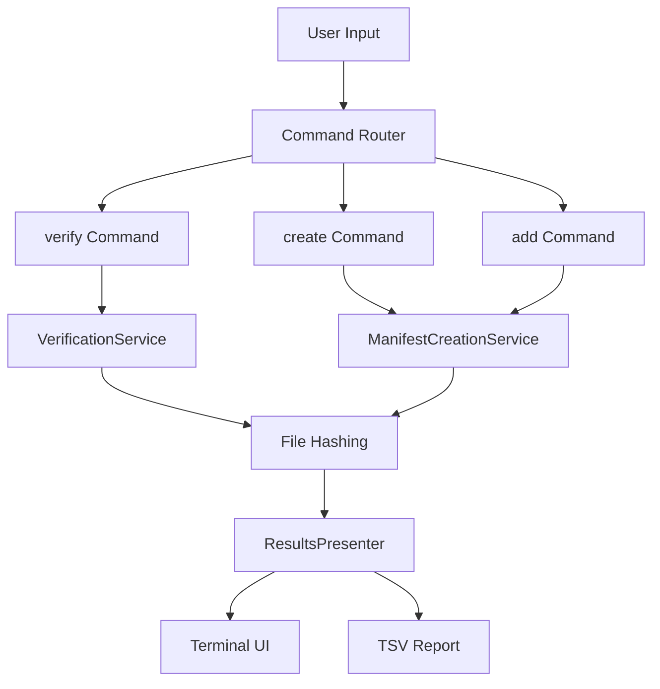
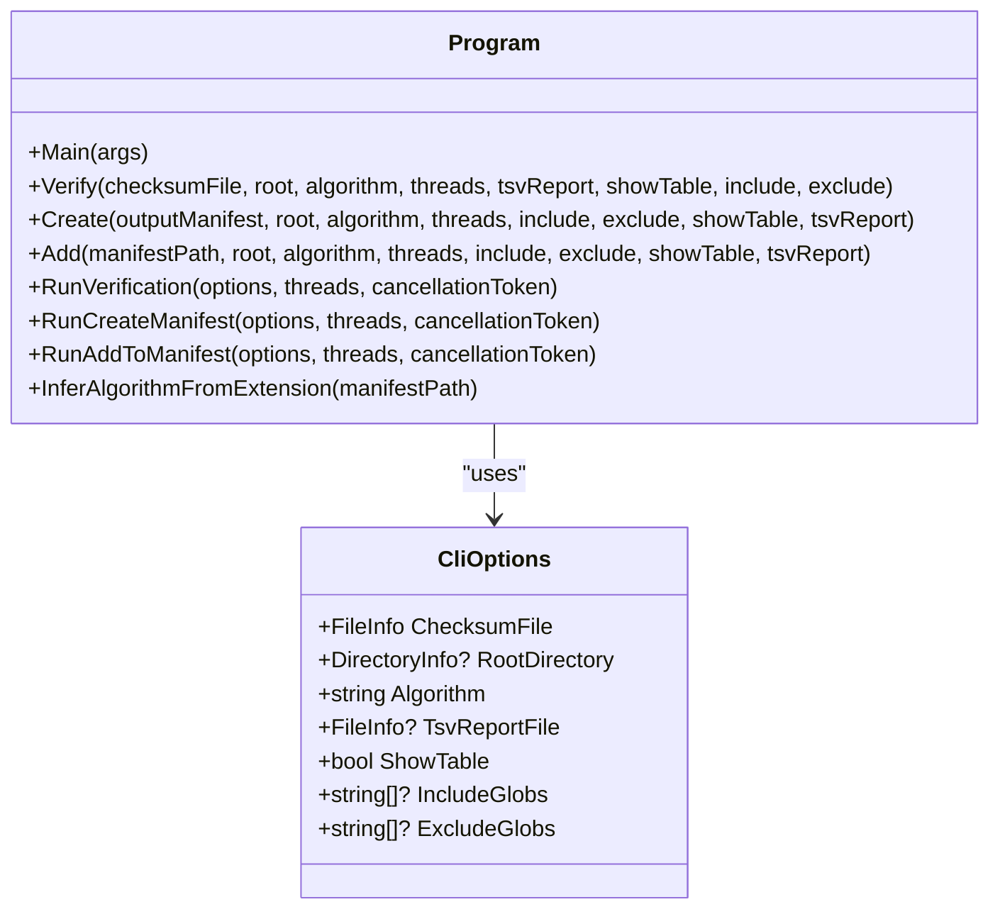
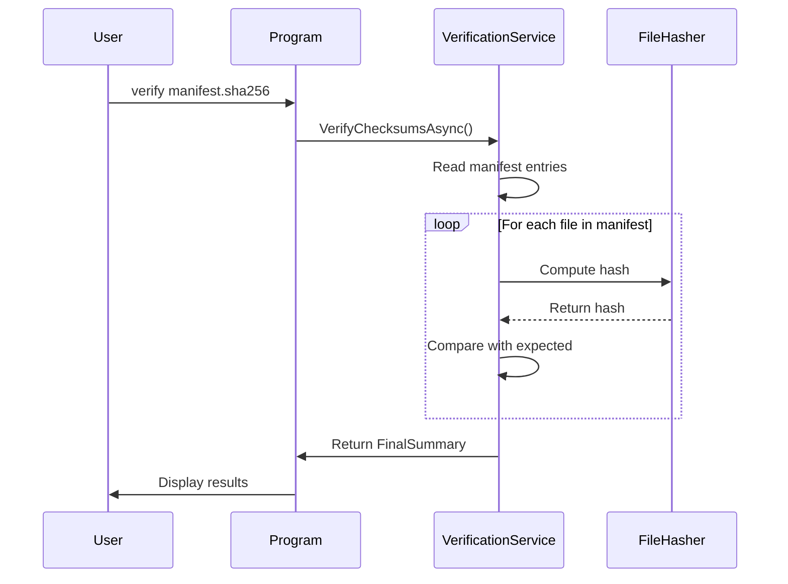
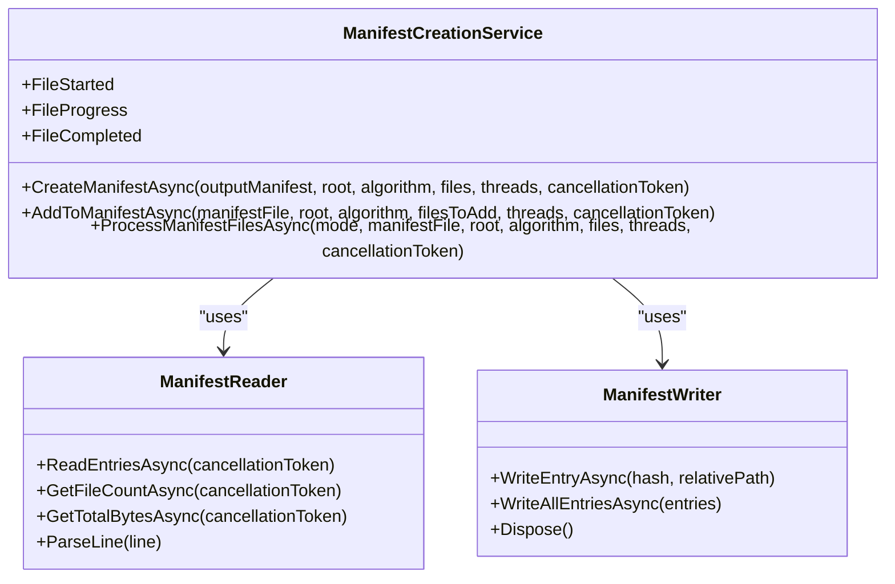
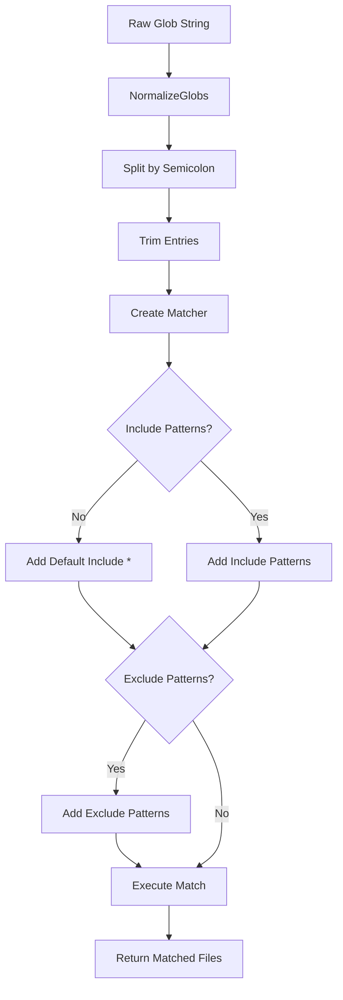
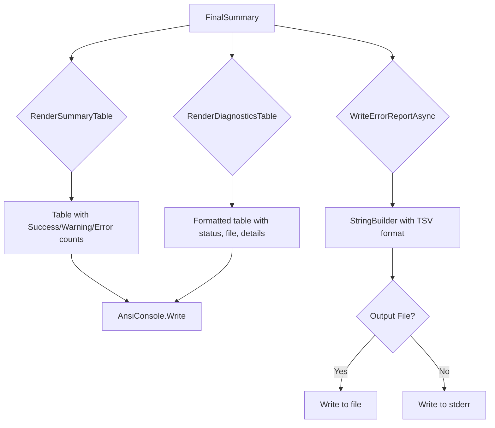
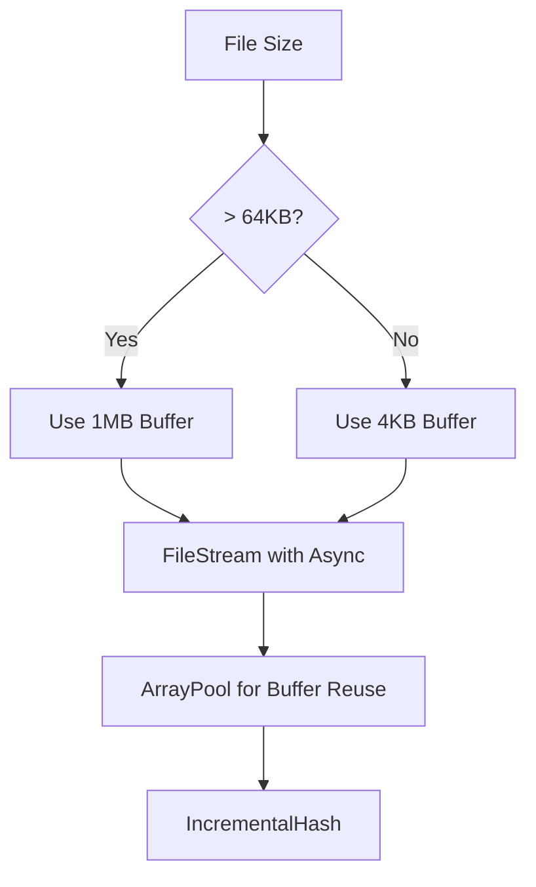

# Tool Overview & Core Value


## Table of Contents
1. [Tool Overview & Core Value](#tool-overview--core-value)
2. [Core Functionality and Use Cases](#core-functionality-and-use-cases)
3. [System Architecture](#system-architecture)
4. [Core Components](#core-components)
5. [Data Flow and Processing Logic](#data-flow-and-processing-logic)
6. [Performance Characteristics](#performance-characteristics)
7. [Error Handling and Diagnostics](#error-handling-and-diagnostics)
8. [Practical Workflows and Examples](#practical-workflows-and-examples)

## Core Functionality and Use Cases

Verity is a high-performance command-line tool designed for file integrity verification and manifest management using cryptographic hashing (SHA256, MD5, SHA1). The tool enables users to ensure data consistency, validate backups, detect tampering, and maintain archival integrity through checksum-based verification.

The core value proposition of Verity lies in its ability to provide cryptographic assurance of data integrity across various scenarios:
- **Backup Validation**: Verify that backup files have not been corrupted or altered since creation
- **Data Consistency Checks**: Ensure files remain unchanged across systems or over time
- **Tamper Detection**: Identify unauthorized modifications to critical files
- **Archival Integrity**: Maintain verifiable records of file states for long-term preservation

Verity operates through three primary commands:
- **verify**: Validates files against an existing manifest
- **create**: Generates a new manifest from a directory of files
- **add**: Updates an existing manifest with new files

The tool supports glob pattern filtering for precise file selection, provides a rich terminal UI with live progress tracking, and generates machine-readable TSV reports for automation and integration purposes.

**Section sources**
- [README.md](file://README.md#L1-L214)
- [Program.cs](file://Verity/Program.cs#L1-L425)

## System Architecture

Verity follows a modular, event-driven architecture built on the ConsoleAppFramework pattern. The application implements a command-based interface with three main operations (verify, create, add) that share common infrastructure for file processing, hashing, and reporting.

The architectural style combines parallel processing with event-driven communication between components. The system uses a producer-consumer pattern for efficient resource utilization, where file enumeration acts as the producer and hash computation serves as the consumer. This design maximizes throughput by saturating available CPU cores and I/O capacity.





**Diagram sources**
- [Program.cs](file://Verity/Program.cs#L1-L425)
- [VerificationService.cs](file://Verity/Services/VerificationService.cs#L32-L180)
- [ManifestCreationService.cs](file://Verity/Services/ManifestCreationService.cs#L32-L148)
- [ResultsPresenter.cs](file://Verity/Utilities/ResultsPresenter.cs#L1-L131)

**Section sources**
- [Program.cs](file://Verity/Program.cs#L1-L425)
- [Models.cs](file://Verity/Models.cs#L1-L45)

## Core Components

### Command Processing and Routing

The `Program.cs` file serves as the entry point and command router, leveraging ConsoleAppFramework to map CLI arguments to specific methods. Each command (`verify`, `create`, `add`) accepts common options including root directory, hashing algorithm, thread count, and glob patterns for file inclusion/exclusion.

The `CliOptions` record structure encapsulates all command-line parameters, providing a clean interface between the CLI parser and the underlying services. The application automatically infers the hashing algorithm from the manifest file extension (.sha256, .md5, .sha1) when not explicitly specified.





**Diagram sources**
- [Program.cs](file://Verity/Program.cs#L1-L425)
- [Models.cs](file://Verity/Models.cs#L1-L45)

**Section sources**
- [Program.cs](file://Verity/Program.cs#L1-L425)
- [Models.cs](file://Verity/Models.cs#L1-L45)

### Verification Service

The `VerificationService` class implements the core logic for validating file integrity against a manifest. It uses an event-driven model with events for file processing stages (FileStarted, FileProgress, FileCompleted).

The service employs a channel-based producer-consumer architecture where manifest entries are enqueued as jobs and processed by multiple consumer threads. For each file, it computes the hash using the specified algorithm and compares it against the expected value in the manifest.

Key features include:
- Timestamp-based warning detection for files newer than the manifest
- Comprehensive error classification (hash mismatch, file not found, read errors)
- Detection of unlisted files in the target directory





**Diagram sources**
- [VerificationService.cs](file://Verity/Services/VerificationService.cs#L32-L180)
- [Models.cs](file://Verity/Models.cs#L1-L45)

**Section sources**
- [VerificationService.cs](file://Verity/Services/VerificationService.cs#L32-L180)

### Manifest Creation Service

The `ManifestCreationService` handles both manifest creation and updating operations. It shares a similar event-driven architecture with the VerificationService but focuses on hash computation rather than comparison.

For manifest creation, it scans the specified directory, computes hashes for all matching files, and writes the results to the output manifest. For manifest updates, it reads the existing manifest, identifies new files not already listed, computes their hashes, and merges them with the existing entries.

The service uses parallel processing via `Partitioner.Create()` to distribute file processing across multiple threads, maximizing CPU utilization.





**Diagram sources**
- [ManifestCreationService.cs](file://Verity/Services/ManifestCreationService.cs#L32-L148)
- [ManifestReader.cs](file://Verity/Utilities/ManifestReader.cs#L1-L50)
- [ManifestWriter.cs](file://Verity/Utilities/ManifestWriter.cs#L1-L32)

**Section sources**
- [ManifestCreationService.cs](file://Verity/Services/ManifestCreationService.cs#L32-L148)

## Data Flow and Processing Logic

### Manifest Format and Processing

Verity uses a simple tab-separated values (TSV) format for manifests, with each line containing a hash and relative file path. The `ManifestReader` and `ManifestWriter` classes handle parsing and generation of these files.

The `ManifestReader` processes files line by line using asynchronous enumeration, which minimizes memory usage regardless of manifest size. It validates each line by ensuring it contains a tab separator and extracts the hash and path components.

The `ManifestWriter` uses a thread-safe `StreamWriter` with a 4KB buffer to write entries. It provides both single-entry and bulk writing capabilities, with the bulk method being used for final manifest generation.

**Section sources**
- [ManifestReader.cs](file://Verity/Utilities/ManifestReader.cs#L1-L50)
- [ManifestWriter.cs](file://Verity/Utilities/ManifestWriter.cs#L1-L32)

### File Filtering with Glob Patterns

The `GlobUtils` class provides comprehensive file filtering capabilities using Microsoft.Extensions.FileSystemGlobbing. It supports semicolon-separated glob patterns for both inclusion and exclusion rules.

Key features include:
- Pattern normalization from semicolon-delimited strings to arrays
- Case-insensitive matching using `StringComparison.OrdinalIgnoreCase`
- Support for complex patterns including `**` for recursive matching
- Efficient filtering of large file collections





**Diagram sources**
- [GlobUtils.cs](file://Verity/Utilities/GlobUtils.cs#L1-L49)

**Section sources**
- [GlobUtils.cs](file://Verity/Utilities/GlobUtils.cs#L1-L49)

### Results Presentation

The `ResultsPresenter` class handles all output formatting, providing both rich terminal UI and machine-readable reports. It uses Spectre.Console for interactive displays and generates TSV format for automation.

The presentation logic includes:
- Summary tables with color-coded success/warning/error counts
- Diagnostic tables showing detailed issue information
- Machine-readable TSV reports written to file or stderr
- Top N grouping of error types for concise reporting





**Diagram sources**
- [ResultsPresenter.cs](file://Verity/Utilities/ResultsPresenter.cs#L1-L131)

**Section sources**
- [ResultsPresenter.cs](file://Verity/Utilities/ResultsPresenter.cs#L1-L131)

## Performance Characteristics

### Parallel Processing Model

Verity implements a high-performance parallel processing model that maximizes throughput by utilizing all available CPU cores. The system uses `Channel<T>` for thread-safe communication between producers and consumers, with bounded channels to prevent excessive memory usage.

For verification operations, the producer reads the manifest and enqueues verification jobs, while multiple consumer threads process these jobs in parallel. For manifest creation, the work is partitioned using `Partitioner.Create()` to distribute files across threads.

### I/O Optimization

The `FileIOUtils` class implements intelligent buffer sizing based on file size:
- 4KB buffer for files ≤ 64KB
- 1MB buffer for larger files

This optimization reduces the number of I/O operations for large files while avoiding excessive memory allocation for small files. The tool also uses asynchronous file operations with `FileOptions.Asynchronous` to leverage system-level I/O completion ports.





**Diagram sources**
- [FileIOUtils.cs](file://Verity/Utilities/FileIOUtils.cs#L1-L13)
- [VerificationService.cs](file://Verity/Services/VerificationService.cs#L32-L180)

**Section sources**
- [FileIOUtils.cs](file://Verity/Utilities/FileIOUtils.cs#L1-L13)

### Memory Management

Verity employs several memory-efficient practices:
- Uses `ArrayPool<byte>.Shared` for buffer reuse, reducing GC pressure
- Processes files incrementally without loading entire contents into memory
- Uses `IReadOnlyList` and `IReadOnlyCollection` interfaces to avoid unnecessary copying
- Implements `IDisposable` on `ManifestWriter` for proper resource cleanup

## Error Handling and Diagnostics

### Error Classification

Verity distinguishes between different types of issues using the `ResultStatus` enum:
- **Success**: File verified successfully
- **Warning**: Non-critical issues (e.g., newer file, unlisted file)
- **Error**: Critical failures (e.g., hash mismatch, file not found)

This classification enables appropriate exit codes:
- `0`: Success (no warnings/errors)
- `1`: Warning (warnings present, no errors)
- `-1`: Error (errors found)
- `-2`: Canceled by user

### Diagnostic Information

The tool provides comprehensive diagnostic information through multiple channels:
- Rich terminal UI with live progress and summary tables
- Detailed diagnostic tables showing status, file, details, and hash values
- Machine-readable TSV reports for integration with other tools
- Hierarchical error grouping to identify common failure patterns

The `FinalSummary` record aggregates all processing results, including counts of total files, successes, warnings, errors, and problematic results with detailed information.

**Section sources**
- [Models.cs](file://Verity/Models.cs#L1-L45)
- [ResultsPresenter.cs](file://Verity/Utilities/ResultsPresenter.cs#L1-L131)

## Practical Workflows and Examples

### Backup Verification

To verify the integrity of a backup against a manifest:


```bash
Verity.exe verify C:\backup\manifest.sha256
```


This command reads the manifest, computes hashes for all listed files, and reports any discrepancies. The tool will detect hash mismatches, missing files, and files that have been modified since the manifest was created.

### Creating Archival Manifests

To create a manifest for archival purposes:


```bash
Verity.exe create D:\archive\manifest.sha256 --root D:\data --include "*.jpg;*.pdf" --exclude "*.tmp"
```


This command scans the specified directory, computes SHA256 hashes for all JPG and PDF files (excluding temporary files), and creates a manifest file.

### Updating Manifests with New Files

To add newly created files to an existing manifest:


```bash
Verity.exe add D:\archive\manifest.sha256 --root D:\newdata --include "*.docx"
```


This command reads the existing manifest, scans the new data directory, identifies DOCX files not already in the manifest, computes their hashes, and updates the manifest with the new entries.

### Automation Integration

For automated workflows, use the TSV reporting feature:


```bash
Verity.exe verify manifest.sha256 --tsv-report errors.tsv
```


The resulting TSV file can be parsed by other tools for further processing, alerting, or logging.

**Section sources**
- [README.md](file://README.md#L1-L214)
- [Program.cs](file://Verity/Program.cs#L1-L425)

**Referenced Files in This Document**   
- [Program.cs](file://Verity/Program.cs#L1-L425)
- [Models.cs](file://Verity/Models.cs#L1-L45)
- [VerificationService.cs](file://Verity/Services/VerificationService.cs#L32-L180)
- [ManifestCreationService.cs](file://Verity/Services/ManifestCreationService.cs#L32-L148)
- [FileIOUtils.cs](file://Verity/Utilities/FileIOUtils.cs#L1-L13)
- [GlobUtils.cs](file://Verity/Utilities/GlobUtils.cs#L1-L49)
- [ResultsPresenter.cs](file://Verity/Utilities/ResultsPresenter.cs#L1-L131)
- [ManifestReader.cs](file://Verity/Utilities/ManifestReader.cs#L1-L50)
- [ManifestWriter.cs](file://Verity/Utilities/ManifestWriter.cs#L1-L32)
- [Utilities.cs](file://Verity/Utilities/Utilities.cs#L1-L60)
- [README.md](file://README.md#L1-L214)