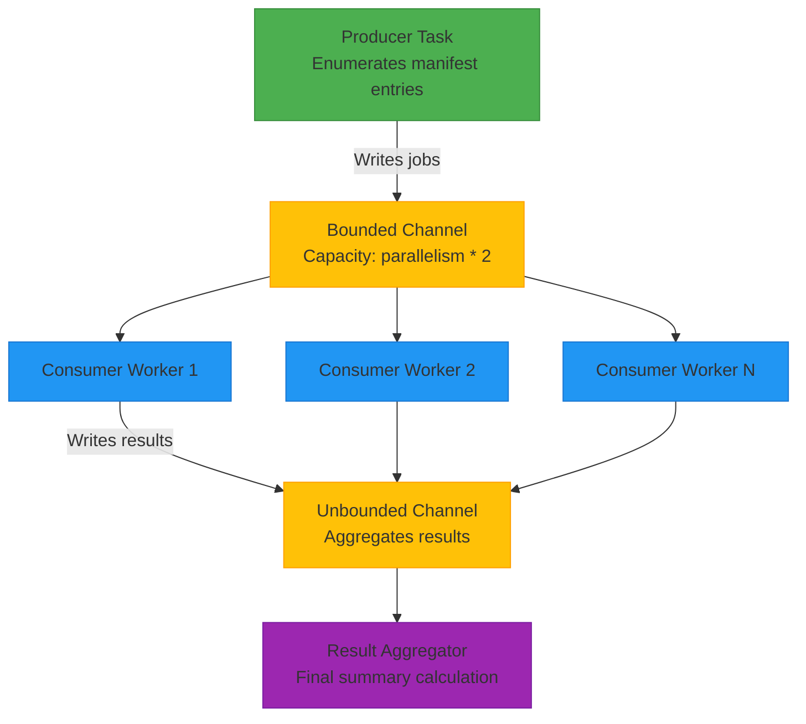
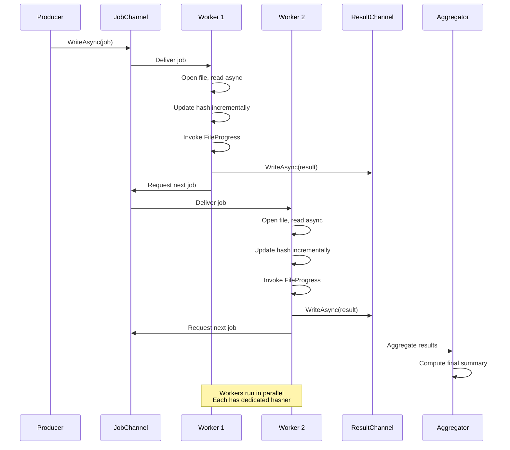
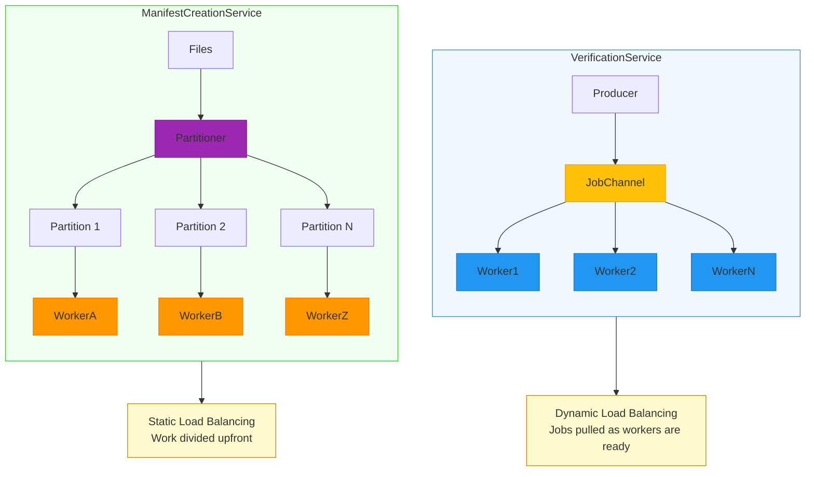

# Thread Management


## Table of Contents
1. [Introduction](#introduction)
2. [Producer-Consumer Architecture in VerificationService](#producer-consumer-architecture-in-verificationservice)
3. [Worker Thread Lifecycle and Task Scheduling](#worker-thread-lifecycle-and-task-scheduling)
4. [Parallelism Configuration and CPU Utilization](#parallelism-configuration-and-cpu-utilization)
5. [Cancellation and Graceful Shutdown](#cancellation-and-graceful-shutdown)
6. [Load Balancing and Multi-Core Optimization](#load-balancing-and-multi-core-optimization)
7. [Performance Pitfalls and Tuning Recommendations](#performance-pitfalls-and-tuning-recommendations)
8. [I/O Buffering and Storage System Optimization](#io-buffering-and-storage-system-optimization)
9. [Conclusion](#conclusion)

## Introduction
The **VerificationService** component in the Verity application implements a high-performance, concurrent architecture designed to efficiently verify file integrity using checksums. This document details the thread management strategy, focusing on the producer-consumer pattern, parallelism configuration, cancellation handling, and performance optimization across different hardware profiles. The system is engineered to maximize throughput while maintaining resource efficiency and responsiveness during high-load verification tasks.

**Section sources**
- [README.md](file://README.md#L23-L48)

## Producer-Consumer Architecture in VerificationService

The core of the **VerificationService** is built around a **Channel<T>**-based producer-consumer pattern, which enables efficient work distribution and decoupling of job production from processing. This design uses bounded and unbounded channels from `System.Threading.Channels` to manage job queuing and result aggregation.

A bounded channel with a capacity of `parallelism * 2` is created to hold verification jobs, preventing unbounded memory growth while allowing sufficient buffering to keep workers busy:


```csharp
var jobChannel = Channel.CreateBounded<VerificationJob>(parallelism * 2);
```


Jobs are written asynchronously by a single producer task that enumerates manifest entries and writes them to the channel. Once all jobs are enqueued, the channel is marked as complete to signal consumers that no more work will arrive.

Results are collected via an unbounded result channel, allowing all verification outcomes to be aggregated without blocking the worker threads:


```csharp
var resultChannel = Channel.CreateUnbounded<VerificationResult>();
```


This architecture ensures smooth flow of work items and results, minimizing contention and enabling scalable parallel processing.





**Diagram sources**
- [VerificationService.cs](file://Verity/Services/VerificationService.cs#L50-L51)

**Section sources**
- [VerificationService.cs](file://Verity/Services/VerificationService.cs#L37-L68)

## Worker Thread Lifecycle and Task Scheduling

Worker threads in **VerificationService** are implemented as `Task.Run` delegates that asynchronously read from the shared job channel. The number of concurrent workers is determined by the `parallelism` parameter, which defaults to the number of logical processors.

Each worker maintains its own `IncrementalHash` instance to avoid synchronization overhead during hashing operations. This per-thread state ensures thread safety and optimal CPU utilization:


```csharp
using var hasher = IncrementalHash.CreateHash(new HashAlgorithmName(options.Algorithm));
```


Workers continuously pull jobs from the channel using `ReadAllAsync`, which automatically completes when the channel is closed by the producer:


```csharp
await foreach (var job in jobChannel.Reader.ReadAllAsync(cancellationToken))
```


For each job, the worker:
1. Opens the file with asynchronous I/O and an optimized buffer size
2. Reads the file in chunks, updating the hash incrementally
3. Invokes progress and completion events
4. Writes the result to the result channel

The lifecycle is tightly bound to the channel's completion and respects the provided `CancellationToken`, enabling graceful shutdown.





**Diagram sources**
- [VerificationService.cs](file://Verity/Services/VerificationService.cs#L70-L150)

**Section sources**
- [VerificationService.cs](file://Verity/Services/VerificationService.cs#L70-L150)

## Parallelism Configuration and CPU Utilization

The degree of parallelism is configurable via the `--threads` command-line option. If not specified, it defaults to the number of logical processors on the system:


```csharp
if (parallelism <= 0) parallelism = Environment.ProcessorCount;
```


This default ensures optimal CPU core utilization across different hardware configurations. The value is used to:
- Determine the number of concurrent worker tasks
- Set the bounded channel capacity (`parallelism * 2`)
- Scale the overall throughput of the verification process

The architecture is designed to saturate CPU cores during hashing operations, making it compute-bound on systems with fast storage. On slower storage (e.g., HDDs), the workload becomes I/O-bound, but the asynchronous file reading still allows overlapping I/O with computation.

**Section sources**
- [VerificationService.cs](file://Verity/Services/VerificationService.cs#L45)
- [Program.cs](file://Verity/Program.cs#L60-L83)
- [README.md](file://README.md#L49-L96)

## Cancellation and Graceful Shutdown

The system integrates `CancellationToken` throughout to support graceful shutdown during long-running verification tasks. The token is passed to:
- Asynchronous file reads
- Channel operations
- Long-running loops

Each worker and the producer check for cancellation before processing each job:


```csharp
cancellationToken.ThrowIfCancellationRequested();
```


When cancellation is requested (e.g., via Ctrl+C), all active operations will observe the token and terminate cleanly. The system ensures that:
- No new jobs are started
- In-progress file reads complete or are interrupted safely
- Partial results are still reported
- Final summary is generated with available data

This allows users to stop verification early without corrupting state or losing progress information.

**Section sources**
- [VerificationService.cs](file://Verity/Services/VerificationService.cs#L60-L65)

## Load Balancing and Multi-Core Optimization

While **VerificationService** uses a centralized job queue (channel) for load balancing, the **ManifestCreationService** employs a different strategy using `Partitioner.Create()` to divide work statically among threads:


```csharp
Partitioner.Create(files).GetPartitions(threads)
```


This approach creates a separate partition for each thread, eliminating contention on a shared queue. It is particularly effective when file processing times are relatively uniform.

In contrast, the channel-based approach in **VerificationService** provides dynamic load balancing, where faster workers naturally process more jobs. This is beneficial when file sizes vary significantly, preventing thread starvation that could occur with static partitioning.

For multi-core systems, both approaches scale well, but the channel-based model adapts better to heterogeneous workloads.





**Diagram sources**
- [VerificationService.cs](file://Verity/Services/VerificationService.cs#L50)
- [ManifestCreationService.cs](file://Verity/Services/ManifestCreationService.cs#L34-L59)

**Section sources**
- [ManifestCreationService.cs](file://Verity/Services/ManifestCreationService.cs#L34-L59)

## Performance Pitfalls and Tuning Recommendations

### Common Pitfalls
- **Thread Starvation**: Not a significant risk due to the bounded channel and proper cancellation handling.
- **Excessive Context Switching**: Can occur if thread count greatly exceeds CPU cores, especially on systems with many logical processors.
- **I/O Bottlenecks**: On HDDs, random access patterns can severely limit throughput.

### Tuning Recommendations
- **For CPU-bound workloads (SSD storage)**: Use default parallelism (`Environment.ProcessorCount`) to fully utilize all cores.
- **For I/O-bound workloads (HDD storage)**: Reduce thread count to 2-4 to minimize disk head thrashing and seek times.
- **For mixed workloads**: Start with default settings and monitor CPU and I/O utilization; adjust threads downward if I/O wait is high.

The system avoids common pitfalls like unbounded memory usage by using bounded channels and processing files incrementally.

**Section sources**
- [VerificationService.cs](file://Verity/Services/VerificationService.cs#L50)
- [ManifestCreationService.cs](file://Verity/Services/ManifestCreationService.cs#L34-L59)

## I/O Buffering and Storage System Optimization

The **FileIOUtils.GetOptimalBufferSize** method dynamically selects buffer sizes based on file size to optimize I/O performance:


```csharp
public static int GetOptimalBufferSize(long fileSize)
{
    const int smallFileThreshold = 64 * 1024; // 64KB
    const int defaultBufferSize = 4096; // 4KB
    const int largeFileBufferSize = 1 * 1024 * 1024; // 1MB
    return (fileSize > smallFileThreshold) ? largeFileBufferSize : defaultBufferSize;
}
```


This strategy:
- Uses small buffers (4KB) for small files to reduce memory overhead
- Uses large buffers (1MB) for large files to maximize sequential read performance
- Adapts to file characteristics without user intervention

For SSDs, larger buffers improve throughput by reducing system call frequency. For HDDs, they help amortize seek times. The use of `ArrayPool<byte>.Shared` further reduces memory allocation pressure.

**Section sources**
- [FileIOUtils.cs](file://Verity/Utilities/FileIOUtils.cs#L0-L11)

## Conclusion
The thread management implementation in **VerificationService** demonstrates a robust, high-performance design using the Channel<T>-based producer-consumer pattern. By combining configurable parallelism, efficient work distribution, and proper cancellation support, it achieves optimal throughput across diverse hardware configurations. The integration of dynamic I/O buffering and event-driven progress reporting further enhances its effectiveness for large-scale file verification tasks. For best results, users should tune the thread count based on their storage subsystem, leveraging the default CPU-core-based setting as a solid starting point.

**Referenced Files in This Document**   
- [VerificationService.cs](file://Verity/Services/VerificationService.cs#L0-L194)
- [ManifestCreationService.cs](file://Verity/Services/ManifestCreationService.cs#L0-L149)
- [Program.cs](file://Verity/Program.cs#L60-L83)
- [FileIOUtils.cs](file://Verity/Utilities/FileIOUtils.cs#L0-L11)
- [launchSettings.json](file://Verity/Properties/launchSettings.json#L0-L7)
- [README.md](file://README.md#L23-L48)