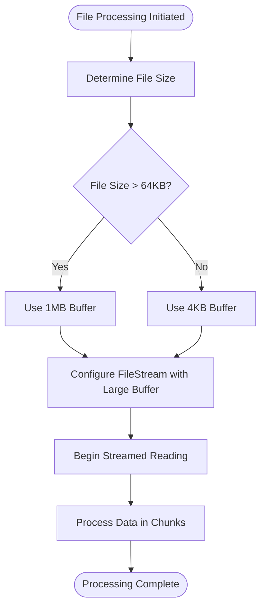
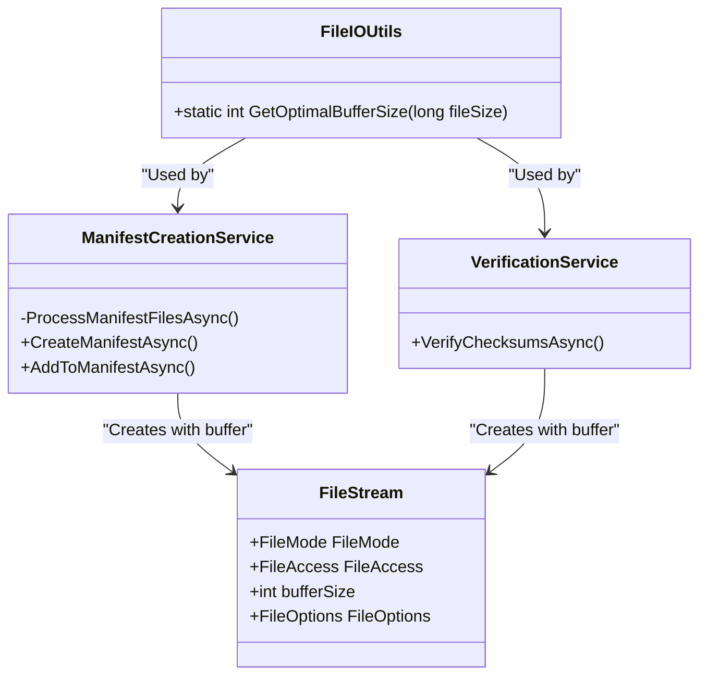
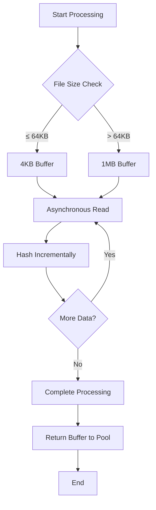

# I/O Buffering Strategy


## Table of Contents
1. [Introduction](#introduction)
2. [Adaptive Buffer Size Logic](#adaptive-buffer-size-logic)
3. [Integration with File Processing](#integration-with-file-processing)
4. [Memory Management and Performance](#memory-management-and-performance)
5. [Troubleshooting and Best Practices](#troubleshooting-and-best-practices)
6. [Conclusion](#conclusion)

## Introduction
Verity implements an intelligent I/O buffering strategy designed to optimize file read performance while maintaining efficient memory usage. The system dynamically selects buffer sizes based on file characteristics, balancing throughput and resource consumption across different file sizes and storage types. This document details the adaptive buffering mechanism, its implementation across the codebase, and provides guidance for optimal usage in various scenarios.

## Adaptive Buffer Size Logic

The core of Verity's adaptive I/O strategy is implemented in the `FileIOUtils.GetOptimalBufferSize` method, which determines the appropriate buffer size for file operations based on file size thresholds.


```csharp
public static int GetOptimalBufferSize(long fileSize)
{
  const int smallFileThreshold = 64 * 1024; // 64KB
  const int defaultBufferSize = 4096; // 4KB
  const int largeFileBufferSize = 1 * 1024 * 1024; // 1MB
  return (fileSize > smallFileThreshold) ? largeFileBufferSize : defaultBufferSize;
}
```


This method implements a binary threshold system:
- **Small files (≤ 64KB)**: Uses a 4KB buffer
- **Large files (> 64KB)**: Uses a 1MB buffer

The 64KB threshold represents a strategic balance point where larger buffers begin to provide diminishing returns for small files while significantly improving throughput for larger files. The 4KB buffer size aligns with typical filesystem block sizes, minimizing wasted memory for small files. The 1MB buffer maximizes sequential read efficiency for larger files by reducing the number of system calls and disk seeks.





**Diagram sources**
- [FileIOUtils.cs](file://Verity/Utilities/FileIOUtils.cs#L4-L11)

**Section sources**
- [FileIOUtils.cs](file://Verity/Utilities/FileIOUtils.cs#L4-L11)

## Integration with File Processing

The adaptive buffering strategy is integrated into both manifest creation and verification workflows through the `ManifestCreationService` and `VerificationService` classes.

### Manifest Creation Processing
When creating checksum manifests, the service processes each file with an optimally sized buffer:


```csharp
int bufferSize = FileIOUtils.GetOptimalBufferSize(fileSize);
using var stream = new FileStream(file, FileMode.Open, FileAccess.Read, FileShare.Read, bufferSize, FileOptions.Asynchronous);
```


The service employs a parallel processing model using `Task.WhenAll` with partitioned file collections, allowing multiple files to be processed concurrently. Each file stream uses the buffer size determined by the adaptive algorithm, ensuring optimal I/O performance across files of varying sizes.

### Verification Processing
During verification operations, the same buffering strategy is applied:


```csharp
int bufferSize = FileIOUtils.GetOptimalBufferSize(job.FileSize);
using (var stream = new FileStream(fullPath, FileMode.Open, FileAccess.Read, FileShare.Read, bufferSize, FileOptions.Asynchronous))
```


The verification service uses a producer-consumer pattern with bounded channels, where file metadata is produced and consumed for processing. This architecture allows for controlled parallelism while maintaining the adaptive buffering benefits for each individual file operation.





**Diagram sources**
- [FileIOUtils.cs](file://Verity/Utilities/FileIOUtils.cs#L4-L11)
- [ManifestCreationService.cs](file://Verity/Services/ManifestCreationService.cs#L69)
- [VerificationService.cs](file://Verity/Services/VerificationService.cs#L93)

**Section sources**
- [ManifestCreationService.cs](file://Verity/Services/ManifestCreationService.cs#L50-L90)
- [VerificationService.cs](file://Verity/Services/VerificationService.cs#L80-L100)

## Memory Management and Performance

Verity's I/O strategy incorporates several performance optimization techniques beyond adaptive buffering.

### Buffer Pooling with ArrayPool
To minimize garbage collection pressure and memory allocation overhead, the system uses `ArrayPool<byte>.Shared` for buffer management:


```csharp
byte[] buffer = ArrayPool<byte>.Shared.Rent(bufferSize);
// ... use buffer for reading ...
ArrayPool<byte>.Shared.Return(buffer);
```


This object pooling pattern reuses byte arrays across operations, significantly reducing memory pressure during bulk file processing. For multi-gigabyte file processing, this approach prevents large object heap fragmentation and reduces GC frequency.

### Asynchronous I/O Operations
All file operations use asynchronous methods with `FileOptions.Asynchronous`, enabling non-blocking I/O that can overlap with CPU-intensive hashing operations:


```csharp
while ((bytesRead = await stream.ReadAsync(buffer, cancellationToken)) > 0)
{
    hasher.AppendData(buffer, 0, bytesRead);
    bytesReadTotal += bytesRead;
}
```


The combination of asynchronous reads and the `IncrementalHash` class allows for efficient streaming of data from disk to hash computation without loading entire files into memory.

### Sequential vs Random Access Patterns
The buffering strategy is optimized for sequential access patterns typical of checksum operations. The 1MB buffer size is particularly effective for:
- Sequential reads on HDDs (reduces seek time impact)
- Large file processing on SSDs (maximizes throughput)
- Network drives with high latency (reduces round-trip frequency)

For random access patterns, the smaller 4KB buffer is more appropriate as it aligns with typical page sizes and minimizes unnecessary data transfer.

## Troubleshooting and Best Practices

### Network Drive Considerations
When processing files on network drives or high-latency storage, consider the following:

- **Increased latency sensitivity**: The 1MB buffer helps mitigate network latency by reducing the frequency of round trips
- **Bandwidth limitations**: Monitor network utilization to avoid saturation
- **Timeout handling**: Ensure adequate timeout settings for slow connections

### Memory-Constrained Environments
In systems with limited RAM, consider these tuning options:

- **Reduce parallelism**: Use the `--threads` parameter to limit concurrent file processing
- **Monitor buffer impact**: The maximum memory footprint per thread is approximately 1MB (buffer) + hash state
- **Process large files sequentially**: For systems with very limited memory, process large files one at a time

### Large Archive Processing
When handling large archives or datasets:

- **Leverage the 1MB buffer**: Files over 64KB automatically benefit from optimized buffering
- **Monitor I/O throughput**: Use the built-in progress indicators to identify bottlenecks
- **Consider disk type**: SSDs benefit more from large buffers than HDDs for sequential reads

### Performance Monitoring
The system provides built-in performance metrics through:
- Real-time progress bars in the terminal UI
- Detailed summary tables showing processing statistics
- TSV error reports for troubleshooting issues





**Diagram sources**
- [FileIOUtils.cs](file://Verity/Utilities/FileIOUtils.cs#L4-L11)
- [ManifestCreationService.cs](file://Verity/Services/ManifestCreationService.cs#L75-L87)
- [VerificationService.cs](file://Verity/Services/VerificationService.cs#L97-L107)

**Section sources**
- [ManifestCreationService.cs](file://Verity/Services/ManifestCreationService.cs#L70-L90)
- [VerificationService.cs](file://Verity/Services/VerificationService.cs#L90-L110)

## Conclusion
Verity's adaptive I/O buffering strategy effectively balances performance and resource efficiency across diverse file sizes and storage scenarios. By dynamically selecting buffer sizes based on file characteristics, the system optimizes throughput for large files while minimizing memory pressure for small files. The integration of buffer pooling, asynchronous operations, and parallel processing creates a robust solution for handling multi-gigabyte datasets efficiently. This approach ensures optimal performance on various storage media while maintaining predictable memory usage, making Verity suitable for both high-performance workstations and resource-constrained environments.

**Referenced Files in This Document**   
- [FileIOUtils.cs](file://Verity/Utilities/FileIOUtils.cs)
- [ManifestCreationService.cs](file://Verity/Services/ManifestCreationService.cs)
- [VerificationService.cs](file://Verity/Services/VerificationService.cs)
- [README.md](file://README.md)