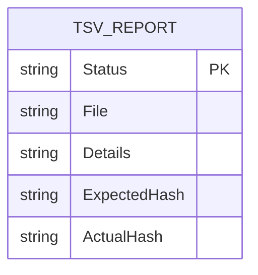
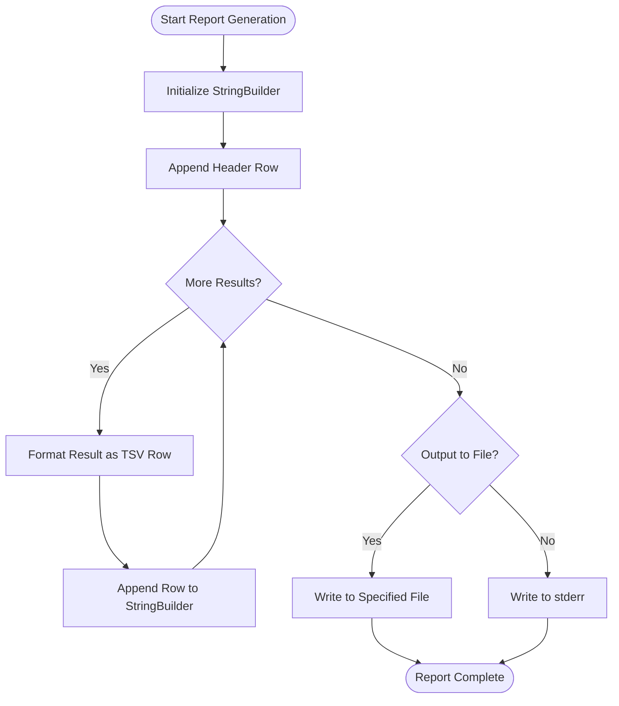

# TSV Report Format


## Table of Contents
1. [Introduction](#introduction)
2. [Schema Structure](#schema-structure)
3. [TSV Output Generation](#tsv-output-generation)
4. [Data Types and Formatting Rules](#data-types-and-formatting-rules)
5. [Use Cases and Integration](#use-cases-and-integration)
6. [Examples of Valid TSV Output](#examples-of-valid-tsv-output)
7. [Redirecting and Parsing TSV Output](#redirecting-and-parsing-tsv-output)
8. [Differences from Human-Readable Output](#differences-from-human-readable-output)

## Introduction
The TSV (Tab-Separated Values) report format is a machine-readable output generated by the Verity tool to provide structured reporting of verification, creation, and addition operations. This format is designed for automation, CI/CD integration, and post-processing with external tools such as awk, Excel, or Python scripts. The report captures all errors and warnings encountered during execution, enabling programmatic analysis and downstream processing.

The TSV report is generated when the `--tsv-report` option is specified or automatically written to `stderr` if issues are detected and no file is specified. It includes a header row prefixed with `#` followed by data rows containing detailed information about each problematic file.

**Section sources**
- [README.md](file://README.md#L107-L133)

## Schema Structure
The TSV report schema consists of five columns that capture essential information about file verification results:

- **Status**: Indicates the result status (`ERROR` or `WARNING`)
- **File**: The relative path to the file being processed
- **Details**: A descriptive message explaining the issue (e.g., "Hash mismatch", "File not found")
- **ExpectedHash**: The expected hash value from the manifest (lowercase SHA256)
- **ActualHash**: The actual computed hash of the file (when available)

These columns are consistently ordered and separated by tab characters. The header row is commented with `#` to distinguish it from data rows.





**Diagram sources**
- [Models.cs](file://Verity/Models.cs#L0-L44)
- [ResultsPresenter.cs](file://Verity/Utilities/ResultsPresenter.cs#L99-L130)

**Section sources**
- [Models.cs](file://Verity/Models.cs#L0-L44)
- [ResultsPresenter.cs](file://Verity/Utilities/ResultsPresenter.cs#L99-L130)

## TSV Output Generation
The TSV output is generated in the `ResultsPresenter.WriteErrorReportAsync` method located in `ResultsPresenter.cs`. This method constructs the report using `StringBuilder` and properly escapes special characters through standard .NET string handling.

The generation process follows these steps:
1. Initialize a `StringBuilder` instance
2. Append the header row with `#Status\tFile\tDetails\tExpectedHash\tActualHash`
3. Iterate through problematic results in the `FinalSummary`
4. For each result, append a data row with tab-separated values
5. Write the complete report to either a specified file or `stderr`

Special characters in file paths or details are handled naturally through .NET's string encoding, ensuring valid TSV output. The method uses `string.Join("\t", ...)` to ensure proper tab separation between fields.





**Diagram sources**
- [ResultsPresenter.cs](file://Verity/Utilities/ResultsPresenter.cs#L99-L130)

**Section sources**
- [ResultsPresenter.cs](file://Verity/Utilities/ResultsPresenter.cs#L99-L130)

## Data Types and Formatting Rules
Each field in the TSV report adheres to specific data types and formatting rules:

- **Status**: String, uppercase (`ERROR` or `WARNING`)
- **File**: String, relative path using forward slashes
- **Details**: String, human-readable description of the issue
- **ExpectedHash**: String, lowercase hexadecimal SHA256 hash
- **ActualHash**: String, lowercase hexadecimal SHA256 hash (empty when file not found)

Timestamp precision is not included in the TSV output itself but is available in the accompanying console output. All hashes are represented in lowercase hexadecimal format as required by the manifest format specification.

Null or missing values are represented as empty strings. The report uses proper escaping by relying on .NET's built-in string handling, ensuring that tabs within field values do not corrupt the TSV structure (though such cases are prevented by path validation).

**Section sources**
- [Models.cs](file://Verity/Models.cs#L0-L44)
- [README.md](file://README.md#L115-L128)

## Use Cases and Integration
The TSV report format supports various automation and integration scenarios:

- **CI/CD Pipelines**: Integrate verification results into build pipelines for quality gates
- **Automated Monitoring**: Process reports to detect integrity issues in production systems
- **Data Analysis**: Import into Excel or Google Sheets for visualization and reporting
- **Script Processing**: Use with awk, sed, or Python for custom analysis
- **Log Aggregation**: Combine with other system logs for comprehensive auditing

The structured nature of TSV makes it ideal for parsing with tools like:
- Python's `csv` module with tab delimiter
- PowerShell's `Import-Csv` cmdlet
- Bash scripts using `awk` and `cut`
- Excel and Google Sheets import functionality

**Section sources**
- [README.md](file://README.md#L107-L133)

## Examples of Valid TSV Output
The following examples demonstrate valid TSV output for different command types:

### Verify Command Example

```tsv
#Status	File	Details	ExpectedHash	ActualHash
ERROR	data/file1.txt	Hash mismatch	abc123def456ghi789	xyz987uvw654rst321
WARNING	data/file2.txt	File is newer than manifest	abc123def456ghi789	abc123def456ghi789
ERROR	data/file3.txt	File not found		
```


### Create Command Example

```tsv
#Status	File	Details	ExpectedHash	ActualHash
WARNING	newfile.txt	New file added to manifest	abc123def456ghi789	abc123def456ghi789
WARNING	tempfile.tmp	File excluded by pattern		
```


### Add Command Example

```tsv
#Status	File	Details	ExpectedHash	ActualHash
ERROR	missing.txt	File not found		
WARNING	updated.txt	File modified since manifest	abc123def456ghi789	xyz987uvw654rst321
```


These examples show the consistent structure across different command types, with appropriate status codes and detail messages reflecting the specific operation context.

**Section sources**
- [README.md](file://README.md#L129-L133)
- [TsvReportParser.cs](file://Verity.Tests/TsvReportParser.cs#L0-L23)

## Redirecting and Parsing TSV Output
The TSV output can be redirected to a file using the `--tsv-report` command-line option:


```bash
Verity.exe verify manifest.sha256 --tsv-report errors.tsv
```


When no file is specified, the report is written to `stderr` if any issues are detected, allowing for shell redirection:


```bash
Verity.exe verify manifest.sha256 2> errors.tsv
```


Programmatic parsing can be accomplished using various languages:

**Python Example:**

```python
import csv
with open('errors.tsv', 'r') as f:
    reader = csv.reader(f, delimiter='\t')
    for row in reader:
        if row and row[0].startswith('#'):
            continue  # Skip header
        status, file, details, expected, actual = row
        # Process each result
```


**Bash/awk Example:**

```bash
awk -F'\t' 'NR>1 {print "File:", $2, "Status:", $1}' errors.tsv
```


The `TsvReportParser.cs` test file demonstrates the expected parsing logic used in unit tests, providing a reference implementation for external parsers.

**Section sources**
- [Program.cs](file://Verity/Program.cs#L223)
- [ResultsPresenter.cs](file://Verity/Utilities/ResultsPresenter.cs#L99-L130)
- [TsvReportParser.cs](file://Verity.Tests/TsvReportParser.cs#L0-L23)

## Differences from Human-Readable Output
The TSV report differs significantly from the human-readable console output in several key aspects:

| Feature | TSV Report | Human-Readable Output |
|-------|-----------|----------------------|
| **Format** | Machine-readable, structured | Human-readable, formatted |
| **Content** | Only errors and warnings | Complete summary with success metrics |
| **Destination** | File or stderr | Console/terminal |
| **Parsing** | Easy for automated tools | Requires text parsing |
| **Detail Level** | Per-file details only | Aggregated statistics and breakdowns |
| **Colorization** | None (plain text) | ANSI color codes for visual clarity |
| **Progress** | Final results only | Live progress indicators |

The human-readable output provides a rich terminal experience with live progress bars, color-coded status indicators, and aggregated statistics, while the TSV report focuses on delivering structured data for automation purposes. The TSV report contains only problematic results (errors and warnings), whereas the console output includes comprehensive success metrics and throughput information.

**Section sources**
- [ResultsPresenter.cs](file://Verity/Utilities/ResultsPresenter.cs#L0-L130)
- [Program.cs](file://Verity/Program.cs#L220-L225)

**Referenced Files in This Document**   
- [ResultsPresenter.cs](file://Verity/Utilities/ResultsPresenter.cs)
- [Models.cs](file://Verity/Models.cs)
- [Program.cs](file://Verity/Program.cs)
- [TsvReportParser.cs](file://Verity.Tests/TsvReportParser.cs)
- [README.md](file://README.md)