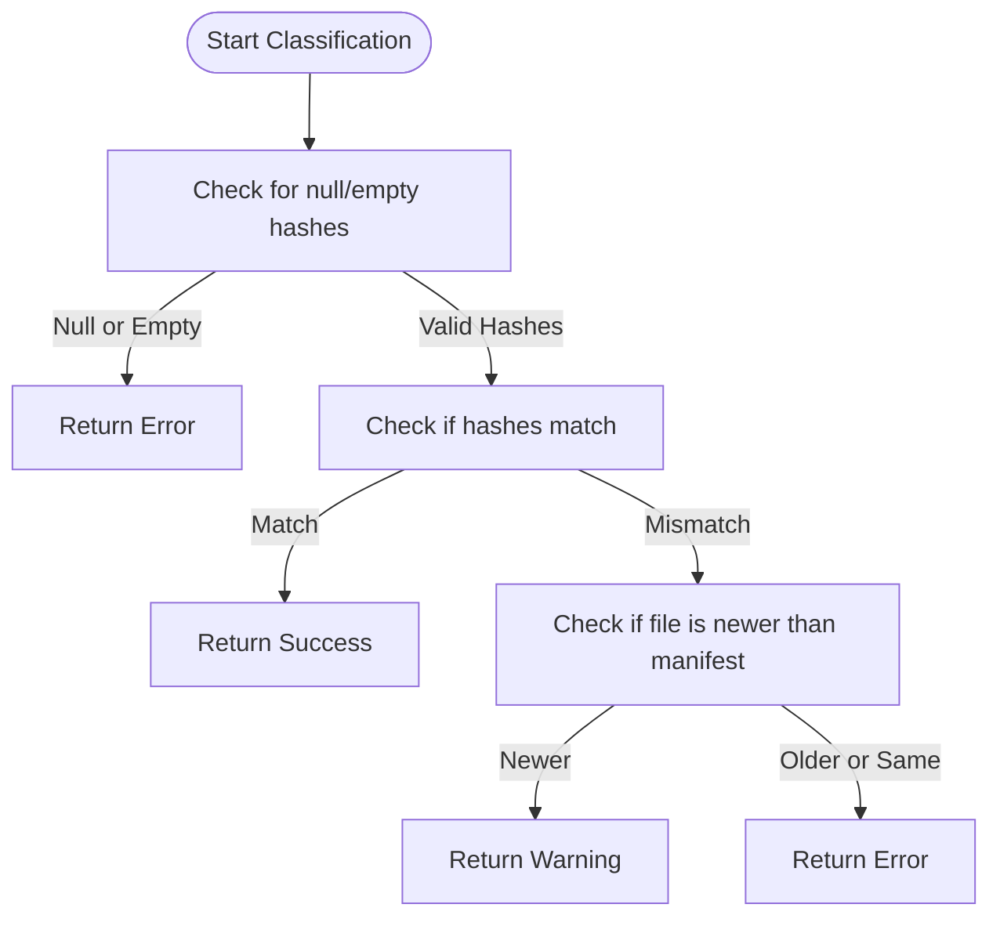
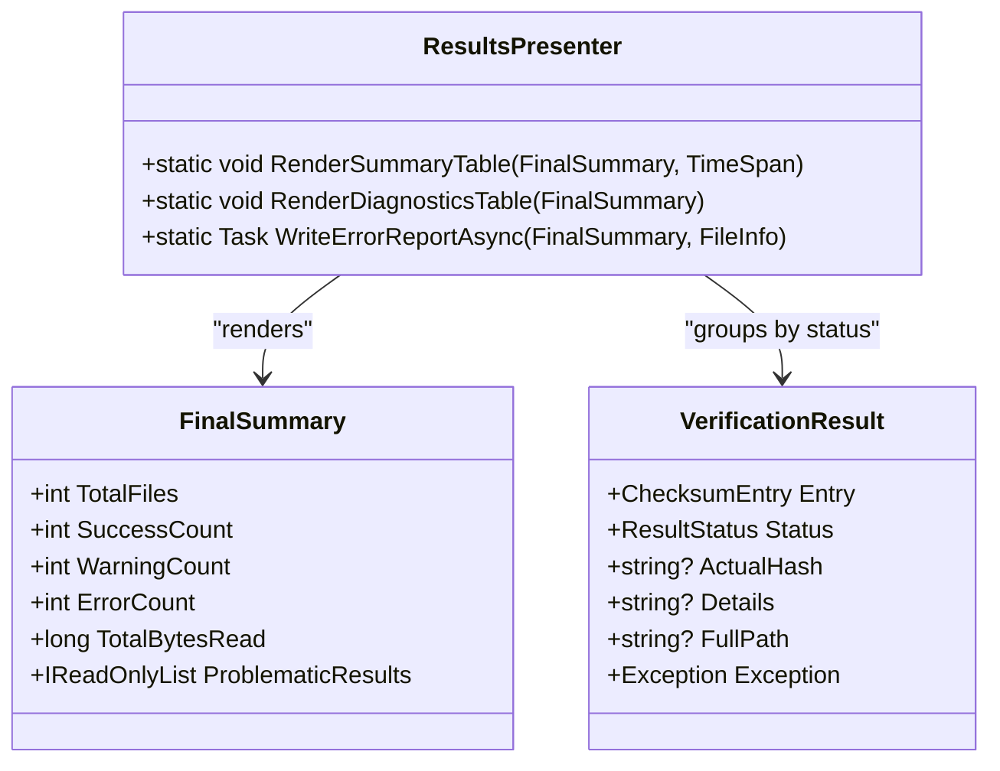
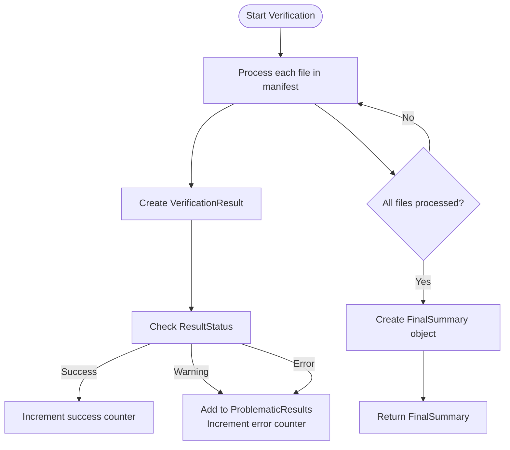

# Result Classification System


## Table of Contents
1. [Introduction](#introduction)
2. [Core Data Structures](#core-data-structures)
3. [Classification Logic in VerificationService](#classification-logic-in-verificationservice)
4. [Result Rendering with ResultsPresenter](#result-rendering-with-resultspresenter)
5. [Status Meaning and Examples](#status-meaning-and-examples)
6. [FinalSummary Aggregation](#finalsummary-aggregation)
7. [Automation and Filtering](#automation-and-filtering)
8. [Edge Case Handling](#edge-case-handling)

## Introduction
The Result Classification System in Verity categorizes file verification outcomes into three distinct states: Success, Warning, and Error. This classification enables users and automation systems to quickly understand the integrity status of files being verified against a checksum manifest. The system uses a combination of hash comparison, file metadata analysis, and I/O exception handling to determine the appropriate status for each file. This document details the business logic, data structures, rendering mechanisms, and edge case handling that comprise the complete result classification workflow.

## Core Data Structures

The classification system relies on several key data structures defined in the codebase:

- **VerificationResult**: Records the outcome of verifying a single file, including its status, actual hash, details about the result, and any associated exception.
- **FinalSummary**: Aggregates results across all files, providing counts for each status type and a list of problematic results.
- **ResultStatus**: Enumeration with three values: Success, Warning, and Error.


```csharp
public record VerificationResult(
    ChecksumEntry Entry,
    ResultStatus Status,
    string? ActualHash = null,
    string? Details = null,
    string? FullPath = null,
    Exception Exception = null
);

public enum ResultStatus
{
    Success,
    Warning,
    Error
}

public record FinalSummary(
    int TotalFiles,
    int SuccessCount,
    int WarningCount,
    int ErrorCount,
    long TotalBytesRead,
    IReadOnlyList<VerificationResult> ProblematicResults
);
```


**Section sources**
- [Models.cs](file://d:/devel/Verity/Verity/Models.cs#L0-L45)

## Classification Logic in VerificationService

The core classification logic resides in the `StatusClassifier` class within VerificationService.cs. This static class contains the `Classify` method that determines the result status based on four parameters: expected hash, actual hash, file write time, and manifest write time.





**Diagram sources**
- [VerificationService.cs](file://d:/devel/Verity/Verity/Services/VerificationService.cs#L181-L193)

The classification follows these rules:
1. If either the expected or actual hash is null or whitespace, return Error
2. If the actual hash matches the expected hash (case-insensitive), return Success
3. If the hashes don't match but the file's write time is newer than the manifest's write time, return Warning
4. For all other cases (mismatched hashes, older file), return Error

This logic is implemented in the `Classify` method:


```csharp
public static ResultStatus Classify(string? expectedHash, string? actualHash, DateTime fileWriteTime, DateTime manifestWriteTime)
{
    if (string.IsNullOrWhiteSpace(expectedHash) || string.IsNullOrWhiteSpace(actualHash))
        return ResultStatus.Error;
    if (string.Equals(actualHash, expectedHash, StringComparison.OrdinalIgnoreCase))
        return ResultStatus.Success;
    if (fileWriteTime > manifestWriteTime)
        return ResultStatus.Warning;
    return ResultStatus.Error;
}
```


**Section sources**
- [VerificationService.cs](file://d:/devel/Verity/Verity/Services/VerificationService.cs#L181-L193)

## Result Rendering with ResultsPresenter

The ResultsPresenter.cs file handles the visual presentation of verification results, using distinct colors and formatting for each status type to provide immediate visual feedback.

### Summary Table Rendering
The `RenderSummaryTable` method displays a summary with color-coded status indicators:
- **Success**: Green text
- **Warning**: Yellow text 
- **Error**: Red text





**Diagram sources**
- [ResultsPresenter.cs](file://d:/devel/Verity/Verity/Utilities/ResultsPresenter.cs#L0-L130)

The summary table shows:
- Total count for each status type
- Breakdown of the top 3 most common warning and error details
- "Other" category for less frequent issues
- Overall statistics (total files, bytes hashed, time, throughput)

### Diagnostic Table Rendering
The `RenderDiagnosticsTable` method displays problematic results in a detailed table with:
- Color-coded status indicators (yellow for Warning, red for Error)
- File path, details, expected hash, and actual hash
- Truncated hash display (first 12 characters) with ellipsis

### TSV Report Generation
The `WriteErrorReportAsync` method generates a machine-readable TSV report with:
- Header row prefixed with #
- Columns: Status, File, Details, ExpectedHash, ActualHash
- Written to specified file or stderr if issues are found

**Section sources**
- [ResultsPresenter.cs](file://d:/devel/Verity/Verity/Utilities/ResultsPresenter.cs#L0-L130)

## Status Meaning and Examples

### Success
A Success status indicates that a file's integrity has been verified. This occurs when:
- The file exists and can be read
- The computed hash matches the expected hash from the manifest

Example: A configuration file with the correct content and no modifications since the manifest was created.

### Warning
Warning statuses indicate potential issues that don't necessarily indicate data corruption. These include:
- **File is newer than manifest**: The file has been modified after the manifest was created, but the hash doesn't match
- **File exists but not in checksum list**: An unlisted file was found during verification
- **Cannot read file**: I/O exception occurred while reading the file

Example: A log file that was updated after the manifest was created would trigger a "Checksum mismatch (file is newer)" warning.

### Error
Error statuses indicate definite problems with file integrity or accessibility:
- **Hash mismatch**: The file exists but its content doesn't match the expected hash
- **File not found**: The file specified in the manifest does not exist
- **Null or empty hashes**: Invalid hash values prevent proper comparison

Example: A critical application file that has been corrupted or tampered with would result in a "Checksum mismatch" error.

**Section sources**
- [README.md](file://d:/devel/Verity/README.md#L97-L133)
- [StatusClassifierTests.cs](file://d:/devel/Verity/Verity.Tests/StatusClassifierTests.cs#L0-L57)

## FinalSummary Aggregation

The FinalSummary object aggregates individual VerificationResult records into a comprehensive overview of the verification process. During the verification workflow:

1. Each VerificationResult is evaluated and its status is counted
2. Problematic results (Warning and Error) are collected in the ProblematicResults list
3. The FinalSummary is constructed with all aggregated data





**Diagram sources**
- [VerificationService.cs](file://d:/devel/Verity/Verity/Services/VerificationService.cs#L171-L193)

The aggregation process ensures that:
- Success counts are tracked but individual success results are not stored
- All Warning and Error results are preserved for detailed reporting
- Byte counts and performance metrics are accumulated

**Section sources**
- [VerificationService.cs](file://d:/devel/Verity/Verity/Services/VerificationService.cs#L171-L193)

## Automation and Filtering

The classification system supports automation scenarios through several mechanisms:

### Exit Codes
Verity uses distinct exit codes to indicate the overall result:
- `0`: Success (no warnings or errors)
- `1`: Warning (warnings present, no errors)  
- `-1`: Error (errors found)
- `-2`: Canceled by user

### TSV Reporting
The machine-readable TSV report enables automated processing of results:
- Can be written to a file or stderr
- Contains all errors and warnings in a structured format
- Header row allows for easy parsing

### Filtering Capabilities
Users can filter results based on status type:
- The diagnostic table can be displayed using the `--show-table` option
- Glob patterns (`--include`, `--exclude`) can limit which files are verified
- The TSV report can be processed by scripts to take specific actions based on result types

Example automation scenario:

```bash
Verity.exe verify manifest.sha256 --tsv-report errors.tsv
if [ $? -eq 1 ]; then
    # Handle warnings (newer files)
    python handle_newer_files.py errors.tsv
elif [ $? -eq -1 ]; then
    # Handle errors (corrupted files)
    python alert_critical_issues.py errors.tsv
fi
```


**Section sources**
- [README.md](file://d:/devel/Verity/README.md#L97-L133)

## Edge Case Handling

The system includes robust handling for various edge cases:

### Partial Reads and Truncated Files
- The system attempts to read the full file length as reported by the file system
- If a partial read occurs, it will result in a hash mismatch (Error)
- Files with zero length are handled with a default buffer size

### Clock Skew
The system handles extreme date values to prevent incorrect classifications due to clock skew:
- When file time is DateTime.MaxValue and manifest time is DateTime.MinValue: Warning
- When file time is DateTime.MinValue and manifest time is DateTime.MaxValue: Error

### I/O Exceptions
Various I/O issues are handled as warnings:
- "Cannot read file" with the associated exception message
- File not found during initial size check
- Access denied or other file system exceptions

### Buffer Management
The system uses intelligent buffer sizing based on file size:
- Files ≤ 64KB: 4KB buffer
- Files > 64KB: 1MB buffer
- This optimizes performance across different file sizes


```csharp
public static int GetOptimalBufferSize(long fileSize)
{
    const int smallFileThreshold = 64 * 1024; // 64KB
    const int defaultBufferSize = 4096; // 4KB  
    const int largeFileBufferSize = 1 * 1024 * 1024; // 1MB
    return (fileSize > smallFileThreshold) ? largeFileBufferSize : defaultBufferSize;
}
```


**Section sources**
- [StatusClassifierTests.cs](file://d:/devel/Verity/Verity.Tests/StatusClassifierTests.cs#L37-L57)
- [FileIOUtils.cs](file://d:/devel/Verity/Verity/Utilities/FileIOUtils.cs#L0-L11)

**Referenced Files in This Document**   
- [Models.cs](file://d:/devel/Verity/Verity/Models.cs)
- [VerificationService.cs](file://d:/devel/Verity/Verity/Services/VerificationService.cs)
- [ResultsPresenter.cs](file://d:/devel/Verity/Verity/Utilities/ResultsPresenter.cs)
- [README.md](file://d:/devel/Verity/README.md)
- [StatusClassifierTests.cs](file://d:/devel/Verity/Verity.Tests/StatusClassifierTests.cs)