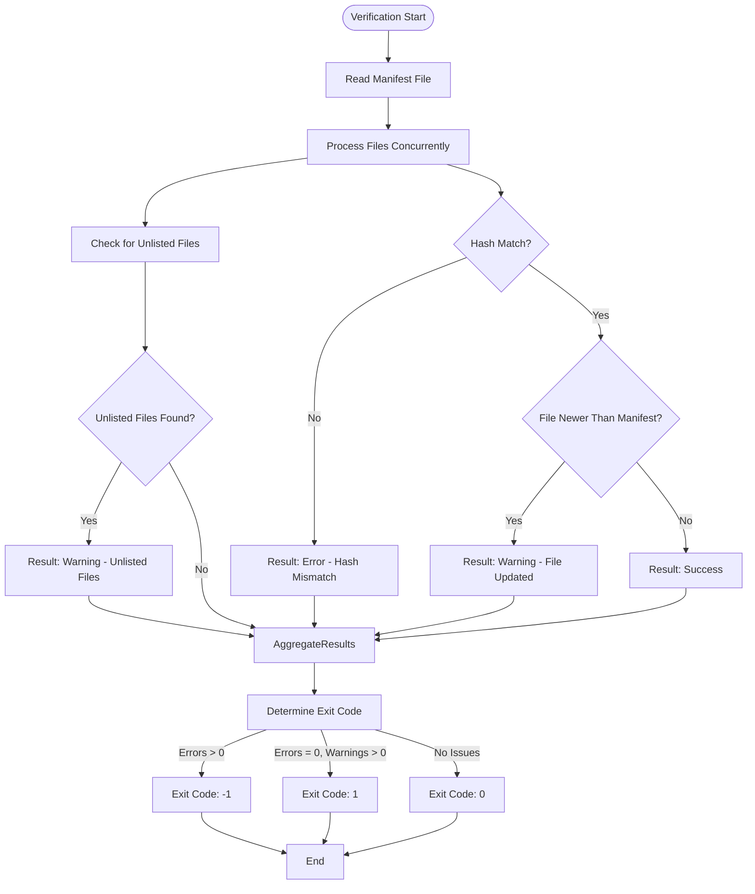
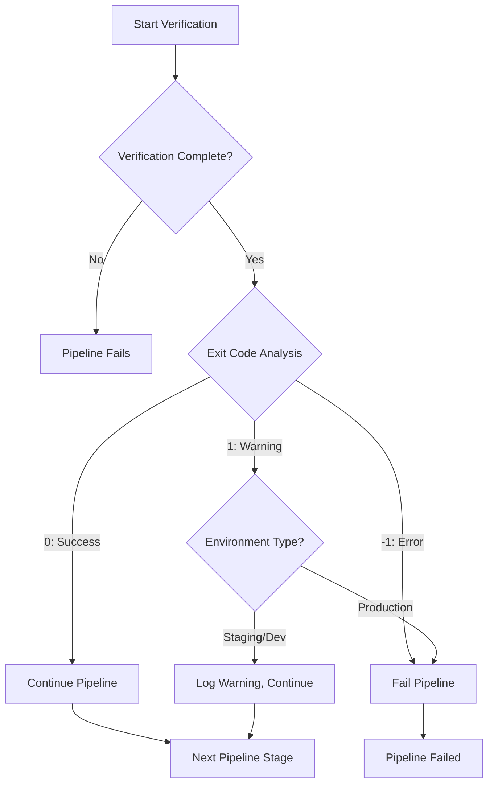

# CI/CD Pipeline Integration


## Table of Contents
1. [Introduction](#introduction)
2. [Exit Code Semantics for Pipeline Control](#exit-code-semantics-for-pipeline-control)
3. [Cake Build Integration Example](#cake-build-integration-example)
4. [Pipeline Configuration Examples](#pipeline-configuration-examples)
5. [Fail-Fast vs Continue-on-Warning Strategies](#fail-fast-vs-continue-on-warning-strategies)
6. [Secure Manifest Management](#secure-manifest-management)
7. [Pull Request Validation](#pull-request-validation)
8. [Conclusion](#conclusion)

## Introduction
Verity is a high-performance file integrity verification tool designed for seamless integration into CI/CD pipelines. This document details how to leverage Verity's capabilities within automation platforms such as GitHub Actions, Azure Pipelines, and Jenkins. The tool's design emphasizes automation-friendly features including standardized exit codes, machine-readable output formats, and robust command-line interface for reliable pipeline orchestration.

**Section sources**
- [README.md](file://README.md#L1-L21)

## Exit Code Semantics for Pipeline Control

Verity uses a comprehensive exit code system to communicate verification outcomes to CI/CD systems, enabling precise control flow decisions:

* **0**: Success (no warnings or errors)
* **1**: Warning (warnings present, no errors)
* **-1**: Error (one or more errors detected)
* **-2**: Canceled by user

These exit codes are determined by the `FinalSummary` object which aggregates verification results. The exit code logic is implemented in the `RunVerification` method in `Program.cs`:


```csharp
if (summary.ErrorCount > 0) return -1;
if (summary.WarningCount > 0) return 1;
return 0;
```


The classification of results into success, warning, and error states is performed by the `StatusClassifier` class. Warnings are issued for conditions like newer files (potential updates) or unlisted files, while errors indicate critical issues such as hash mismatches or missing files.





**Diagram sources**
- [Program.cs](file://Verity/Program.cs#L350-L360)
- [VerificationService.cs](file://Verity/Services/VerificationService.cs#L181-L193)

**Section sources**
- [Program.cs](file://Verity/Program.cs#L350-L360)
- [Models.cs](file://Verity/Models.cs#L35-L40)
- [README.md](file://README.md#L97-L133)

## Cake Build Integration Example

The `build.cake` file provides a real-world example of integrating Verity into a Cake-based build system. This build script orchestrates the complete pipeline including compilation, testing, packaging, and artifact creation.


```csharp
Task("Package")
    .IsDependentOn("AOT-Compile")
    .IsDependentOn("Run-Tests")
    .Does(() => {
    // Get version information from Nerdbank.GitVersioning
    var versionJson = StartProcessAndReadOutput("nbgv", "get-version --format json");
    dynamic versionInfo = ParseJson(versionJson);
    string packageVersion = versionInfo.NuGetPackageVersion;

    // Get current Git branch name
    var branchName = EnvironmentVariable("GITHUB_REF_NAME");
    if (string.IsNullOrEmpty(branchName))
    {
        branchName = StartProcessAndReadOutput("git", "rev-parse --abbrev-ref HEAD");
    }

    // Create package with version and branch information
    EnsureDirectoryExists(artifactsDir);
    var packageFileName = $"{projectName}-v{packageVersion}";
    if (!string.Equals(branchName, "main", StringComparison.OrdinalIgnoreCase))
    {
        packageFileName += $"-{branchName}";
    }
    packageFileName += ".zip";
    
    // Create zip package
    var outputPath = artifactsDir + Directory(packageFileName);
    var filesToZip = GetFiles($"{publishDir}/*.*");
    Zip(publishDir, outputPath.ToString(), filesToZip.ToArray());
});
```


The `Run-Tests` task demonstrates how Verity can be used to validate its own functionality by creating and verifying manifests with different hashing algorithms:


```csharp
Task("Run-Tests")
.Does(() => {
   var verityExe = System.IO.Path.Combine(Directory("./Verity/bin")
   + Directory(configuration) + Directory("net9.0"), "Verity.exe");
   
   var algorithms = new[] {
      new { Name = "SHA256", Ext = ".sha256" },
      new { Name = "MD5", Ext = ".md5" },
      new { Name = "SHA1", Ext = ".sha1" }
   };

   foreach (var algo in algorithms) {
      // Create test environment
      var testRoot = System.IO.Path.Combine(System.IO.Path.GetTempPath(), $"verity-test-{Guid.NewGuid()}");
      System.IO.Directory.CreateDirectory(testRoot);

      // Create test files
      var file1 = System.IO.Path.Combine(testRoot, "file1.txt");
      var file2 = System.IO.Path.Combine(testRoot, "subdir/file2.txt");
      System.IO.File.WriteAllText(file1, "Hello World");
      System.IO.File.WriteAllText(file2, "Cake Test");

      // Execute Verity commands
      var manifestPath = System.IO.Path.Combine(testRoot, $"manifest{algo.Ext}");
      var createResult = StartProcess(verityExe, $"create {manifestPath} --root {testRoot}");
      var verifyResult = StartProcess(verityExe, $"verify {manifestPath} --root {testRoot}");
      
      // Validate results
      if (createResult != 0) {
         Error($"[FAIL] Manifest creation failed for {algo.Name}");
      }
      if (verifyResult != 0) {
         Error($"[FAIL] Manifest verification failed for {algo.Name}");
      }
   }
});
```


This integration pattern can be adapted for any CI/CD platform by translating the Cake syntax to the target platform's configuration format.

**Section sources**
- [build.cake](file://build.cake#L1-L209)

## Pipeline Configuration Examples

### GitHub Actions Configuration

```yaml
name: Build and Verify
on: [push, pull_request]
jobs:
  build:
    runs-on: windows-latest
    steps:
    - uses: actions/checkout@v4
    
    - name: Setup .NET 9
      uses: actions/setup-dotnet@v4
      with:
        dotnet-version: '9.0.x'
    
    - name: Restore tools
      run: dotnet tool restore
    
    - name: Build with Cake
      run: dotnet cake --target=Build
    
    - name: Create integrity manifest
      run: dotnet cake --target=Create-Manifest
      env:
        GITHUB_REF_NAME: ${{ github.ref_name }}
    
    - name: Verify artifact integrity
      run: |
        ./Verity/Verity.exe verify artifacts/manifest.sha256 --tsv-report verification-report.tsv
        if ($LASTEXITCODE -eq -1) {
          Write-Error "Verification failed with errors"
          exit 1
        }
      continue-on-error: true
    
    - name: Upload verification report
      if: failure()
      uses: actions/upload-artifact@v4
      with:
        name: verification-report
        path: verification-report.tsv
```


### Azure Pipelines Configuration

```yaml
trigger:
- main
- develop

pool:
  vmImage: 'windows-latest'

variables:
  solution: '**/*.sln'
  buildPlatform: 'Any CPU'
  buildConfiguration: 'Release'

steps:
- task: DotNetCoreCLI@2
  displayName: 'Restore tools'
  inputs:
    command: 'custom'
    custom: 'tool'
    arguments: 'restore'

- task: Cake@1
  displayName: 'Run Cake Build'
  inputs:
    target: 'Package'
    verbosity: 'Normal'

- script: |
    .\Verity\Verity.exe create $(Build.ArtifactStagingDirectory)\manifest.sha256 --root $(Build.ArtifactStagingDirectory)
    exitCode=$?
    if [ $exitCode -eq -1 ]; then
      echo "##vso[task.logissue type=error]Manifest creation failed"
      exit 1
    fi
  displayName: 'Create Integrity Manifest'

- script: |
    .\Verity\Verity.exe verify $(Build.ArtifactStagingDirectory)\manifest.sha256 --tsv-report $(Build.ArtifactStagingDirectory)\verification-report.tsv
    echo "Verification exit code: $?"
  displayName: 'Verify Artifact Integrity'
  continueOnError: true

- task: PublishBuildArtifacts@1
  displayName: 'Publish Artifacts'
  inputs:
    PathtoPublish: '$(Build.ArtifactStagingDirectory)'
    ArtifactName: 'drop'
    publishLocation: 'Container'
```


### Jenkins Pipeline Configuration

```groovy
pipeline {
    agent { label 'windows' }
    
    stages {
        stage('Build') {
            steps {
                powershell '''
                    dotnet tool restore
                    dotnet cake --target=Build
                '''
            }
        }
        
        stage('Test') {
            steps {
                powershell 'dotnet test --configuration Release'
            }
        }
        
        stage('Package') {
            steps {
                powershell 'dotnet cake --target=Package'
            }
        }
        
        stage('Verify Artifacts') {
            steps {
                script {
                    def exitCode = powershell(
                        script: '''
                            $result = & ".\\Verity\\Verity.exe" verify "artifacts\\manifest.sha256" --tsv-report "artifacts\\verification-report.tsv"
                            exit $LASTEXITCODE
                        ''',
                        returnStatus: true
                    )
                    
                    if (exitCode == -1) {
                        error("Artifact verification failed with errors")
                    }
                    else if (exitCode == 1) {
                        echo "Verification completed with warnings"
                    }
                }
            }
            post {
                always {
                    archiveArtifacts artifacts: 'artifacts/verification-report.tsv', allowEmptyArchive: true
                }
            }
        }
    }
    
    post {
        success {
            echo 'Pipeline completed successfully'
        }
        failure {
            echo 'Pipeline failed'
        }
    }
}
```


**Section sources**
- [build.cake](file://build.cake#L1-L209)
- [README.md](file://README.md#L49-L96)

## Fail-Fast vs Continue-on-Warning Strategies

Verity's distinct exit codes enable flexible pipeline strategies for handling verification results:

### Fail-Fast Strategy
In a fail-fast approach, any verification issue causes immediate pipeline termination. This is appropriate for production deployments where integrity is paramount.


```yaml
- name: Verify production artifacts
  run: |
    ./Verity/Verity.exe verify production-manifest.sha256 --root ./artifacts
    # Any non-zero exit code fails the step
```


### Continue-on-Warning Strategy
For development or staging environments, pipelines may continue execution even with warnings, allowing teams to address non-critical issues without blocking deployment.


```yaml
- name: Verify staging artifacts
  run: |
    ./Verity/Verity.exe verify staging-manifest.sha256 --root ./artifacts --tsv-report report.tsv
    exit_code=$?
    if [ $exit_code -eq -1 ]; then
      echo "##vso[task.logissue type=error]Verification failed with errors"
      exit 1
    elif [ $exit_code -eq 1 ]; then
      echo "##vso[task.logissue type=warning]Verification completed with warnings"
      # Continue pipeline execution
    fi
```


The decision between these strategies depends on the environment and risk tolerance. Production pipelines should typically use fail-fast for errors (exit code -1), while allowing warnings (exit code 1) in non-production environments.





**Diagram sources**
- [Program.cs](file://Verity/Program.cs#L350-L360)
- [README.md](file://README.md#L97-L133)

**Section sources**
- [Program.cs](file://Verity/Program.cs#L350-L360)
- [ResultsPresenter.cs](file://Verity/Utilities/ResultsPresenter.cs#L99-L130)

## Secure Manifest Management

Proper handling of manifests in version control and artifact storage is critical for maintaining integrity throughout the CI/CD pipeline.

### Version Control Practices
Manifests should not be stored in version control alongside source code, as this creates a potential security vulnerability. Instead, manifests should be generated during the build process and stored with the artifacts.


```bash
# .gitignore
/artifacts/
/manifests/
*.sha256
*.md5
*.sha1
```


### Artifact Storage Integration
When storing artifacts in repositories like Azure Artifacts, NuGet, or S3, the manifest should be packaged with the artifacts:


```csharp
// In build.cake
Task("Package-With-Manifest")
.Does(() => {
    // Create the artifact package
    Zip(publishDir, outputPath.ToString(), filesToZip.ToArray());
    
    // Generate integrity manifest
    StartProcess(verityExe, $"create {outputPath}.sha256 --root {outputPath}");
    
    // Both the package and manifest are published as artifacts
});
```


### Secure Distribution
For public distribution, multiple manifests with different algorithms provide defense in depth:


```bash
# Generate multiple manifests with different algorithms
./Verity/Verity.exe create package.zip.sha256 --algorithm SHA256 --root package.zip
./Verity/Verity.exe create package.zip.sha512 --algorithm SHA512 --root package.zip
./Verity/Verity.exe create package.zip.blake3 --algorithm BLAKE3 --root package.zip
```


Consumers can verify integrity using any of the provided manifests, reducing the risk associated with potential cryptographic weaknesses in any single algorithm.

**Section sources**
- [build.cake](file://build.cake#L1-L209)
- [README.md](file://README.md#L49-L96)

## Pull Request Validation

Verity can be integrated into pull request validation workflows to prevent unverified binaries from being merged into the codebase.

### GitHub Actions Pull Request Workflow

```yaml
name: PR Validation
on: pull_request

jobs:
  validate-binaries:
    runs-on: ubuntu-latest
    steps:
    - uses: actions/checkout@v4
    
    - name: Scan for binaries
      id: scan-binaries
      run: |
        # Find all binary files that might need verification
        binaries=$(find . -type f -name "*.exe" -o -name "*.dll" -o -name "*.so" -o -name "*.dylib" | grep -v "/node_modules/" | grep -v "/.git/")
        echo "binaries=$binaries" >> $GITHUB_OUTPUT
        
    - name: Verify binary integrity
      if: steps.scan-binaries.outputs.binaries != ''
      run: |
        # Check if manifest exists for the PR
        if [ -f "pr-manifests/pr-${{ github.event.number }}.sha256" ]; then
          ./Verity/Verity.exe verify pr-manifests/pr-${{ github.event.number }}.sha256
          if [ $? -ne 0 ]; then
            echo "Binary integrity verification failed"
            exit 1
          fi
        else
          echo "No manifest found for PR ${{ github.event.number }}"
          echo "Please generate a manifest for your changes"
          exit 1
        fi
```


### Pre-Commit Hook Example
A pre-commit hook can ensure that manifests are updated when binaries change:


```bash
#!/bin/bash
# .git/hooks/pre-commit

# Check for modified binaries
BINARIES=$(git diff --cached --name-only --diff-filter=AM | grep -E '\.(exe|dll|so|dylib)$')

if [ -n "$BINARIES" ]; then
    echo "Binary files have been modified:"
    echo "$BINARIES"
    
    # Check if manifest needs update
    if ./Verity/Verity.exe create manifest.sha256 --root .; then
        git add manifest.sha256
        echo "Updated integrity manifest"
    else
        echo "Failed to update integrity manifest"
        exit 1
    fi
fi

exit 0
```


This approach ensures that every change to binaries is accompanied by an updated integrity manifest, providing traceability and verification throughout the development process.

**Section sources**
- [build.cake](file://build.cake#L1-L209)
- [Program.cs](file://Verity/Program.cs#L82-L106)

## Conclusion
Verity provides a robust foundation for ensuring artifact integrity throughout CI/CD pipelines. Its automation-friendly design, with standardized exit codes and machine-readable output, enables reliable integration with common automation platforms. By leveraging the examples and strategies outlined in this document, teams can implement comprehensive integrity verification that enhances security and reliability across their software delivery lifecycle. The combination of fail-fast error handling, flexible warning management, and secure manifest practices ensures that Verity can be effectively deployed in environments ranging from development to production.

**Referenced Files in This Document**   
- [build.cake](file://build.cake)
- [Program.cs](file://Verity/Program.cs)
- [Models.cs](file://Verity/Models.cs)
- [VerificationService.cs](file://Verity/Services/VerificationService.cs)
- [ResultsPresenter.cs](file://Verity/Utilities/ResultsPresenter.cs)
- [README.md](file://README.md)