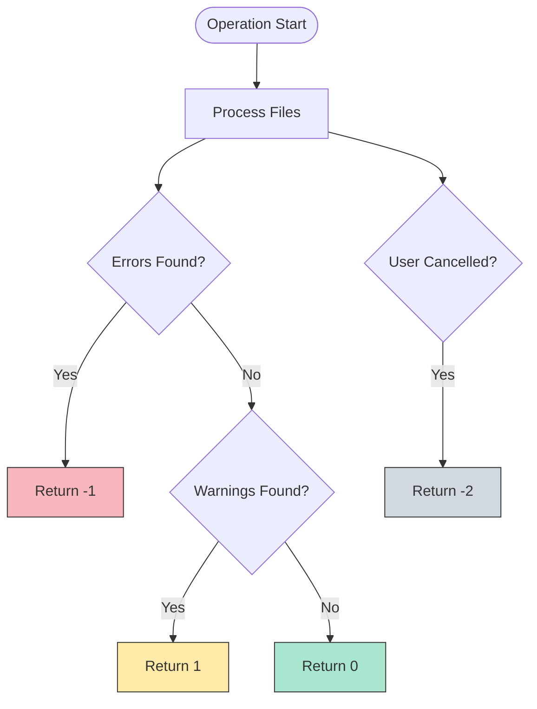
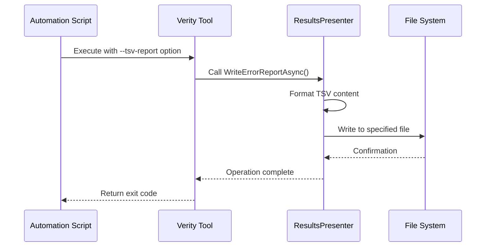
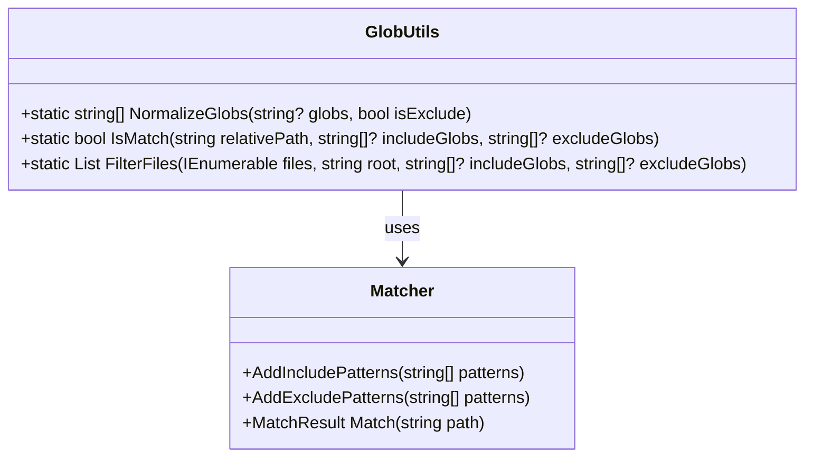
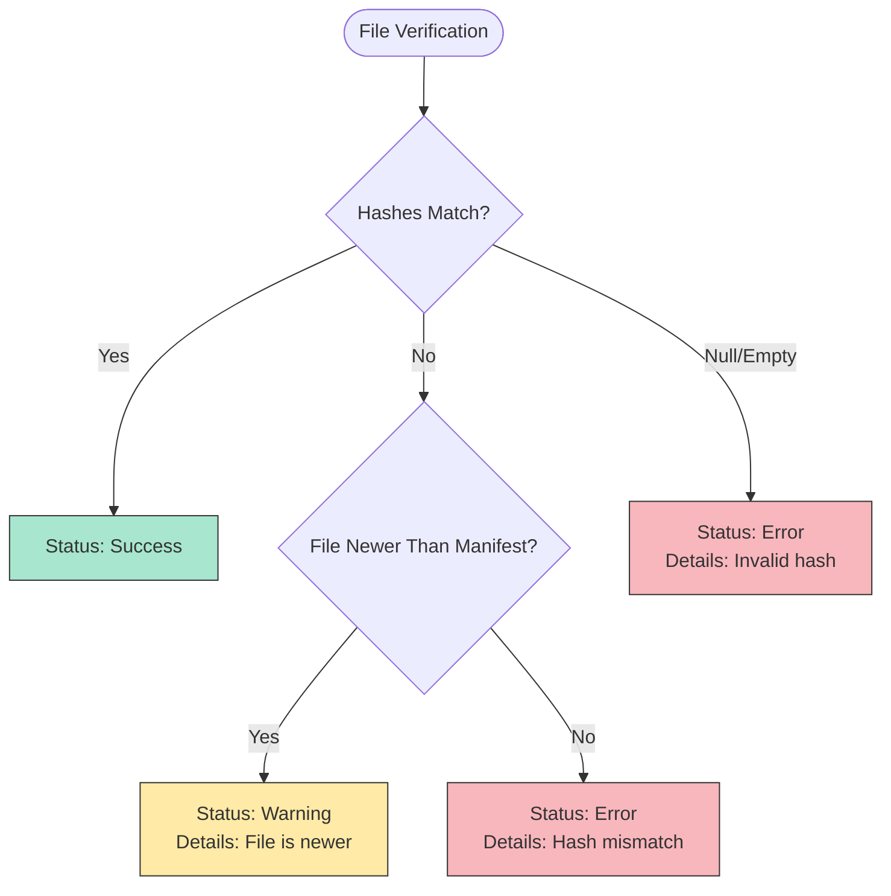

# Scripting and Automation Examples


## Table of Contents
1. [Introduction](#introduction)
2. [Core Automation Features](#core-automation-features)
3. [Exit Code Handling](#exit-code-handling)
4. [TSV Report Generation and Parsing](#tsv-report-generation-and-parsing)
5. [Glob Pattern Filtering](#glob-pattern-filtering)
6. [Practical Scripting Examples](#practical-scripting-examples)
7. [Error Handling Patterns](#error-handling-patterns)
8. [Conclusion](#conclusion)

## Introduction
Verity is a high-performance file integrity verification and manifest management tool designed for robust automation in various environments. This document provides comprehensive scripting examples demonstrating how to automate Verity for common use cases such as nightly backup verification, incremental manifest updates, and long-term archive health checks. The examples cover PowerShell, Bash, and Windows batch scripting, highlighting the use of machine-readable TSV output, exit codes, and flexible glob pattern filtering for creating reusable automation workflows.

## Core Automation Features
Verity provides several key features that make it ideal for automation scenarios:
- **Distinct exit codes** for different operational outcomes
- **Machine-readable TSV reports** for programmatic analysis
- **Flexible glob pattern filtering** for precise file selection
- **Parallel processing** for optimal performance
- **Self-contained executable** with no external dependencies

These features enable the creation of robust scripts that can be integrated into larger automation pipelines and monitoring systems.

**Section sources**
- [Program.cs](file://Verity/Program.cs#L1-L50)
- [README.md](file://README.md#L1-L50)

## Exit Code Handling
Verity uses a comprehensive exit code system to communicate the outcome of operations to calling scripts, enabling automated decision-making based on verification results.





**Diagram sources**
- [Program.cs](file://Verity/Program.cs#L250-L259)
- [README.md](file://README.md#L100-L110)

The exit codes are defined as follows:
- `0`: Success (no warnings or errors)
- `1`: Warning (warnings present, no errors)
- `-1`: Error (errors found)
- `-2`: Operation canceled by user

These exit codes allow scripts to implement appropriate error handling and notification logic based on the verification outcome.

**Section sources**
- [Program.cs](file://Verity/Program.cs#L250-L259)
- [README.md](file://README.md#L100-L110)

## TSV Report Generation and Parsing
Verity can generate machine-readable TSV (Tab-Separated Values) reports that contain detailed information about verification issues, enabling further processing and analysis in subsequent script stages.

### TSV Report Structure
The TSV report format includes a header row (prefixed with `#`) and data rows with the following columns:

| Column | Description |
|--------|-------------|
| `Status` | Status of the verification (`ERROR` or `WARNING`) |
| `File` | Relative path to the file |
| `Details` | Description of the issue |
| `ExpectedHash` | Expected hash from the manifest |
| `ActualHash` | Computed hash of the file |

### Report Generation Process




**Diagram sources**
- [ResultsPresenter.cs](file://Verity/Utilities/ResultsPresenter.cs#L99-L130)
- [Program.cs](file://Verity/Program.cs#L240-L250)

### TSV Report Parsing
The repository includes a TSV report parser that can be used as a reference for implementing custom report analysis:


```csharp
public static class TsvReportParser
{
  public static List<TsvReportRow> Parse(string tsvContent)
  {
    var rows = new List<TsvReportRow>();
    var lines = tsvContent.Split(['\r', '\n'], StringSplitOptions.RemoveEmptyEntries);
    var dataLines = lines.Where(l => !l.StartsWith('#'));
    foreach (var line in dataLines) {
      var parts = line.Split('\t');
      if (parts.Length == 5) {
        rows.Add(new TsvReportRow(
            Status: parts[0],
            File: parts[1],
            Details: parts[2],
            ExpectedHash: parts[3],
            ActualHash: parts[4]
        ));
      }
    }
    return rows;
  }
}
```


This parsing logic can be adapted to various scripting languages for post-processing verification results.

**Section sources**
- [ResultsPresenter.cs](file://Verity/Utilities/ResultsPresenter.cs#L99-L130)
- [TsvReportParser.cs](file://Verity.Tests/TsvReportParser.cs#L5-L24)

## Glob Pattern Filtering
Verity supports flexible file selection through glob pattern filtering, allowing scripts to target specific file types and directories.

### Glob Pattern Processing




**Diagram sources**
- [GlobUtils.cs](file://Verity/Utilities/GlobUtils.cs#L5-L47)

The `GlobUtils` class provides three key methods for pattern handling:
- `NormalizeGlobs`: Converts semicolon-separated glob strings into arrays
- `IsMatch`: Determines if a file matches the include/exclude patterns
- `FilterFiles`: Filters a list of files based on glob patterns

Glob patterns support:
- Multiple patterns separated by semicolons (`;`)
- Directory globs (e.g., `docs/**/*.md`)
- Default inclusion of all files when no include pattern is specified
- Case-insensitive matching

**Section sources**
- [GlobUtils.cs](file://Verity/Utilities/GlobUtils.cs#L5-L47)
- [README.md](file://README.md#L80-L95)

## Practical Scripting Examples
This section provides fully working scripts for common automation scenarios.

### PowerShell: Automated Nightly Backup Verification

```powershell
# nightly-verification.ps1
param(
    [Parameter(Mandatory=$true)]
    [string]$ManifestPath,
    
    [Parameter(Mandatory=$true)]
    [string]$OutputReport,
    
    [string]$IncludePatterns = "*.docx;*.xlsx;*.pptx",
    [string]$ExcludePatterns = "*.tmp;*.bak",
    [string]$RootDirectory = $(Split-Path $ManifestPath -Parent)
)

$ErrorActionPreference = 'Stop'

# Define paths
$verityPath = "$PSScriptRoot\artifacts\Verity.exe"
$timestamp = Get-Date -Format "yyyy-MM-dd_HH-mm-ss"
$localReport = "$OutputReport\verification_$timestamp.tsv"

try {
    # Execute Verity with TSV report output
    & $verityPath verify $ManifestPath `
        --root $RootDirectory `
        --include $IncludePatterns `
        --exclude $ExcludePatterns `
        --tsv-report $localReport
    
    $exitCode = $LASTEXITCODE
    
    switch ($exitCode) {
        0 {
            Write-Host "Verification completed successfully. No issues found."
            exit 0
        }
        1 {
            Write-Warning "Verification completed with warnings."
            # Parse TSV report to generate alert
            if (Test-Path $localReport) {
                $issues = Import-Csv $localReport -Delimiter "`t" -Header Status,File,Details,ExpectedHash,ActualHash | Select-Object -Skip 1
                $warningCount = ($issues | Where-Object { $_.Status -eq "WARNING" }).Count
                Write-Warning "Found $warningCount warning(s):"
                $issues | Where-Object { $_.Status -eq "WARNING" } | ForEach-Object {
                    Write-Warning "File: $($_.File) - $($_.Details)"
                }
            }
            exit 1
        }
        -1 {
            Write-Error "Verification failed with errors."
            # Parse TSV report to generate critical alert
            if (Test-Path $localReport) {
                $issues = Import-Csv $localReport -Delimiter "`t" -Header Status,File,Details,ExpectedHash,ActualHash | Select-Object -Skip 1
                $errorCount = ($issues | Where-Object { $_.Status -eq "ERROR" }).Count
                Write-Error "Found $errorCount error(s):"
                $issues | Where-Object { $_.Status -eq "ERROR" } | ForEach-Object {
                    Write-Error "File: $($_.File) - $($_.Details)"
                }
            }
            exit -1
        }
        -2 {
            Write-Error "Verification was canceled by user."
            exit -2
        }
        default {
            Write-Error "Unknown exit code: $exitCode"
            exit $exitCode
        }
    }
}
catch {
    Write-Error "Verification failed: $($_.Exception.Message)"
    exit -1
}
```


### Bash: Incremental Manifest Updates in Deployment Pipelines

```bash
#!/bin/bash
# incremental-update.sh
set -euo pipefail

# Configuration
MANIFEST_PATH="${1:-}"
SOURCE_DIR="${2:-}"
INCLUDE_PATTERNS="${3:-*.jar;*.war;*.zip}"
EXCLUDE_PATTERNS="${4:-target/*.jar;*.log}"
REPORT_FILE="${5:-update-report.tsv}"
VERITY_PATH="./artifacts/Verity"

# Validate inputs
if [ -z "$MANIFEST_PATH" || -z "$SOURCE_DIR" ](./-z _$MANIFEST_PATH_ __ -z _$SOURCE_DIR_.md); then
    echo "Usage: $0 <manifest_path> <source_dir> [include_patterns] [exclude_patterns] [report_file]"
    exit 1
fi

if [ ! -f "$MANIFEST_PATH" ](./! -f _$MANIFEST_PATH_.md); then
    echo "Error: Manifest file not found: $MANIFEST_PATH"
    exit 1
fi

if [ ! -d "$SOURCE_DIR" ](./! -d _$SOURCE_DIR_.md); then
    echo "Error: Source directory not found: $SOURCE_DIR"
    exit 1
fi

# Create directory for report if it doesn't exist
REPORT_DIR=$(dirname "$REPORT_FILE")
mkdir -p "$REPORT_DIR"

# Execute Verity add command
echo "Updating manifest: $MANIFEST_PATH with files from $SOURCE_DIR"
"$VERITY_PATH" add "$MANIFEST_PATH" \
    --root "$SOURCE_DIR" \
    --include "$INCLUDE_PATTERNS" \
    --exclude "$EXCLUDE_PATTERNS" \
    --tsv-report "$REPORT_FILE"

EXIT_CODE=$?

# Handle exit codes
case $EXIT_CODE in
    0)
        echo "Manifest updated successfully. No issues found."
        # Check if any files were actually added
        if [ -f "$REPORT_FILE" ](./-f _$REPORT_FILE_.md) && grep -q "File exists but not in checksum list" "$REPORT_FILE"; then
            echo "New files were added to the manifest."
            # Generate deployment notification
            ADDED_FILES=$(grep "File exists but not in checksum list" "$REPORT_FILE" | cut -f2)
            echo "Added files:"
            echo "$ADDED_FILES"
        else
            echo "No new files to add."
        fi
        exit 0
        ;;
    1)
        echo "Manifest update completed with warnings."
        if [ -f "$REPORT_FILE" ](./-f _$REPORT_FILE_.md); then
            WARNING_COUNT=$(grep "^WARNING" "$REPORT_FILE" | wc -l)
            echo "Found $WARNING_COUNT warning(s):"
            grep "^WARNING" "$REPORT_FILE" | while IFS=$'\t' read -r status file details expected actual; do
                echo "File: $file - $details"
            done
        fi
        exit 1
        ;;
    -1)
        echo "Manifest update failed with errors."
        if [ -f "$REPORT_FILE" ](./-f _$REPORT_FILE_.md); then
            ERROR_COUNT=$(grep "^ERROR" "$REPORT_FILE" | wc -l)
            echo "Found $ERROR_COUNT error(s):"
            grep "^ERROR" "$REPORT_FILE" | while IFS=$'\t' read -r status file details expected actual; do
                echo "File: $file - $details"
            done
        fi
        exit -1
        ;;
    -2)
        echo "Manifest update was canceled."
        exit -2
        ;;
    *)
        echo "Unknown exit code: $EXIT_CODE"
        exit $EXIT_CODE
        ;;
esac
```


### Windows Batch: Health Checks for Long-Term Archives

```batch
@echo off
:: archive-health-check.bat
:: Parameters: %1 = Manifest path, %2 = Root directory, %3 = Report directory

setlocal enabledelayedexpansion

:: Configuration
set "MANIFEST_PATH=%~1"
set "ROOT_DIR=%~2"
set "REPORT_DIR=%~3"
set "VERITY_PATH=artifacts\Verity.exe"
set "TIMESTAMP=%date:~10%%date:~4,2%%date:~7,2%_%time:~0,2%%time:~3,2%%time:~6,2%"
set "TIMESTAMP=!TIMESTAMP: =0!"
set "REPORT_FILE=%REPORT_DIR%\health-check-!TIMESTAMP!.tsv"
set "INCLUDE_PATTERNS=*.pdf;*.txt;*.doc;*.docx"
set "EXCLUDE_PATTERNS=*.tmp;*.temp;*.log"

:: Validate inputs
if "%MANIFEST_PATH%"=="" (
    echo Error: Manifest path is required.
    echo Usage: %0 ^<manifest_path^> ^<root_directory^> ^<report_directory^>
    exit /b 1
)

if "%ROOT_DIR%"=="" (
    echo Error: Root directory is required.
    exit /b 1
)

if "%REPORT_DIR%"=="" (
    echo Error: Report directory is required.
    exit /b 1
)

:: Create report directory
if not exist "%REPORT_DIR%" mkdir "%REPORT_DIR%"

:: Execute Verity verification
echo Running archive health check on %MANIFEST_PATH%
echo Report will be saved to %REPORT_FILE%

"%VERITY_PATH%" verify "%MANIFEST_PATH%" ^
    --root "%ROOT_DIR%" ^
    --include "%INCLUDE_PATTERNS%" ^
    --exclude "%EXCLUDE_PATTERNS%" ^
    --tsv-report "%REPORT_FILE%"

set EXIT_CODE=%ERRORLEVEL%

:: Handle exit codes
if %EXIT_CODE% equ 0 (
    echo Archive health check completed successfully. No issues found.
    echo Creating success notification...
    echo Archive verified successfully at %date% %time% > "%REPORT_DIR%\SUCCESS-%TIMESTAMP%.txt"
    exit /b 0
) else if %EXIT_CODE% equ 1 (
    echo Archive health check completed with warnings.
    if exist "%REPORT_FILE%" (
        :: Count warnings
        for /f "usebackq" %%a in (`findstr /c:"WARNING" "%REPORT_FILE%" ^| find /c /v ""`) do set "WARNING_COUNT=%%a"
        echo Found !WARNING_COUNT! warning(s):
        
        :: Extract warning details
        for /f "usebackq tokens=1,2,3 delims=	" %%a in (`findstr /c:"WARNING" "%REPORT_FILE%"`) do (
            echo File: %%b - %%c
        )
        
        :: Create warning notification
        echo Archive has warnings at %date% %time% > "%REPORT_DIR%\WARNING-%TIMESTAMP%.txt"
        echo Details: >> "%REPORT_DIR%\WARNING-%TIMESTAMP%.txt"
        findstr /c:"WARNING" "%REPORT_FILE%" >> "%REPORT_DIR%\WARNING-%TIMESTAMP%.txt"
    )
    exit /b 1
) else if %EXIT_CODE% equ -1 (
    echo Archive health check failed with errors.
    if exist "%REPORT_FILE%" (
        :: Count errors
        for /f "usebackq" %%a in (`findstr /c:"ERROR" "%REPORT_FILE%" ^| find /c /v ""`) do set "ERROR_COUNT=%%a"
        echo Found !ERROR_COUNT! error(s):
        
        :: Extract error details
        for /f "usebackq tokens=1,2,3 delims=	" %%a in (`findstr /c:"ERROR" "%REPORT_FILE%"`) do (
            echo File: %%b - %%c
        )
        
        :: Create error notification
        echo Archive has critical errors at %date% %time% > "%REPORT_DIR%\ERROR-%TIMESTAMP%.txt"
        echo Details: >> "%REPORT_DIR%\ERROR-%TIMESTAMP%.txt"
        findstr /c:"ERROR" "%REPORT_FILE%" >> "%REPORT_DIR%\ERROR-%TIMESTAMP%.txt"
    )
    exit /b -1
) else if %EXIT_CODE% equ -2 (
    echo Archive health check was canceled.
    exit /b -2
) else (
    echo Unknown exit code: %EXIT_CODE%
    exit /b %EXIT_CODE%
)
```


**Section sources**
- [Program.cs](file://Verity/Program.cs#L50-L200)
- [ResultsPresenter.cs](file://Verity/Utilities/ResultsPresenter.cs#L99-L130)
- [GlobUtils.cs](file://Verity/Utilities/GlobUtils.cs#L5-L47)

## Error Handling Patterns
Verity implements comprehensive error handling to ensure reliable operation in automated environments.

### Result Classification Logic




**Diagram sources**
- [VerificationService.cs](file://Verity/Services/VerificationService.cs#L181-L193)
- [Models.cs](file://Verity/Models.cs#L28-L33)

The `StatusClassifier` determines the result status based on:
1. If either hash is null or empty → Error
2. If hashes match → Success
3. If file is newer than manifest → Warning
4. Otherwise → Error

### Diagnostic Output and Logging
Verity captures diagnostic information through multiple channels:
- **Console output**: Human-readable summary and progress
- **TSV reports**: Machine-readable detailed issues
- **Exit codes**: Programmatic success/failure indication

Scripts should capture both stdout and stderr for comprehensive logging:


```powershell
# Example of capturing diagnostic output
$logFile = "verification.log"
$tsvReport = "issues.tsv"

# Redirect stdout to log file and stderr to TSV report
& $verityPath verify $manifestPath --tsv-report $tsvReport 2>&1 | Tee-Object -FilePath $logFile

# Process based on exit code
if ($LASTEXITCODE -eq 0) {
    Write-Host "Verification successful" -ForegroundColor Green
} elseif ($LASTEXITCODE -eq 1) {
    Write-Warning "Verification completed with warnings"
    # Parse TSV report for details
} else {
    Write-Error "Verification failed"
}
```


**Section sources**
- [VerificationService.cs](file://Verity/Services/VerificationService.cs#L181-L193)
- [ResultsPresenter.cs](file://Verity/Utilities/ResultsPresenter.cs#L37-L69)
- [Models.cs](file://Verity/Models.cs#L28-L33)

## Conclusion
Verity provides a robust foundation for file integrity automation across various environments. Its combination of distinct exit codes, machine-readable TSV reports, flexible glob pattern filtering, and comprehensive error handling makes it ideal for integration into automated workflows. The scripting examples provided demonstrate how to implement common use cases such as nightly backup verification, incremental manifest updates, and long-term archive health checks. By leveraging Verity's automation-friendly features, organizations can ensure data integrity while maintaining efficient and reliable verification processes.

The key takeaways for effective Verity automation are:
1. Always handle all possible exit codes (0, 1, -1, -2)
2. Use TSV reports for detailed issue analysis and reporting
3. Leverage glob patterns for precise file selection
4. Implement proper error handling and logging
5. Parameterize scripts for reuse across different environments

These practices ensure reliable and maintainable automation scripts that can be confidently deployed in production environments.

**Referenced Files in This Document**   
- [Program.cs](file://Verity/Program.cs)
- [ResultsPresenter.cs](file://Verity/Utilities/ResultsPresenter.cs)
- [GlobUtils.cs](file://Verity/Utilities/GlobUtils.cs)
- [Models.cs](file://Verity/Models.cs)
- [VerificationService.cs](file://Verity/Services/VerificationService.cs)
- [TsvReportParser.cs](file://Verity.Tests/TsvReportParser.cs)
- [build.ps1](file://build.ps1)
- [build.sh](file://build.sh)