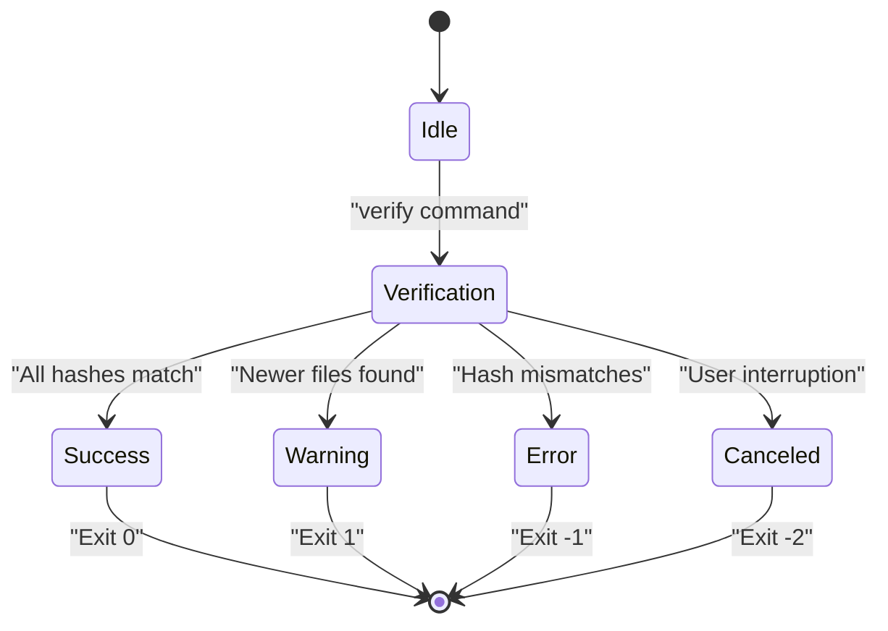
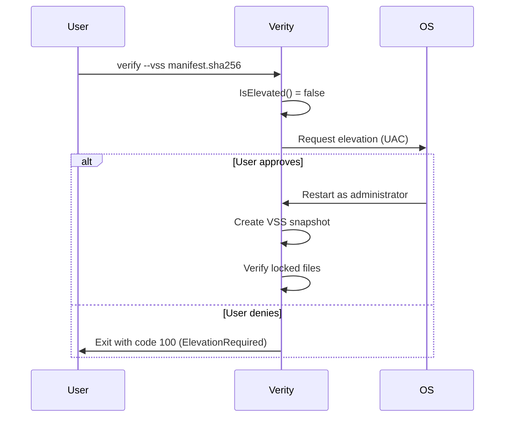

# Headless and Containerized Deployment


## Table of Contents
1. [Introduction](#introduction)
2. [Headless Execution Configuration](#headless-execution-configuration)
3. [Containerization with Docker](#containerization-with-docker)
4. [Kubernetes Integration](#kubernetes-integration)
5. [File System and Security Considerations](#file-system-and-security-considerations)
6. [Best Practices Summary](#best-practices-summary)

## Introduction

Verity is a high-performance file integrity verification tool designed for modern Windows systems, built as a self-contained .NET 9.0 AOT-compiled executable. This document provides comprehensive guidance for deploying Verity in headless environments and containerized platforms such as Docker and Kubernetes. The focus is on automation-friendly configurations, non-interactive execution patterns, and integration with orchestration systems for periodic integrity checks.

The application supports three primary commands: `verify`, `create`, and `add`, all of which can be executed without user interaction. Verity outputs structured results suitable for logging systems and returns standardized exit codes that enable integration with monitoring and health probes.

**Section sources**
- [README.md](file://README.md#L1-L213)
- [Program.cs](file://Verity/Program.cs#L1-L466)

## Headless Execution Configuration

### Command-Line Interface and Non-Interactive Mode

Verity is inherently designed for headless execution with a rich set of command-line options that eliminate the need for interactive input. The tool uses the ConsoleAppFramework and Spectre.Console libraries to provide both human-readable output and machine-parseable results.

Key command-line arguments for headless operation include:
- `--tsv-report <file>`: Outputs a machine-readable TSV report of errors and warnings
- `--include` and `--exclude`: Semicolon-separated glob patterns for file filtering
- `--threads`: Controls parallelism for performance tuning
- `--show-table`: Forces diagnostic table output regardless of result status

The application automatically suppresses interactive prompts when standard input is not a terminal, making it ideal for script-based automation.

### Exit Codes for Automation

Verity uses distinct exit codes to communicate execution outcomes, enabling integration with CI/CD pipelines and monitoring systems:

| Exit Code | Meaning | Use Case |
|---------|--------|--------|
| `0` | Success (no warnings or errors) | Healthy state, no action needed |
| `1` | Warning (warnings present, no errors) | Notify but do not fail pipeline |
| `-1` | Error (integrity violations found) | Fail pipeline, trigger alerts |
| `-2` | Canceled by user | Interrupted execution |

These exit codes allow shell scripts and orchestration tools to make decisions based on verification results.





**Diagram sources**
- [Program.cs](file://Verity/Program.cs#L150-L280)
- [ResultsPresenter.cs](file://Verity/Utilities/ResultsPresenter.cs#L99-L130)

**Section sources**
- [Program.cs](file://Verity/Program.cs#L1-L466)
- [README.md](file://README.md#L97-L133)

### Machine-Readable Output

For integration with logging and monitoring systems, Verity can generate TSV (Tab-Separated Values) reports via the `--tsv-report` option. When specified, all issues are written to the designated file in a structured format:


```
#Status	File	Details	ExpectedHash	ActualHash
ERROR	data/file1.txt	Hash mismatch	...	...
WARNING	data/file2.txt	File is newer than manifest	...	...
```


If `--tsv-report` is not specified but issues are detected, the TSV output is written to stderr, ensuring that automation systems can capture diagnostic information even without explicit file output.

**Section sources**
- [ResultsPresenter.cs](file://Verity/Utilities/ResultsPresenter.cs#L99-L130)
- [README.md](file://README.md#L100-L133)

## Containerization with Docker

### Building a Minimal Docker Image

Although no Dockerfile exists in the repository, Verity's self-contained nature makes it ideal for containerization. The following Dockerfile demonstrates how to package the AOT-compiled binary for minimal footprint:


```dockerfile
# Use a minimal Windows base image compatible with .NET 9 AOT
FROM mcr.microsoft.com/windows/servercore:ltsc2022 AS runtime

# Set working directory
WORKDIR /app

# Copy the self-contained Verity executable
COPY artifacts/Verity.exe .

# Copy any required runtime dependencies (if applicable)
# COPY artifacts/Verity.deps.json .

# Expose volumes for manifests and target files
VOLUME ["C:/manifests", "C:/targets"]

# Set entrypoint to Verity
ENTRYPOINT ["./Verity.exe"]

# Default command can be overridden at runtime
CMD ["--help"]
```


This approach results in a minimal container image containing only the executable and its immediate dependencies.

**Section sources**
- [build.sh](file://build.sh#L1-L11)
- [README.md](file://README.md#L180-L188)

### Volume Mounting Strategy

When running Verity in containers, manifests and target files should be mounted as volumes to enable access from the host system:


```bash
# Example: Verify files in a mounted directory
docker run --rm \
  -v /host/manifests:/app/manifests \
  -v /host/data:/app/data \
  verity-image \
  verify manifests/data.sha256 --root /app/data
```


The containerized Verity can access files through the mounted volumes, with paths adjusted accordingly. This pattern enables separation of concerns between the verification tool and the data being verified.

### Environment Variable Configuration

While Verity does not natively use environment variables for configuration, they can be leveraged in wrapper scripts to enhance flexibility:


```bash
#!/bin/bash
# wrapper.sh
VERITY_ROOT=${VERITY_ROOT:-/app/data}
VERITY_MANIFEST=${VERITY_MANIFEST:-manifests/checksum.sha256}
VERITY_THREADS=${VERITY_THREADS:-$(nproc)}

./Verity.exe "$VERITY_COMMAND" "$VERITY_MANIFEST" \
  --root "$VERITY_ROOT" \
  --threads "$VERITY_THREADS" \
  --tsv-report "/app/reports/$(date +%s).tsv"
```


This approach allows configuration through environment variables while maintaining compatibility with Verity's native CLI.

**Section sources**
- [Program.cs](file://Verity/Program.cs#L150-L280)
- [Models.cs](file://Verity/Models.cs#L1-L46)

## Kubernetes Integration

### Periodic Integrity Checks with CronJobs

Verity can be integrated into Kubernetes as a CronJob for periodic integrity verification:


```yaml
apiVersion: batch/v1
kind: CronJob
metadata:
  name: verity-integrity-check
spec:
  schedule: "0 2 * * *"  # Daily at 2 AM
  jobTemplate:
    spec:
      template:
        spec:
          containers:
          - name: verity
            image: registry/verity:latest
            command:
            - verify
            - manifests/prod-data.sha256
            - --root
            - /data
            - --tsv-report
            - /reports/integrity-report.tsv
            volumeMounts:
            - name: data-volume
              mountPath: /data
            - name: manifests-volume
              mountPath: /manifests
            - name: reports-volume
              mountPath: /reports
          volumes:
          - name: data-volume
            persistentVolumeClaim:
              claimName: data-pvc
          - name: manifests-volume
            configMap:
              name: verity-manifests
          - name: reports-volume
            persistentVolumeClaim:
              claimName: reports-pvc
          restartPolicy: OnFailure
```


The CronJob automatically executes integrity checks according to schedule, with results stored in persistent storage for analysis.

### Health Probes Using Exit Codes

Kubernetes liveness and readiness probes can leverage Verity's exit codes to determine pod health:


```yaml
livenessProbe:
  exec:
    command:
    - sh
    - -c
    - |
      ./Verity.exe verify manifests/health-check.sha256 --root /app/health-data
      # Exit code 0 = healthy, non-zero = unhealthy
  initialDelaySeconds: 30
  periodSeconds: 60
  failureThreshold: 3
```


This pattern treats file integrity as a health indicator, restarting pods when critical files are modified or corrupted.

**Section sources**
- [Program.cs](file://Verity/Program.cs#L150-L280)
- [README.md](file://README.md#L97-L133)

## File System and Security Considerations

### VSS Mode and Privilege Requirements

Verity supports Volume Shadow Copy (VSS) mode via the `--vss` flag, which allows access to locked files by creating volume snapshots. This feature requires administrator privileges:





**Diagram sources**
- [ElevationHelper.cs](file://Verity/Utilities/ElevationHelper.cs#L1-L100)
- [VssSnapshotManager.cs](file://Verity/Utilities/VssSnapshotManager.cs#L1-L36)

In containerized environments, VSS mode presents challenges:
- Requires Windows containers with elevated privileges
- Needs access to VSS service on the host
- May not be available in all container orchestration environments

For most container use cases, it's recommended to ensure files are not locked during verification rather than using VSS mode.

### File System Permissions in Containers

When running Verity in containers, proper file system permissions are critical:

1. The container user must have read access to mounted volumes
2. For manifest creation, write access to the output directory is required
3. On Linux containers, consider UID/GID mapping to avoid permission issues

Best practices include:
- Running containers with the minimal required privileges
- Using dedicated service accounts with limited permissions
- Mounting volumes with appropriate read/write permissions
- Avoiding root privileges unless absolutely necessary (e.g., for VSS)

The `ElevationHelper` class manages privilege escalation on Windows, but in container environments, privileges should be configured at deployment time rather than requested interactively.

**Section sources**
- [ElevationHelper.cs](file://Verity/Utilities/ElevationHelper.cs#L1-L100)
- [VerificationService.cs](file://Verity/Services/VerificationService.cs#L1-L206)
- [ManifestWriter.cs](file://Verity/Utilities/ManifestWriter.cs#L1-L31)

## Best Practices Summary

1. **Use TSV reporting** for machine-readable output in automated environments
2. **Leverage exit codes** for pipeline integration and health checks
3. **Mount manifests and data** as volumes in containerized deployments
4. **Avoid interactive features** by providing all necessary parameters via command line
5. **Schedule periodic checks** using Kubernetes CronJobs or similar orchestration tools
6. **Design health probes** around Verity's exit codes for self-healing systems
7. **Minimize container privileges** and avoid VSS mode when possible
8. **Handle file locking** through operational procedures rather than relying on VSS in containers
9. **Store reports persistently** for audit and analysis purposes
10. **Test configurations thoroughly** in staging environments before production deployment

By following these practices, Verity can be effectively deployed in headless and containerized environments for robust file integrity monitoring.

**Section sources**
- [README.md](file://README.md#L1-L213)
- [Program.cs](file://Verity/Program.cs#L1-L466)
- [ResultsPresenter.cs](file://Verity/Utilities/ResultsPresenter.cs#L1-L130)

**Referenced Files in This Document**   
- [Program.cs](file://Verity/Program.cs)
- [ResultsPresenter.cs](file://Verity/Utilities/ResultsPresenter.cs)
- [ElevationHelper.cs](file://Verity/Utilities/ElevationHelper.cs)
- [VssSnapshotManager.cs](file://Verity/Utilities/VssSnapshotManager.cs)
- [VerificationService.cs](file://Verity/Services/VerificationService.cs)
- [ManifestCreationService.cs](file://Verity/Services/ManifestCreationService.cs)
- [ManifestReader.cs](file://Verity/Utilities/ManifestReader.cs)
- [ManifestWriter.cs](file://Verity/Utilities/ManifestWriter.cs)
- [Models.cs](file://Verity/Models.cs)
- [build.sh](file://build.sh)
- [README.md](file://README.md)