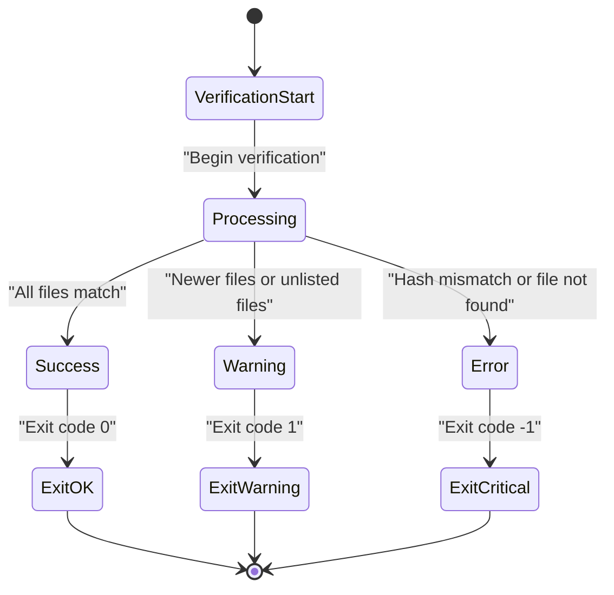
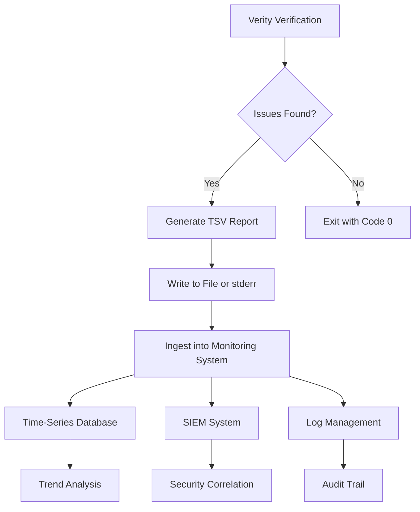
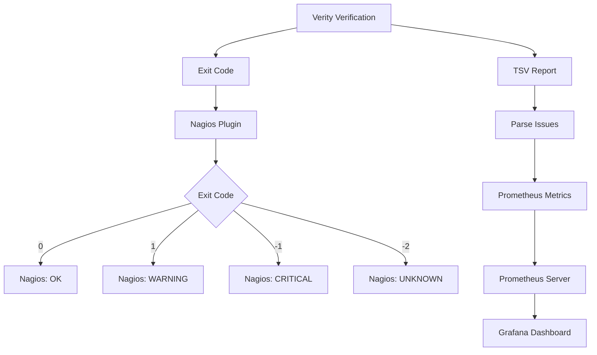

# Monitoring and Compliance Integration


## Table of Contents
1. [Verification Outcomes and Monitoring States](#verification-outcomes-and-monitoring-states)
2. [TSV Report Format for System Integration](#tsv-report-format-for-system-integration)
3. [Parsing TSV Output for Custom Metrics](#parsing-tsv-output-for-custom-metrics)
4. [Integration with Monitoring Systems](#integration-with-monitoring-systems)
5. [Compliance Framework Integration](#compliance-framework-integration)
6. [Tamper-Evident Logging and Immutable Records](#tamper-evident-logging-and-immutable-records)

## Verification Outcomes and Monitoring States

Verity implements a clear mapping between verification outcomes and monitoring system states, enabling seamless integration with external monitoring tools. The application uses a three-tier status classification system defined in the `ResultStatus` enum, which directly corresponds to standard monitoring states.

The `ResultStatus` enum defines three possible outcomes for file verification:
- **Success**: File integrity is verified and matches the expected hash
- **Warning**: Potential issue detected (e.g., file newer than manifest, unlisted file)
- **Error**: Critical failure (e.g., hash mismatch, file not found)

These outcomes map directly to standard monitoring states used by systems like Prometheus, Grafana, and Nagios:

| Verification Outcome | Monitoring State | Exit Code | Description |
|----------------------|------------------|-----------|-------------|
| `Success` | `OK` | `0` | All files verified successfully with no issues |
| `Warning` | `Warning` | `1` | Non-critical issues detected, but no errors |
| `Error` | `Critical` | `-1` | Critical errors detected during verification |
| `Canceled` | `Unknown` | `-2` | Verification process was canceled by user |

This mapping is implemented in the program's exit logic, where the final summary's error and warning counts determine the process exit code. When errors are present, the application returns `-1` (Critical); when only warnings exist, it returns `1` (Warning); and when no issues are found, it returns `0` (OK).





**Diagram sources**
- [Models.cs](file://Verity/Models.cs#L30-L35)
- [ResultsPresenter.cs](file://Verity/Utilities/ResultsPresenter.cs#L37-L69)

**Section sources**
- [Models.cs](file://Verity/Models.cs#L30-L35)
- [README.md](file://README.md#L97-L133)

## TSV Report Format for System Integration

Verity's TSV (Tab-Separated Values) report format provides a machine-readable output that enables ingestion into time-series databases, SIEM systems, and other monitoring platforms for trend analysis and long-term data integrity monitoring.

The TSV report is generated when issues (warnings or errors) are detected during verification and can be written to a specified file using the `--tsv-report` option or to `stderr` if no file is specified. The report follows a standardized format with a header row prefixed with `#` and subsequent data rows containing detailed information about each issue.

**TSV Report Structure:**

| Column | Description | Example Value |
|-------|-------------|---------------|
| `Status` | Verification status (`ERROR` or `WARNING`) | `ERROR` |
| `File` | Relative path to the problematic file | `data/file1.txt` |
| `Details` | Description of the issue | `Hash mismatch` |
| `ExpectedHash` | Expected hash from manifest | `a1b2c3d4...` |
| `ActualHash` | Computed hash of the file | `e5f6g7h8...` |

The structured nature of this format makes it ideal for ingestion into various systems:
- **Time-series databases**: Metrics can be extracted and stored with timestamps for trend analysis
- **SIEM systems**: Security events can be correlated with other security data for comprehensive monitoring
- **Log management platforms**: Reports can be indexed and searched for audit purposes
- **Data warehouses**: Historical verification data can be analyzed for long-term integrity trends





**Diagram sources**
- [ResultsPresenter.cs](file://Verity/Utilities/ResultsPresenter.cs#L99-L130)
- [README.md](file://README.md#L108-L133)

**Section sources**
- [ResultsPresenter.cs](file://Verity/Utilities/ResultsPresenter.cs#L99-L130)
- [README.md](file://README.md#L108-L133)

## Parsing TSV Output for Custom Metrics

The structured TSV output from Verity can be parsed to generate custom metrics for monitoring dashboards, alerting systems, and compliance reporting. This section provides examples of how to extract meaningful metrics from the TSV report for various use cases.

### Example: Calculating Percentage of Corrupted Files

The following example demonstrates how to parse the TSV report to calculate the percentage of corrupted files relative to the total number of files verified:


```csharp
public record TsvReportRow(string Status, string File, string Details, string ExpectedHash, string ActualHash);

public static class TsvReportParser
{
  public static List<TsvReportRow> Parse(string tsvContent)
  {
    var rows = new List<TsvReportRow>();
    var lines = tsvContent.Split(['\r', '\n'], StringSplitOptions.RemoveEmptyEntries);
    var dataLines = lines.Where(l => !l.StartsWith('#'));
    foreach (var line in dataLines) {
      var parts = line.Split('\t');
      if (parts.Length == 5) {
        rows.Add(new TsvReportRow(
            Status: parts[0],
            File: parts[1],
            Details: parts[2],
            ExpectedHash: parts[3],
            ActualHash: parts[4]
        ));
      }
    }
    return rows;
  }
  
  public static double CalculateCorruptionPercentage(List<TsvReportRow> rows, int totalFiles)
  {
    int corruptedFiles = rows.Count(r => r.Status == "ERROR" && r.Details == "Hash mismatch");
    return totalFiles > 0 ? (corruptedFiles * 100.0 / totalFiles) : 0;
  }
}
```


### Example: Tracking Verification Duration Trends

By combining TSV report data with execution timing information, organizations can track verification duration trends over time:


```csharp
// Example of collecting duration metrics
var startTime = DateTime.UtcNow;
// Execute Verity verification
var exitCode = await RunVerityVerification();
var endTime = DateTime.UtcNow;
var duration = endTime - startTime;

// Store metrics in time-series format
var metrics = new Dictionary<string, object>
{
    { "verification_duration_seconds", duration.TotalSeconds },
    { "exit_code", exitCode },
    { "timestamp", startTime.ToString("o") },
    { "host", Environment.MachineName },
    { "manifest_file", "backup.sha256" }
};

// This data can be sent to Prometheus, InfluxDB, or other time-series databases
```


### Example: Generating File Corruption Rate Over Time

Organizations can establish baselines for expected corruption rates and set alerts when thresholds are exceeded:


```python
# Python example for processing multiple TSV reports over time
import pandas as pd
from datetime import datetime

def analyze_corruption_trends(report_files):
    all_data = []
    
    for report_file in report_files:
        # Extract timestamp from filename or file metadata
        timestamp = extract_timestamp(report_file)
        
        # Parse TSV report
        df = pd.read_csv(report_file, sep='\t', comment='#')
        
        # Calculate metrics
        total_issues = len(df)
        hash_mismatches = len(df[df['Details'] == 'Hash mismatch'])
        file_not_found = len(df[df['Details'] == 'File not found'])
        
        all_data.append({
            'timestamp': timestamp,
            'total_issues': total_issues,
            'hash_mismatches': hash_mismatches,
            'file_not_found': file_not_found,
            'corruption_rate': hash_mismatches / total_files if total_files > 0 else 0
        })
    
    return pd.DataFrame(all_data)
```


These custom metrics can be visualized in monitoring dashboards to identify trends, such as increasing corruption rates that might indicate failing storage hardware or unauthorized modifications to critical data.

**Section sources**
- [TsvReportParser.cs](file://Verity.Tests/TsvReportParser.cs#L0-L24)
- [ResultsPresenter.cs](file://Verity/Utilities/ResultsPresenter.cs#L99-L130)

## Integration with Monitoring Systems

Verity can be integrated with popular monitoring systems such as Prometheus, Grafana, and Nagios to provide real-time visibility into data integrity status and automated alerting for potential issues.

### Prometheus Integration

Verity's exit codes and TSV output can be exposed as Prometheus metrics using a simple exporter or by integrating with Node Exporter's textfile collector:


```bash
# Example script to convert Verity output to Prometheus metrics
#!/bin/bash
VERITY_PATH="/usr/local/bin/verity"
MANIFEST_PATH="/data/backup.sha256"
OUTPUT_DIR="/var/lib/node_exporter/textfile_collector"

# Run verification and capture exit code
$VERITY_PATH verify $MANIFEST_PATH --tsv-report /tmp/verity_report.tsv
EXIT_CODE=$?

# Convert to Prometheus metrics
cat > $OUTPUT_DIR/verity_backup.prom << EOF
# HELP verity_verification_exit_code Exit code from verity verification
# TYPE verity_verification_exit_code gauge
verity_verification_exit_code $EXIT_CODE

# HELP verity_verification_timestamp Timestamp of last verification
# TYPE verity_verification_timestamp gauge
verity_verification_timestamp $(date +%s)
EOF

# If TSV report exists, parse it for additional metrics
if [ -f "/tmp/verity_report.tsv" ]; then
    ERROR_COUNT=$(grep -c "^ERROR" /tmp/verity_report.tsv)
    WARNING_COUNT=$(grep -c "^WARNING" /tmp/verity_report.tsv)
    
    cat >> $OUTPUT_DIR/verity_backup.prom << EOF
# HELP verity_error_count Number of errors in verification
# TYPE verity_error_count gauge
verity_error_count $ERROR_COUNT

# HELP verity_warning_count Number of warnings in verification
# TYPE verity_warning_count gauge
verity_warning_count $WARNING_COUNT
EOF
fi
```


These metrics can then be scraped by Prometheus and visualized in Grafana dashboards, enabling teams to monitor data integrity over time and set up alerts for critical issues.

### Nagios Integration

Verity can be integrated with Nagios using a custom plugin that interprets exit codes according to Nagios plugin guidelines:


```bash
# Nagios plugin for Verity
#!/bin/bash

VERITY_CMD="/usr/local/bin/verity"
MANIFEST_FILE="$1"

if [ -z "$MANIFEST_FILE" ]; then
    echo "Usage: $0 <manifest_file>"
    exit 3  # Unknown state
fi

if [ ! -f "$MANIFEST_FILE" ]; then
    echo "CRITICAL - Manifest file not found: $MANIFEST_FILE"
    exit 2
fi

# Run verification
$VERITY_CMD verify "$MANIFEST_FILE" --tsv-report /tmp/verity_nagios.tsv
EXIT_CODE=$?

case $EXIT_CODE in
    0)
        echo "OK - All files verified successfully"
        exit 0
        ;;
    1)
        # Count warnings
        WARNING_COUNT=$(grep -c "^WARNING" /tmp/verity_nagios.tsv)
        echo "WARNING - $WARNING_COUNT files have potential issues"
        exit 1
        ;;
    -1)
        # Count errors
        ERROR_COUNT=$(grep -c "^ERROR" /tmp/verity_nagios.tsv)
        echo "CRITICAL - $ERROR_COUNT files failed verification"
        exit 2
        ;;
    -2)
        echo "UNKNOWN - Verification was canceled"
        exit 3
        ;;
    *)
        echo "UNKNOWN - Unexpected exit code: $EXIT_CODE"
        exit 3
        ;;
esac
```


This plugin returns standard Nagios exit codes (0=OK, 1=WARNING, 2=CRITICAL, 3=UNKNOWN) based on Verity's verification results, allowing Nagios to trigger appropriate alerts and notifications.





**Diagram sources**
- [README.md](file://README.md#L97-L133)
- [Models.cs](file://Verity/Models.cs#L30-L35)

**Section sources**
- [README.md](file://README.md#L97-L133)
- [Models.cs](file://Verity/Models.cs#L30-L35)

## Compliance Framework Integration

Verity can be effectively utilized in regulatory compliance workflows for data integrity audits in environments governed by HIPAA, GDPR, and SOC 2 requirements. The tool's verification capabilities provide verifiable evidence of data integrity, which is a critical component of these compliance frameworks.

### HIPAA Compliance

For HIPAA compliance, Verity helps ensure the integrity of Protected Health Information (PHI) by providing regular verification of critical data files. The TSV reports serve as audit trails that demonstrate ongoing data integrity checks:


```bash
# Example HIPAA compliance workflow
# 1. Create manifest of PHI files
verity create /data/phi_manifest.sha256 --root /data/phi --include "*.enc"

# 2. Schedule daily verification
# Add to cron: 0 2 * * * /scripts/verity_hipaa_check.sh

# 3. Generate compliance report
verity verify /data/phi_manifest.sha256 --tsv-report /reports/phi_integrity_$(date +\%Y\%m\%d).tsv
```


The resulting TSV reports can be archived as part of audit documentation, demonstrating regular integrity checks on PHI data as required by HIPAA's Security Rule (164.312(c)(1)).

### GDPR Compliance

Under GDPR, organizations must ensure the integrity and confidentiality of personal data (Article 32). Verity supports GDPR compliance by providing a mechanism to verify that personal data has not been altered or corrupted:


```bash
# GDPR data integrity workflow
# Verify integrity of personal data exports
verity verify /exports/customers_export.sha256 --tsv-report /audit/gdpr_verification_$(date +\%Y\%m\%d).tsv

# The TSV report provides evidence for:
# - Data integrity checks (Article 32)
# - Audit trails (Article 30)
# - Breach detection capabilities (Articles 33-34)
```


### SOC 2 Compliance

For SOC 2 Type II audits, Verity supports the Security and Availability trust service criteria by providing regular verification of system-critical files and data:


```bash
# SOC 2 compliance workflow
# 1. Create manifests for critical system components
verity create /manifests/app_binaries.sha256 --root /app/bin --include "*.dll;*.exe"
verity create /manifests/config_files.sha256 --root /app/config --include "*.json;*.xml"

# 2. Implement continuous monitoring
# Integrate with monitoring system to alert on verification failures

# 3. Generate monthly audit packages
zip -r /audit/soc2_evidence_$(date +\%Y\%m).zip \
  /manifests/*.sha256 \
  /reports/verification_*.tsv \
  /logs/verity_*.log
```


The combination of manifests, TSV reports, and logs creates a comprehensive audit trail that demonstrates ongoing data integrity monitoring, satisfying SOC 2 requirements for system integrity and monitoring.

**Section sources**
- [README.md](file://README.md#L108-L133)
- [ResultsPresenter.cs](file://Verity/Utilities/ResultsPresenter.cs#L99-L130)

## Tamper-Evident Logging and Immutable Records

Verity supports the creation of tamper-evident logs and immutable verification records, which are essential for high-assurance environments and regulatory compliance. These features ensure that verification results cannot be altered without detection.

### Tamper-Evident Log Generation

The TSV report format itself provides a foundation for tamper-evident logging. By combining the TSV output with cryptographic signing, organizations can create verifiable audit trails:


```bash
# Generate tamper-evident verification record
VERITY_OUTPUT=$(mktemp)
TIMESTAMP=$(date -u +"%Y-%m-%dT%H:%M:%SZ")

# Run verification and capture output
verity verify data_manifest.sha256 --tsv-report "$VERITY_OUTPUT"
EXIT_CODE=$?

# Create signed record
cat > "verification_record_$(date +%Y%m%d_%H%M%S).json" << EOF
{
  "verification": {
    "timestamp": "$TIMESTAMP",
    "exit_code": $EXIT_CODE,
    "manifest_file": "data_manifest.sha256",
    "host": "$(hostname)",
    "version": "$(verity --version)"
  },
  "results": $(if [ -s "$VERITY_OUTPUT" ]; then cat "$VERITY_OUTPUT" | base64; else echo 'null'; fi),
  "signature": "$(cat "$VERITY_OUTPUT" | openssl dgst -sha256 -sign private.key | base64)"
}
EOF

# Clean up
rm "$VERITY_OUTPUT"
```


This approach creates a JSON record containing:
- Verification metadata (timestamp, exit code, system information)
- Base64-encoded TSV results
- Cryptographic signature of the results

The signature can be verified by auditors to ensure the integrity of the verification results.

### Immutable Record Storage

For maximum security, verification records can be stored in immutable storage systems:


```python
# Example: Store verification records in write-once storage
import boto3
import hashlib
from datetime import datetime

def store_immutable_record(record_data, bucket_name, region='us-east-1'):
    # Create S3 client with Object Lock enabled
    s3 = boto3.client('s3', region_name=region)
    
    # Generate unique key based on timestamp and hash
    timestamp = datetime.utcnow().strftime('%Y%m%d_%H%M%S_%f')
    data_hash = hashlib.sha256(record_data.encode()).hexdigest()[:16]
    key = f"verity-records/{timestamp}_{data_hash}.json"
    
    # Store with Object Lock in GOVERNANCE mode
    s3.put_object(
        Bucket=bucket_name,
        Key=key,
        Body=record_data,
        ObjectLockMode='GOVERNANCE',
        ObjectLockRetainUntilDate=datetime(2030, 1, 1),
        ServerSideEncryption='aws:kms'
    )
    
    return f"s3://{bucket_name}/{key}"
```


### Blockchain-Based Verification Records

For the highest level of assurance, verification results can be anchored to a blockchain:


```bash
# Create blockchain-anchored verification record
TSV_HASH=$(cat verification_report.tsv | sha256sum | awk '{print $1}')
ANCHOR_DATA="{\"tsv_hash\": \"$TSV_HASH\", \"timestamp\": \"$(date -u +%Y-%m-%dT%H:%M:%SZ)\", \"host\": \"$(hostname)\"}"

# Submit to blockchain anchoring service
curl -X POST https://api.blockchain-anchor.com/v1/anchors \
  -H "Content-Type: application/json" \
  -d "$ANCHOR_DATA" \
  -u "$API_KEY:$API_SECRET"
```


This creates a permanent, verifiable record that the data integrity verification occurred at a specific time, with the TSV report hash stored on the blockchain. Auditors can later verify that the TSV report has not been altered by comparing its hash with the anchored value.

These tamper-evident and immutable record capabilities make Verity suitable for use in highly regulated environments where the integrity of audit trails is paramount.

**Section sources**
- [ResultsPresenter.cs](file://Verity/Utilities/ResultsPresenter.cs#L99-L130)
- [TsvReportParser.cs](file://Verity.Tests/TsvReportParser.cs#L0-L24)

**Referenced Files in This Document**   
- [README.md](file://README.md#L97-L133)
- [Models.cs](file://Verity/Models.cs#L30-L35)
- [ResultsPresenter.cs](file://Verity/Utilities/ResultsPresenter.cs#L99-L130)
- [VerificationService.cs](file://Verity/Services/VerificationService.cs#L0-L206)
- [TsvReportParser.cs](file://Verity.Tests/TsvReportParser.cs#L0-L24)