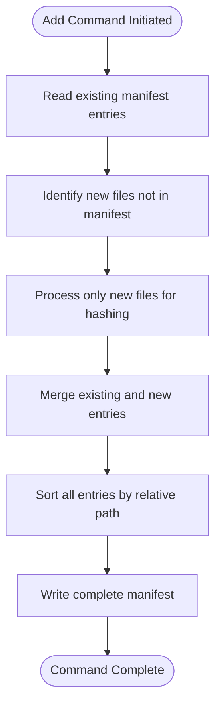
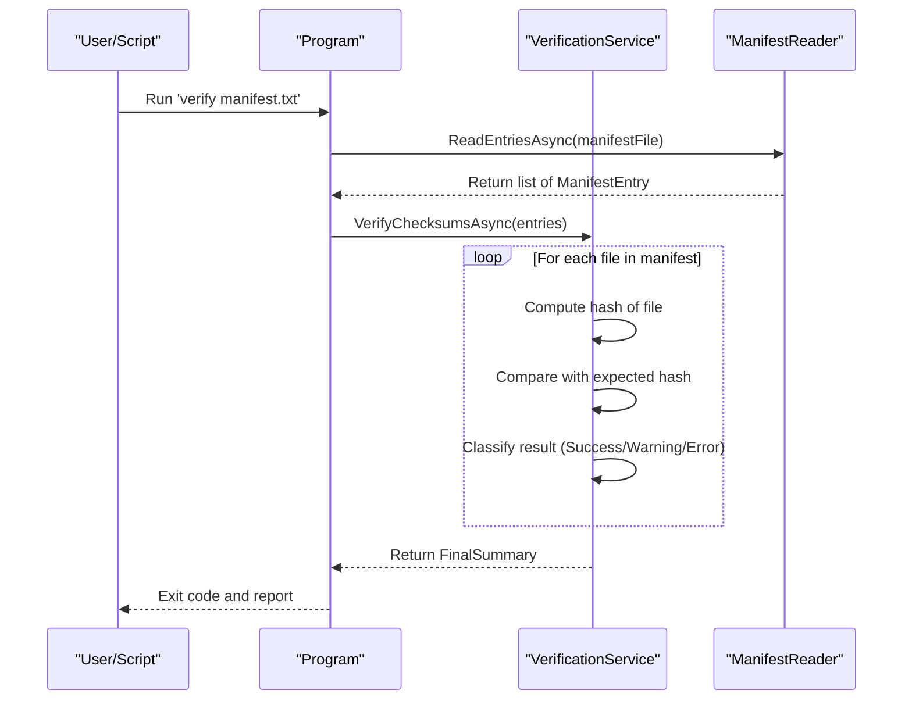
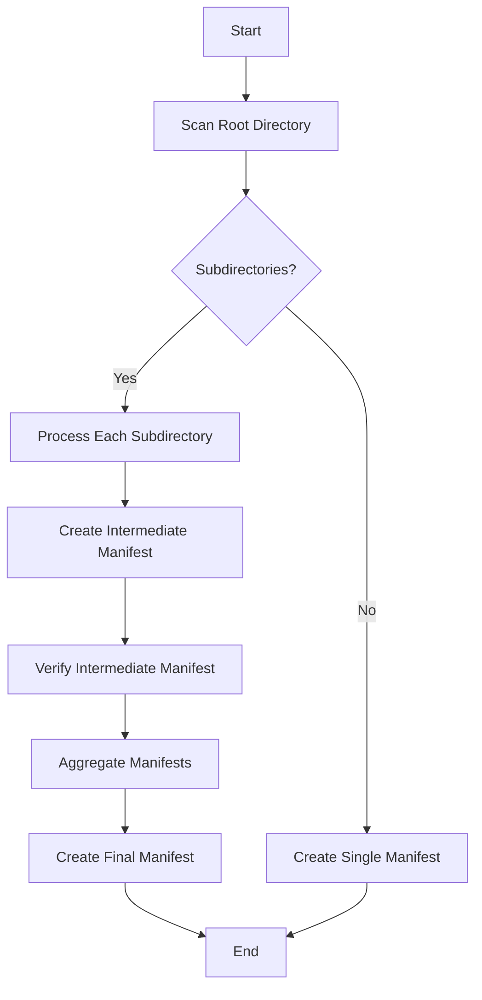

# Idempotency and Retry Strategies


## Table of Contents
1. [Introduction](#introduction)
2. [Idempotent Command Behavior](#idempotent-command-behavior)
3. [Retry Strategies for Unreliable Environments](#retry-strategies-for-unreliable-environments)
4. [Error Classification and Exit Codes](#error-classification-and-exit-codes)
5. [Exponential Backoff Implementation](#exponential-backoff-implementation)
6. [Checkpointing with Intermediate Manifests](#checkpointing-with-intermediate-manifests)
7. [Conclusion](#conclusion)

## Introduction
Verity is a high-performance file integrity verification and manifest management tool designed for automation in production environments. This document details its idempotent behavior and provides guidance on implementing robust retry strategies for handling transient failures. The tool's design ensures safe re-execution of commands, making it suitable for integration into automated workflows where network or I/O instability may occur. Understanding the idempotent nature of Verity's commands and leveraging its exit code system enables the creation of resilient automation scripts that can recover from temporary failures without data corruption or duplication.

## Idempotent Command Behavior

Verity implements idempotency in its `create` and `add` commands to ensure safe repeated execution. The `verify` command is inherently idempotent as it performs only read operations.

### Create and Add Commands
The `create` and `add` commands are idempotent with respect to existing files in the manifest. When the `add` command is executed, it first reads the existing manifest entries using the `ManifestReader` class. It then compares the files to be added against the existing entries to avoid duplication.





**Diagram sources**
- [ManifestCreationService.cs](file://Verity/Services/ManifestCreationService.cs#L100-L130)
- [ManifestReader.cs](file://Verity/Utilities/ManifestReader.cs#L10-L25)

The core logic for this behavior is in the `ProcessManifestFilesAsync` method of the `ManifestCreationService` class. When in `Add` mode, it reads the existing manifest, creates a `HashSet` of existing file paths, and filters the new entries to include only those not already present. This ensures that re-running an `add` command will not duplicate entries, even if some files were successfully added in a previous attempt that was interrupted.


```csharp
if (mode == ManifestOperationMode.Add) {
  // Read existing entries and merge
  var reader = new ManifestReader(manifestFile, root);
  var manifestEntries = await reader.ReadEntriesAsync(cancellationToken);
  var existingEntries = manifestEntries
    .Where(entry => entry != null && entry.Hash != null && entry.RelativePath != null)
    .Select(entry => (entry.Hash!, entry.RelativePath!))
    .ToList();
  // Avoid duplicates: only add new entries for files not already present
  var existingPaths = new HashSet<string>(existingEntries.Select(e => e.Item2), StringComparer.OrdinalIgnoreCase);
  var filteredNewEntries = newEntries.Where(e => !existingPaths.Contains(e.relativePath)).OrderBy(e => e.relativePath);
  allEntries = [.. existingEntries, .. filteredNewEntries];
}
```


**Section sources**
- [ManifestCreationService.cs](file://Verity/Services/ManifestCreationService.cs#L100-L130)

### Verify Command
The `verify` command is purely read-only and inherently idempotent. It reads the manifest file and verifies the integrity of the listed files without modifying any data. This makes it safe to run multiple times, even concurrently, as it does not alter the state of the system.





**Diagram sources**
- [Program.cs](file://Verity/Program.cs#L287-L325)
- [VerificationService.cs](file://Verity/Services/VerificationService.cs#L50-L150)

## Retry Strategies for Unreliable Environments

Transient I/O errors, such as network timeouts or temporary file locks, can occur during manifest operations. Verity's idempotent design allows for safe retry mechanisms without the risk of data corruption or entry duplication.

### Transient Error Scenarios
Common transient errors include:
- **Network timeouts**: When accessing files over a network share.
- **File locks**: When a file is temporarily locked by another process.
- **Disk I/O errors**: Temporary hardware or driver issues.
- **VSS snapshot creation failures**: Temporary issues with Volume Shadow Copy Service.

These errors are typically retryable, as they are often resolved by waiting and re-attempting the operation. In contrast, fatal errors like manifest file corruption or invalid hash algorithms require manual intervention.

### Safe Retry Implementation
Because the `create` and `add` commands are idempotent, they can be safely retried after a failure. If a previous `add` operation partially completed before failing, re-running the command will only process files that were not already added, preventing duplication. Similarly, a `create` command can be re-run on an empty directory without adverse effects.

## Error Classification and Exit Codes

Verity uses a clear exit code system to distinguish between success, warnings, errors, and cancellations, enabling automation scripts to make informed decisions about retries.

| Exit Code | Meaning | Retry Strategy |
|---------|-------|--------------|
| `0` | Success (no warnings/errors) | No retry needed |
| `1` | Warning (warnings, no errors) | Retry may not be necessary; log and continue |
| `-1` | Error (errors found) | Assess error type; retry if transient |
| `-2` | Canceled by user | Do not retry automatically |

**Section sources**
- [README.md](file://README.md#L150-L155)

The exit code `-1` indicates a fatal error that requires investigation, such as a hash mismatch or missing file. However, the underlying cause of the error might be transient. Scripts should parse the TSV error report to determine if the error is retryable (e.g., "Cannot read file" due to a temporary lock) or fatal (e.g., "File not found" indicating permanent data loss).

## Exponential Backoff Implementation

Implementing exponential backoff with Verity commands ensures that retries do not overwhelm the system and allow time for transient issues to resolve.

### PowerShell Script Example
The following PowerShell script demonstrates a robust retry strategy using exponential backoff:


```powershell
function Invoke-VerityWithRetry {
    param(
        [string]$Command,
        [int]$MaxRetries = 5,
        [int]$BaseDelay = 2  # seconds
    )

    $attempt = 0
    $success = $false

    while ($attempt -lt $MaxRetries -and -not $success) {
        $attempt++
        Write-Host "Attempt $attempt of $MaxRetries: $Command"
        
        # Execute Verity command
        $result = cmd /c $Command 2>&1
        $exitCode = $LASTEXITCODE
        
        Write-Host "Exit code: $exitCode"
        
        if ($exitCode -eq 0) {
            Write-Host "Command succeeded."
            $success = $true
        }
        elseif ($exitCode -eq 1) {
            Write-Host "Command completed with warnings. Consider manual review."
            $success = $true  # Treat warnings as success for automation
        }
        elseif ($exitCode -eq -1) {
            # Check if the error is retryable by examining stderr
            if ($result -match "Cannot read file" -or $result -match "I/O error") {
                if ($attempt -lt $MaxRetries) {
                    $delay = [Math]::Pow($BaseDelay, $attempt)
                    Write-Host "Transient error detected. Retrying in $delay seconds..."
                    Start-Sleep -Seconds $delay
                }
                else {
                    Write-Error "Max retries exceeded. Command failed: $Command"
                    Write-Error $result
                    return $false
                }
            }
            else {
                Write-Error "Fatal error detected. Manual intervention required:"
                Write-Error $result
                return $false
            }
        }
        elseif ($exitCode -eq -2) {
            Write-Error "Command was canceled by user. Stopping retries."
            return $false
        }
        else {
            Write-Error "Unknown exit code $exitCode. Stopping retries."
            return $false
        }
    }
    
    return $success
}

# Usage example
$command = "Verity.exe add D:\data\backups\manifest.sha256 --root D:\data\newfiles"
Invoke-VerityWithRetry -Command $command
```


This script retries the command up to five times, with delays of 2, 4, 8, 16, and 32 seconds between attempts. It examines the error output to distinguish between retryable I/O errors and fatal issues, ensuring that only appropriate errors trigger a retry.

## Checkpointing with Intermediate Manifests

For very large datasets, processing can be divided into smaller, manageable chunks using intermediate manifests to implement a checkpointing strategy.

### Chunked Processing Strategy
Instead of processing an entire large directory in one operation, divide it into subdirectories and create intermediate manifests. This approach limits the impact of a failure to a single chunk, reducing recovery time.





**Diagram sources**
- [Program.cs](file://Verity/Program.cs#L384-L584)
- [ManifestWriter.cs](file://Verity/Utilities/ManifestWriter.cs#L10-L30)

### Implementation Example

```powershell
# Process large dataset in chunks
$rootDir = "D:\large_dataset"
$manifestDir = "D:\manifests"
$finalManifest = "$manifestDir\final_manifest.txt"

# Clear or initialize final manifest
New-Item -Path $finalManifest -ItemType File -Force

Get-ChildItem -Path $rootDir -Directory | ForEach-Object {
    $subdir = $_.Name
    $intermediateManifest = "$manifestDir\$subdir.manifest"
    
    # Create manifest for this subdirectory
    $createCommand = "Verity.exe create $intermediateManifest --root $rootDir\$subdir"
    $success = Invoke-VerityWithRetry -Command $createCommand
    
    if ($success) {
        # Append intermediate manifest to final manifest
        Get-Content $intermediateManifest | Add-Content $finalManifest
        Write-Host "Successfully processed $subdir"
    } else {
        Write-Error "Failed to process $subdir after retries"
    }
}

Write-Host "Final manifest created at $finalManifest"
```


This strategy ensures that if a failure occurs during the processing of one subdirectory, only that chunk needs to be reprocessed, rather than the entire dataset. The use of Verity's idempotent `create` command makes it safe to re-run the command for a specific subdirectory without affecting the others.

## Conclusion
Verity's idempotent design for `create` and `add` commands, combined with its clear exit code system, enables the creation of robust automation workflows. By implementing exponential backoff retry strategies and using checkpointing with intermediate manifests, users can safely handle transient errors in unreliable environments. The key to a successful retry strategy is distinguishing between retryable transient errors (like I/O timeouts) and fatal errors (like data corruption) by examining both the exit code and the detailed error report. This approach ensures data integrity while maximizing the chances of successful completion in challenging operational conditions.

**Referenced Files in This Document**   
- [ManifestCreationService.cs](file://Verity/Services/ManifestCreationService.cs)
- [ManifestWriter.cs](file://Verity/Utilities/ManifestWriter.cs)
- [ManifestReader.cs](file://Verity/Utilities/ManifestReader.cs)
- [VerificationService.cs](file://Verity/Services/VerificationService.cs)
- [Program.cs](file://Verity/Program.cs)
- [README.md](file://README.md)
- [CreateCommandTests.cs](file://Verity.Tests/IntegrationTests/CreateCommandTests.cs)
- [AddCommandTests.cs](file://Verity.Tests/IntegrationTests/AddCommandTests.cs)
- [VerifyCommandTests.cs](file://Verity.Tests/IntegrationTests/VerifyCommandTests.cs)