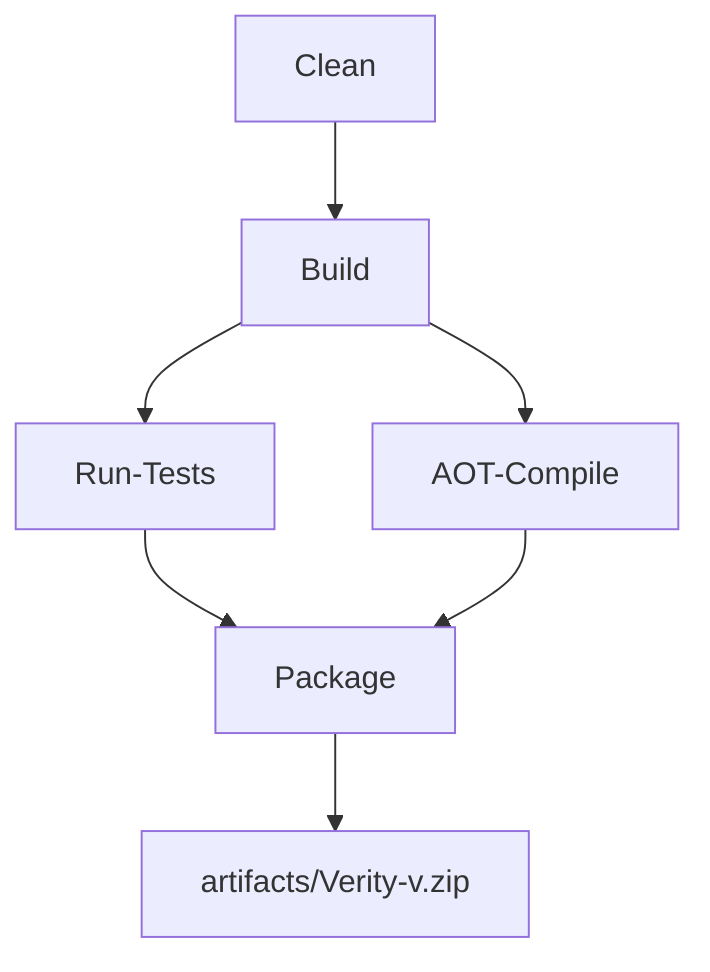

# Building from Source


## Table of Contents
1. [Development Environment Setup](#development-environment-setup)
2. [Build System Overview](#build-system-overview)
3. [Build Targets and Workflow](#build-targets-and-workflow)
4. [Versioning Configuration](#versioning-configuration)
5. [AOT Compilation and Packaging](#aot-compilation-and-packaging)
6. [Running the Compiled Application](#running-the-compiled-application)
7. [Common Build Issues and Troubleshooting](#common-build-issues-and-troubleshooting)
8. [Customizing the Build Process](#customizing-the-build-process)

## Development Environment Setup

To build Verity from source, you must first set up a development environment with the required tools and dependencies. Verity is a .NET 9.0 application written in C# 13.0, so the .NET 9.0 SDK is required.

### Installing .NET 9.0 SDK

1. Download the .NET 9.0 SDK from the official Microsoft website: https://dotnet.microsoft.com/download/dotnet/9.0
2. Run the installer and follow the on-screen instructions.
3. Verify the installation by opening a terminal and running:
   
```bash
   dotnet --version
   ```

   This should output a version number starting with `9.0`.

### Cloning the Repository

After installing the SDK, clone the Verity repository to your local machine:


```bash
git clone https://github.com/your-username/Verity.git
cd Verity
```


Ensure that Git is installed and available in your system PATH.

**Section sources**
- [README.md](file://README.md#L110-L115)

## Build System Overview

Verity uses the Cake (C# Make) build automation system to manage its build process. Cake provides a cross-platform way to define and execute build tasks using C# code.

### Cross-Platform Build Scripts

The project includes two build scripts for different operating systems:

- `build.ps1`: PowerShell script for Windows
- `build.sh`: Bash script for Unix-based systems (Linux, macOS)

Both scripts perform the same core functions:
1. Set environment variables to optimize .NET CLI behavior
2. Restore Cake tools using `dotnet tool restore`
3. Execute the Cake build script with `dotnet cake`


```powershell
# build.ps1
$ErrorActionPreference = 'Stop'
Set-Location -LiteralPath $PSScriptRoot
$env:DOTNET_SKIP_FIRST_TIME_EXPERIENCE = '1'
$env:DOTNET_CLI_TELEMETRY_OPTOUT = '1'
$env:DOTNET_NOLOGO = '1'
dotnet tool restore
dotnet cake @args
```


```bash
# build.sh
#!/usr/bin/env bash
set -euox pipefail
cd "$(dirname "${BASH_SOURCE[0]}")"
export DOTNET_SKIP_FIRST_TIME_EXPERIENCE=1
export DOTNET_CLI_TELEMETRY_OPTOUT=1
export DOTNET_NOLOGO=1
dotnet tool restore
dotnet cake "$@"
```


The environment variables disable unnecessary .NET CLI features that could interfere with automated builds:
- `DOTNET_SKIP_FIRST_TIME_EXPERIENCE`: Skips first-run setup
- `DOTNET_CLI_TELEMETRY_OPTOUT`: Disables telemetry collection
- `DOTNET_NOLOGO`: Suppresses the .NET logo in output

**Section sources**
- [build.ps1](file://build.ps1#L1-L13)
- [build.sh](file://build.sh#L1-L12)

## Build Targets and Workflow

The build process is defined in `build.cake`, which specifies a series of tasks that can be executed in sequence. The main build target is "Default", which runs all essential tasks.

### Available Build Targets

| Target | Description | Dependencies |
|--------|-------------|--------------|
| Clean | Removes build artifacts and temporary files | None |
| Build | Compiles the source code | Clean |
| Run-Tests | Executes unit and integration tests | Build |
| AOT-Compile | Compiles to native code using AOT | Build |
| Package | Creates distributable package | AOT-Compile, Run-Tests |

### Build Execution

To run the build process, execute the appropriate script for your platform:

**Windows:**

```powershell
.\build.ps1
```


**Unix-based systems:**

```bash
./build.sh
```


To run a specific target, pass it as an argument:

```bash
./build.sh --target=Build
```


The build workflow follows this sequence:
1. Clean previous build artifacts
2. Compile the Verity and Verity.Tests projects
3. Run automated tests
4. Perform AOT compilation to native code
5. Package the executable into a ZIP file





**Diagram sources**
- [build.cake](file://build.cake#L50-L208)

**Section sources**
- [build.cake](file://build.cake#L50-L208)

## Versioning Configuration

Verity uses Nerdbank.GitVersioning (NBGV) for automated version management. This system generates version numbers based on Git repository metadata, ensuring consistent and meaningful versioning.

### version.json Configuration

The versioning strategy is defined in `version.json`:


```json
{
  "$schema": "https://raw.githubusercontent.com/dotnet/Nerdbank.GitVersioning/main/src/NerdBank.GitVersioning/version.schema.json",
  "version": "1.2-alpha",
  "assemblyVersion": {
    "precision": "revision"
  },
  "publicReleaseRefSpec": [
    "^refs/heads/main$",
    "^refs/heads/v\\d+\\.\\d+$"
  ],
  "cloudBuild": {
    "buildNumber": {
      "enabled": true
    }
  }
}
```


Key configuration elements:
- **version**: Base version number with pre-release tag
- **assemblyVersion.precision**: Sets assembly version precision to revision level
- **publicReleaseRefSpec**: Regular expressions defining branches that produce public releases
- **cloudBuild.buildNumber.enabled**: Enables build number integration with CI/CD systems

During the build process, the Package task retrieves version information using the `nbgv get-version --format json` command and incorporates it into the package filename.

**Section sources**
- [version.json](file://version.json#L1-L16)
- [build.cake](file://build.cake#L130-L140)

## AOT Compilation and Packaging

Verity is compiled as a self-contained, native executable using .NET's Ahead-of-Time (AOT) compilation feature. This eliminates the need for a separate .NET runtime installation on target systems.

### AOT Compilation Process

The AOT compilation is performed by the "AOT-Compile" task in the Cake script:


```csharp
Task("AOT-Compile")
    .IsDependentOn("Build")
    .Does(() => {
    DotNetPublish("./Verity/Verity.csproj", new DotNetPublishSettings {
        Configuration = configuration,
        OutputDirectory = publishDir,
        ArgumentCustomization = args => args
            .Append("/p:PublishAot=true")
            .Append("/p:PublishTrimmed=true")
            .Append("-r win-x64")
    });
});
```


Key compilation settings:
- **PublishAot=true**: Enables native AOT compilation
- **PublishTrimmed=true**: Removes unused code to reduce binary size
- **-r win-x64**: Specifies the target runtime identifier (can be changed for other platforms)

### Cross-Platform Packaging

The "Package" task creates a ZIP archive containing the compiled executable:

1. Retrieves version information from NBGV
2. Determines the current Git branch
3. Constructs a package filename with version and branch information
4. Zips the published files into the artifacts directory

The resulting package follows this naming convention:

```
Verity-v<version>.zip
Verity-v<version>-<branch>.zip  # For non-main branches
```


**Section sources**
- [build.cake](file://build.cake#L100-L125)
- [build.cake](file://build.cake#L145-L185)

## Running the Compiled Application

After a successful build, the compiled Verity executable can be found in the `artifacts` directory as a ZIP file. To use the application:

1. Extract the ZIP file:
   
```bash
   unzip artifacts/Verity-v*.zip -d verity-app
   ```


2. Run the executable:
   
```bash
   # Windows
   verity-app/Verity.exe --help
   
   # Unix (ensure execution permission)
   chmod +x verity-app/Verity
   ./verity-app/Verity --help
   ```


The application supports three main commands:
- **verify**: Verify file integrity against a checksum manifest
- **create**: Create a new checksum manifest from a directory
- **add**: Add new files to an existing manifest

Example usage:

```bash
# Create a manifest
./Verity create backup.sha256 --root /path/to/backup --include "*.txt;*.pdf"

# Verify a manifest
./Verity verify backup.sha256 --root /path/to/backup
```


**Section sources**
- [README.md](file://README.md#L40-L80)
- [Program.cs](file://Verity/Program.cs#L50-L150)

## Common Build Issues and Troubleshooting

### Missing .NET 9.0 SDK

**Symptom**: `dotnet` command not found or wrong version reported.

**Solution**: Install the .NET 9.0 SDK from the official website and ensure it's in your system PATH.

### Cake Tool Not Restored

**Symptom**: `dotnet cake` command fails with "command not found" error.

**Solution**: Ensure `dotnet tool restore` completes successfully. If it fails, try:

```bash
dotnet new tool-manifest
dotnet tool restore
```


### Version Retrieval Failure

**Symptom**: Build fails when retrieving version information with `nbgv`.

**Solution**: Install the Nerdbank.GitVersioning tool globally:

```bash
dotnet tool install -g nbgv
```


### Platform-Specific Compilation

**Symptom**: Need to build for a platform other than Windows x64.

**Solution**: Modify the runtime identifier in the AOT-Compile task:
- Linux x64: `-r linux-x64`
- macOS x64: `-r osx-x64`
- macOS ARM64: `-r osx-arm64`

Update the `publishDir` variable in `build.cake` accordingly.

### Test Failures

**Symptom**: Run-Tests task fails.

**Solution**: Run tests directly using the .NET CLI for better diagnostics:

```bash
dotnet test Verity.Tests/Verity.Tests.csproj --configuration Release
```


**Section sources**
- [build.ps1](file://build.ps1#L10-L13)
- [build.sh](file://build.sh#L9-L12)
- [build.cake](file://build.cake#L100-L125)

## Customizing the Build Process

The build process can be customized for different deployment scenarios by modifying the Cake script or using command-line arguments.

### Configuration Options

The build script accepts two main arguments:
- **target**: Specifies which task to run (e.g., `--target=Build`)
- **configuration**: Sets the build configuration (Debug or Release, default: Release)

### Modifying Build Targets

To add a new build target, edit `build.cake` and define a new task:


```csharp
Task("Custom-Target")
    .IsDependentOn("Build")
    .Does(() => {
    // Custom build logic here
    Information("Running custom build steps...");
});
```


### Cross-Platform Builds

To support additional platforms, extend the AOT-Compile task:


```csharp
// Add multiple publish directories
var publishDirs = new Dictionary<string, DirectoryPath> {
    { "win-x64", publishDir + Directory("win-x64") },
    { "linux-x64", publishDir + Directory("linux-x64") },
    { "osx-x64", publishDir + Directory("osx-x64") }
};

// Create a task for each platform
foreach (var platform in publishDirs) {
    Task($"AOT-Compile-{platform.Key}")
        .IsDependentOn("Build")
        .Does(() => {
        DotNetPublish("./Verity/Verity.csproj", new DotNetPublishSettings {
            Configuration = configuration,
            OutputDirectory = platform.Value,
            ArgumentCustomization = args => args
                .Append("/p:PublishAot=true")
                .Append("/p:PublishTrimmed=true")
                .Append($"-r {platform.Key}")
        });
    });
}
```


### Continuous Integration Integration

The build script is designed to work with CI/CD systems. The `cloudBuild.buildNumber.enabled` setting in `version.json` ensures that build numbers are properly set in CI environments like GitHub Actions.

**Section sources**
- [build.cake](file://build.cake#L1-L208)
- [version.json](file://version.json#L1-L16)

**Referenced Files in This Document**   
- [README.md](file://README.md)
- [build.ps1](file://build.ps1)
- [build.sh](file://build.sh)
- [build.cake](file://build.cake)
- [version.json](file://version.json)
- [Program.cs](file://Verity/Program.cs)
- [Models.cs](file://Verity/Models.cs)