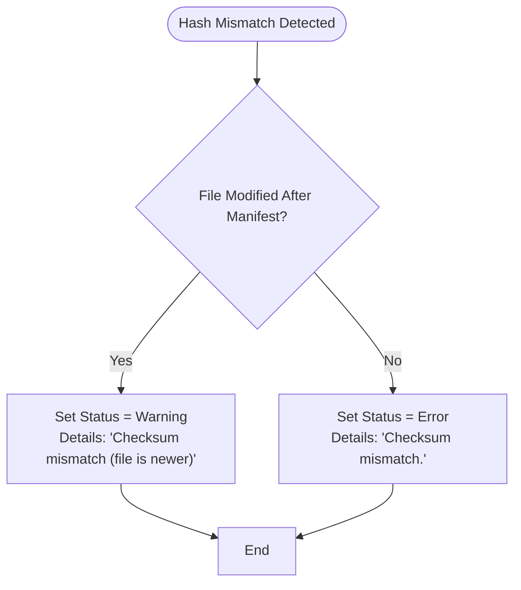
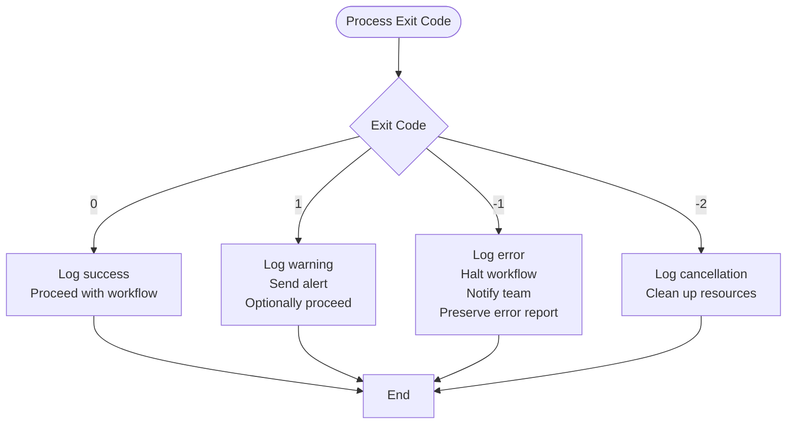

# Exit Codes


## Table of Contents
1. [Exit Code Specification](#exit-code-specification)
2. [Exit Code Mapping to Verification Outcomes](#exit-code-mapping-to-verification-outcomes)
3. [Status Classification Logic](#status-classification-logic)
4. [Shell Scripting Examples for CI/CD](#shell-scripting-examples-for-cicd)
5. [Best Practices for Automated Error Handling](#best-practices-for-automated-error-handling)

## Exit Code Specification

Verity returns standardized exit codes to enable reliable automation integration. These codes reflect the overall outcome of manifest verification, creation, or update operations. The exit code is determined by the aggregated status of individual file verification results, as captured in the `FinalSummary` object.

| Exit Code | Meaning | Automation Interpretation |
|-----------|-------|---------------------------|
| 0 | Success | Operation completed successfully; no errors or warnings |
| 1 | Warning | Operation completed with non-critical issues; integrity check passed but requires review |
| -1 | General Error | Operation failed due to critical integrity or processing errors |
| -2 | Interrupted by User | Process was manually canceled (e.g., via Ctrl+C) |

**Section sources**
- [Program.cs](file://Verity/Program.cs#L225-L227)

## Exit Code Mapping to Verification Outcomes

The exit code is determined in `Program.cs` based on the `FinalSummary` object returned from `VerificationService.VerifyChecksumsAsync`. The logic is implemented in `RunVerification`, `RunCreateManifest`, and `RunAddToManifest` methods.


```csharp
if (summary.ErrorCount > 0) return -1;
if (summary.WarningCount > 0) return 1;
return 0;
```


This logic applies uniformly across all commands (`verify`, `create`, `add`). The exit code is derived from the counts of problematic results categorized by `ResultStatus`.

### ResultStatus Enumeration

The `ResultStatus` enum (defined in `Models.cs`) classifies individual verification outcomes:


```csharp
public enum ResultStatus
{
  Success,
  Warning,
  Error
}
```


**Section sources**
- [Models.cs](file://Verity/Models.cs#L29-L34)

### FinalSummary Structure

The `FinalSummary` record aggregates verification results for exit code determination:


```csharp
public record FinalSummary(
    int TotalFiles,
    int SuccessCount,
    int WarningCount,
    int ErrorCount,
    long TotalBytesRead,
    IReadOnlyList<VerificationResult> ProblematicResults
);
```


The `ProblematicResults` collection contains all non-success results (warnings and errors), which are used to populate diagnostic tables and TSV reports.

**Section sources**
- [Models.cs](file://Verity/Models.cs#L36-L43)

## Status Classification Logic

The classification of individual file verification results into `Success`, `Warning`, or `Error` is performed by the `StatusClassifier` class in `VerificationService.cs`. This logic determines whether a hash mismatch is treated as a warning or error based on file modification timestamps.





**Diagram sources**
- [VerificationService.cs](file://Verity/Services/VerificationService.cs#L181-L193)

### Specific Failure Modes

The following table maps `ResultStatus` values to specific failure modes in `VerificationService` and `ResultsPresenter`:

| Status | Trigger Condition | Source Component | Details Field Value |
|--------|-------------------|------------------|---------------------|
| Success | `actualHash == expectedHash` | VerificationService | N/A |
| Warning | File exists but not in manifest | VerificationService | "File exists but not in checksum list." |
| Warning | `fileWriteTime > manifestWriteTime` and hash mismatch | VerificationService | "Checksum mismatch (file is newer)." |
| Warning | Exception during file read | VerificationService | "Cannot read file" |
| Error | Hash mismatch and file not newer than manifest | VerificationService | "Checksum mismatch." |
| Error | File not found | VerificationService | "File not found." |

The `ResultsPresenter` uses these statuses to render summary tables and diagnostic output:


```csharp
// In RenderSummaryTable
summaryTable.AddRow("[yellow]Warnings[/]", $"{summary.WarningCount:N0}");
summaryTable.AddRow("[red]Errors[/]", $"{summary.ErrorCount:N0}");
```


**Section sources**
- [VerificationService.cs](file://Verity/Services/VerificationService.cs#L181-L193)
- [ResultsPresenter.cs](file://Verity/Utilities/ResultsPresenter.cs#L37-L69)

## Shell Scripting Examples for CI/CD

The following examples demonstrate how to react to Verity's exit codes in automated pipelines.

### Basic Verification with Error Handling


```bash
#!/bin/bash
set -e

echo "Verifying manifest integrity..."
verity verify manifest.sha256 --tsv-report errors.tsv

case $? in
    0)
        echo "SUCCESS: All files verified successfully."
        ;;
    1)
        echo "WARNING: Verification completed with warnings."
        echo "Review errors.tsv for details."
        # Optionally fail pipeline on warnings
        # exit 1
        ;;
    -1)
        echo "ERROR: Verification failed due to critical errors."
        cat errors.tsv
        exit 1
        ;;
    -2)
        echo "ERROR: Verification was interrupted by user."
        exit 1
        ;;
    *)
        echo "ERROR: Unknown exit code"
        exit 1
        ;;
esac
```


### Conditional Processing Based on Exit Codes


```bash
#!/bin/bash

verity verify manifest.md5

case $? in
    0)
        echo "Deployment approved - integrity verified"
        ./deploy.sh
        ;;
    1)
        echo "Manual review required - warnings detected"
        verity verify manifest.md5 --show-table
        read -p "Continue with deployment? (y/N): " confirm
        [[ $confirm == [yY] ]] && ./deploy.sh || exit 1
        ;;
    *)
        echo "Deployment blocked - integrity check failed"
        exit 1
        ;;
esac
```


### CI Pipeline Integration (GitHub Actions)


```yaml
jobs:
  verify-integrity:
    runs-on: ubuntu-latest
    steps:
      - uses: actions/checkout@v4
      
      - name: Verify file integrity
        run: |
          ./verity verify manifest.sha256 --tsv-report errors.tsv || case $? in
            0) echo "All good";;
            1) echo "Warnings present" && cat errors.tsv;;
            *) echo "Critical failure" && cat errors.tsv && exit 1;;
          esac
        
      - name: Fail on warnings (strict mode)
        if: ${{ failure() }}
        run: exit 1
```


**Section sources**
- [Program.cs](file://Verity/Program.cs#L225-L227)

## Best Practices for Automated Error Handling

### Distinguishing Transient vs. Critical Failures

Verity's exit code system enables differentiation between transient I/O issues and critical integrity failures:

- **Transient I/O Errors** (classified as `Warning`):
  - File read exceptions due to temporary locks
  - Permission issues on non-critical files
  - Network latency in file access
  - These may be retried automatically

- **Critical Integrity Failures** (classified as `Error`):
  - Hash mismatches on files older than the manifest
  - Missing critical files listed in manifest
  - Corrupted manifest format
  - These require manual investigation

### Recommended Handling Strategies





**Diagram sources**
- [Program.cs](file://Verity/Program.cs#L225-L227)

### Implementation Guidelines

1. **Always check exit codes** in automation scripts using `$?` or equivalent
2. **Preserve TSV reports** when errors occur for forensic analysis
3. **Use `--tsv-report`** parameter to capture machine-readable output
4. **Implement retry logic** for exit code 1 (warnings) in non-strict environments
5. **Treat exit code -1 as non-retryable** - indicates fundamental integrity issues
6. **Monitor for recurring warnings** that may indicate systemic issues
7. **Use `--show-table`** in debugging mode to get detailed diagnostic output

The `ResultsPresenter.WriteErrorReportAsync` method ensures that detailed error information is available either via `stderr` or a specified output file, enabling comprehensive post-execution analysis.

**Section sources**
- [ResultsPresenter.cs](file://Verity/Utilities/ResultsPresenter.cs#L99-L130)
- [Program.cs](file://Verity/Program.cs#L225-L227)

**Referenced Files in This Document**   
- [Program.cs](file://Verity/Program.cs#L225-L227)
- [ResultsPresenter.cs](file://Verity/Utilities/ResultsPresenter.cs#L37-L69)
- [VerificationService.cs](file://Verity/Services/VerificationService.cs#L181-L193)
- [Models.cs](file://Verity/Models.cs#L29-L34)
- [Models.cs](file://Verity/Models.cs#L36-L43)
- [Models.cs](file://Verity/Models.cs#L20-L27)