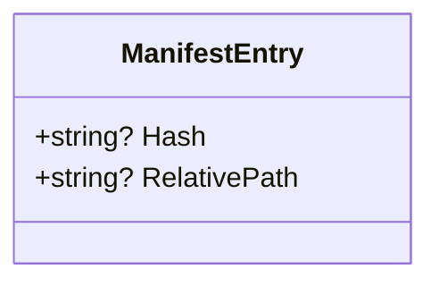

# Manifest Format Specification


## Table of Contents
1. [Introduction](#introduction)
2. [Manifest Format Structure](#manifest-format-structure)
3. [Field Definitions](#field-definitions)
4. [Parsing Logic](#parsing-logic)
5. [Serialization Process](#serialization-process)
6. [Supported Hash Algorithms](#supported-hash-algorithms)
7. [Encoding and Line Endings](#encoding-and-line-endings)
8. [Path Handling](#path-handling)
9. [Examples](#examples)
10. [Versioning and Compatibility](#versioning-and-compatibility)
11. [Manual Editing and Validation](#manual-editing-and-validation)

## Introduction
The manifest format specification defines a simple, machine-readable format for storing file integrity checksums. This document details the structure, parsing, and serialization of manifest files used by the Verity application for file verification and integrity checking. The format is designed to be both human-readable and easily processed by automated tools.

## Manifest Format Structure

The manifest format is a Tab-Separated Values (TSV) text file where each line represents a single file entry containing a hash value and a relative file path. The format is minimal with no header metadata, comments, or additional structural elements.

**Key characteristics:**
- **Format**: TSV (Tab-Separated Values)
- **Structure**: One entry per line
- **Fields per entry**: Two (hash value, relative path)
- **File encoding**: UTF-8
- **Line endings**: Platform-native (detected automatically)
- **Case sensitivity**: Path handling uses case-insensitive comparison on Windows, case-sensitive on Unix-like systems


```mermaid
flowchart TD
A[Manifest File] --> B[Line 1: hash\trelative/path.txt]
A --> C[Line 2: hash\trelative/path2.txt]
A --> D[...]
A --> E[Line N: hash\trelative/pathN.txt]
B --> F[Parse Tab Delimiter]
C --> F
D --> F
E --> F
F --> G[ManifestEntry: {Hash, RelativePath}]
```


**Diagram sources**
- [ManifestReader.cs](file://Verity/Utilities/ManifestReader.cs#L0-L50)
- [ManifestWriter.cs](file://Verity/Utilities/ManifestWriter.cs#L0-L30)

**Section sources**
- [ManifestReader.cs](file://Verity/Utilities/ManifestReader.cs#L0-L50)
- [ManifestWriter.cs](file://Verity/Utilities/ManifestWriter.cs#L0-L30)

## Field Definitions

The manifest format consists of two required fields per entry, separated by a tab character.

### Hash Field
- **Purpose**: Stores the cryptographic hash of the file's contents
- **Position**: First field (before tab delimiter)
- **Data type**: String
- **Format**: Hexadecimal characters (lowercase)
- **Length**: Variable, depending on algorithm (64 characters for SHA256, 32 for MD5, 40 for SHA1)
- **Example**: `a1b2c3d4e5f6...` (truncated for brevity)

### Relative Path Field
- **Purpose**: Stores the relative path to the file from the root directory
- **Position**: Second field (after tab delimiter)
- **Data type**: String
- **Format**: Platform-appropriate path separator (converted to forward slashes internally)
- **Case handling**: Stored as-is, compared case-insensitively on Windows
- **Example**: `documents/report.txt`

The data model for manifest entries is defined by the `ManifestEntry` class:





**Diagram sources**
- [ManifestReader.cs](file://Verity/Utilities/ManifestReader.cs#L0-L4)

**Section sources**
- [ManifestReader.cs](file://Verity/Utilities/ManifestReader.cs#L0-L4)
- [Models.cs](file://Verity/Models.cs#L7-L10)

## Parsing Logic

The parsing logic is implemented in the `ManifestReader` class, which handles reading and interpreting manifest files.

### ReadEntriesAsync Method
- **Function**: Reads all entries from a manifest file asynchronously
- **Process**: 
  1. Streams lines from the file
  2. Skips empty or whitespace-only lines
  3. Splits each line by tab character
  4. Creates `ManifestEntry` objects for valid lines
  5. Returns collection of entries
- **Error handling**: Invalid lines are skipped silently
- **Performance**: Uses asynchronous file reading for large manifests

### ParseLine Method
- **Function**: Parses a single line into a `ManifestEntry`
- **Validation rules**:
  - Line must not be null, empty, or whitespace-only
  - Line must contain at least one tab character
  - Must split into at least two parts
  - Both hash and relative path must be non-whitespace
- **Behavior**: Returns `null` for invalid lines
- **Extra fields**: Ignores additional fields beyond the first two


```mermaid
flowchart TD
A[Input Line] --> B{Valid Line?}
B --> |No| C[Return null]
B --> |Yes| D[Split by Tab]
D --> E[Extract Hash (Part 1)]
E --> F[Extract RelativePath (Part 2)]
F --> G[Create ManifestEntry]
G --> H[Return Entry]
```


**Section sources**
- [ManifestReader.cs](file://Verity/Utilities/ManifestReader.cs#L11-L28)
- [ManifestReaderTests.cs](file://Verity.Tests/ManifestReaderTests.cs#L48-L123)

## Serialization Process

The serialization process is handled by the `ManifestWriter` class, which writes manifest entries to a file.

### WriteEntryAsync Method
- **Function**: Writes a single entry to the manifest file
- **Parameters**: 
  - `hash`: The hash value as a string
  - `relativePath`: The relative file path as a string
- **Process**: 
  1. Acquires write lock for thread safety
  2. Writes formatted line (hash + tab + relativePath + newline)
  3. Returns completed task
- **Thread safety**: Uses lock to prevent race conditions when writing

### WriteAllEntriesAsync Method
- **Function**: Writes multiple entries to the manifest file efficiently
- **Parameters**: Collection of tuples (hash, relativePath)
- **Process**:
  1. Acquires write lock
  2. Iterates through entries
  3. Writes each entry on a separate line
  4. Returns completed task
- **Performance**: More efficient than multiple WriteEntryAsync calls


```mermaid
flowchart TD
A[Write Entry] --> B[Acquire Write Lock]
B --> C[Format: hash + \"\\t\" + relativePath]
C --> D[Write Line with Newline]
D --> E[Release Lock]
E --> F[Return Task]
```


**Section sources**
- [ManifestWriter.cs](file://Verity/Utilities/ManifestWriter.cs#L0-L30)
- [ManifestWriterTests.cs](file://Verity.Tests/ManifestWriterTests.cs#L0-L64)

## Supported Hash Algorithms

The manifest system supports multiple cryptographic hash algorithms, with the specific algorithm determined by context.

### Algorithm Selection
The algorithm used is determined by:
1. **Command-line parameter**: Explicitly specified with `-a` flag
2. **File extension**: Inferred from manifest file extension if not specified
3. **Default**: SHA256 if neither parameter nor recognized extension is present

### Supported Algorithms
- **SHA256**: Default algorithm, used for `.sha256` files
- **MD5**: Supported for `.md5` files
- **SHA1**: Supported for `.sha1` files

### Extension Mapping
The `InferAlgorithmFromExtension` method in `Program.cs` handles the mapping:


```csharp
public static string InferAlgorithmFromExtension(string manifestPath)
{
  var ext = Path.GetExtension(manifestPath).ToLowerInvariant();
  return ext switch {
    ".sha256" => "SHA256",
    ".md5" => "MD5",
    ".sha1" => "SHA1",
    _ => "SHA256"
  };
}
```


The actual hashing is performed using .NET's `IncrementalHash` class with `HashAlgorithmName`:


```csharp
using var hasher = IncrementalHash.CreateHash(new HashAlgorithmName(algorithm));
```


**Section sources**
- [Program.cs](file://Verity/Program.cs#L380-L423)
- [ManifestCreationService.cs](file://Verity/Services/ManifestCreationService.cs#L70-L120)

## Encoding and Line Endings

The manifest format follows specific conventions for encoding and line endings to ensure cross-platform compatibility.

### Text Encoding
- **Encoding**: UTF-8
- **BOM**: Not used (UTF-8 without BOM)
- **Character support**: Full Unicode support, including non-ASCII characters in both hash values and file paths
- **Implementation**: `StreamWriter` is initialized with UTF-8 encoding explicitly

### Line Ending Conventions
- **Writing**: Uses platform-native line endings via `StreamWriter.WriteLine`
- **Reading**: Handles any line ending format (CR, LF, or CRLF) automatically through .NET's file reading methods
- **Consistency**: Output line endings depend on the operating system where the manifest is created

### Comment Handling
- **Comments**: Not supported in the manifest format
- **Empty lines**: Allowed and ignored during parsing
- **Whitespace lines**: Treated as invalid and skipped

**Section sources**
- [ManifestWriter.cs](file://Verity/Utilities/ManifestWriter.cs#L5)
- [ManifestReader.cs](file://Verity/Utilities/ManifestReader.cs#L14)

## Path Handling

The manifest system uses relative paths with specific handling rules for consistency across operations.

### Relative vs Absolute Paths
- **Storage**: Only relative paths are stored in the manifest
- **Resolution**: Paths are resolved relative to either:
  - The specified root directory (if provided)
  - The manifest file's directory (if no root specified)
- **Format**: Uses forward slashes internally, converted from platform-specific separators

### Path Resolution Logic
When calculating file sizes or verifying files:
1. If `RootDirectory` is specified: `Path.Combine(RootDirectory.FullName, relativePath)`
2. Otherwise: `Path.Combine(ManifestFile.DirectoryName, relativePath)`

### Case Sensitivity
- **Storage**: Paths are stored exactly as provided
- **Comparison**: Case-insensitive on Windows, case-sensitive on Unix-like systems
- **Duplicate detection**: Uses `StringComparer.OrdinalIgnoreCase` for path comparison

**Section sources**
- [ManifestReader.cs](file://Verity/Utilities/ManifestReader.cs#L28-L33)
- [ManifestCreationService.cs](file://Verity/Services/ManifestCreationService.cs#L106-L135)

## Examples

### Valid Manifest Files

**Example 1: Basic manifest with SHA256 hashes**

```
e3b0c44298fc1c149afbf4c8996fb92427ae41e4649b934ca495991b7852b855	data.txt
ca978112ca1bbdcafac231b39a23dc4da786eff8147c4e72b9807785afee48bb	image.png
```


**Example 2: Manifest with Unicode characters**

```
a1b2c3d4e5f6...	документы/отчет.txt
e5f6a1b2c3d4...	日本語/ファイル.txt
```


**Example 3: Empty manifest**

```
```


### Invalid Manifest Examples
- `hash value file.txt` (space instead of tab)
- `hash` (missing path)
- `hash\t` (empty path)
- `\tfile.txt` (empty hash)

### Code Example: Creating a Manifest

```csharp
using var writer = new ManifestWriter(new FileInfo("manifest.txt"));
await writer.WriteEntryAsync("a1b2c3d4", "documents/file.txt");
await writer.WriteEntryAsync("e5f6a1b2", "images/photo.jpg");
```


**Section sources**
- [ManifestReaderTests.cs](file://Verity.Tests/ManifestReaderTests.cs#L48-L123)
- [ManifestWriterTests.cs](file://Verity.Tests/ManifestWriterTests.cs#L0-L64)

## Versioning and Compatibility

The manifest format is designed for backward compatibility and version resilience.

### Format Stability
- **Versioning**: The format itself does not include version numbers
- **Backward compatibility**: All versions of the software can read manifests created by older versions
- **Forward compatibility**: Newer versions maintain support for the same basic format

### Evolution Strategy
- **Extensions**: New features are added through companion files rather than changing the core manifest format
- **Algorithm support**: New hash algorithms can be added without format changes
- **Field expansion**: The format could be extended with additional tab-separated fields in the future

### Compatibility Guarantees
- **Reading**: All versions can read manifests created by any other version
- **Writing**: Newer versions may use more secure default algorithms
- **Validation**: Files not matching the two-field TSV format are rejected

**Section sources**
- [ManifestReader.cs](file://Verity/Utilities/ManifestReader.cs#L0-L50)
- [ManifestWriter.cs](file://Verity/Utilities/ManifestWriter.cs#L0-L30)

## Manual Editing and Validation

While the manifest format supports manual editing, certain guidelines should be followed.

### Manual Editing Guidelines
- **Editor**: Use a plain text editor that preserves UTF-8 encoding
- **Line endings**: Ensure consistent line endings (avoid mixing CR, LF, CRLF)
- **Tabs**: Use actual tab characters (not spaces) as delimiters
- **Case**: Be consistent with path casing, especially on case-sensitive systems

### Validation Methods
1. **Automated validation**: Use the `verify` command to check file integrity
2. **Syntax validation**: Ensure each line has exactly one tab separating two non-empty fields
3. **File existence**: Verify that all referenced files exist in the expected location
4. **Hash verification**: Recalculate hashes to confirm they match stored values

### Common Issues and Troubleshooting
- **Invalid delimiter**: Using spaces instead of tabs
- **Encoding issues**: Saving with wrong encoding (e.g., ANSI instead of UTF-8)
- **Path errors**: Using absolute paths instead of relative paths
- **Case mismatches**: Path case doesn't match actual file system on case-sensitive platforms
- **Trailing whitespace**: Extra spaces after paths that affect matching

**Section sources**
- [ManifestReader.cs](file://Verity/Utilities/ManifestReader.cs#L0-L50)
- [ManifestWriter.cs](file://Verity/Utilities/ManifestWriter.cs#L0-L30)
- [ManifestReaderTests.cs](file://Verity.Tests/ManifestReaderTests.cs#L0-L123)

**Referenced Files in This Document**   
- [ManifestReader.cs](file://Verity/Utilities/ManifestReader.cs)
- [ManifestWriter.cs](file://Verity/Utilities/ManifestWriter.cs)
- [ManifestCreationService.cs](file://Verity/Services/ManifestCreationService.cs)
- [Program.cs](file://Verity/Program.cs)
- [Models.cs](file://Verity/Models.cs)
- [ManifestReaderTests.cs](file://Verity.Tests/ManifestReaderTests.cs)
- [ManifestWriterTests.cs](file://Verity.Tests/ManifestWriterTests.cs)