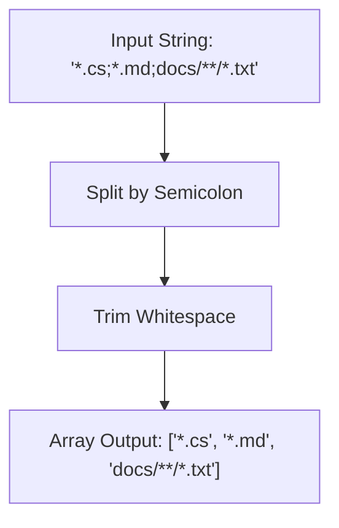
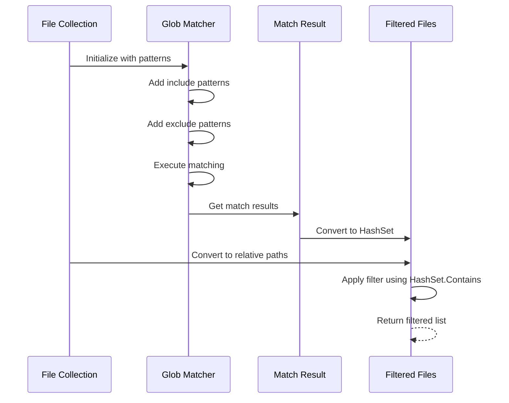
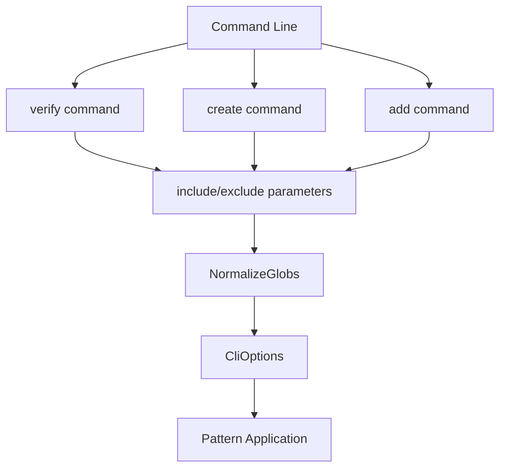
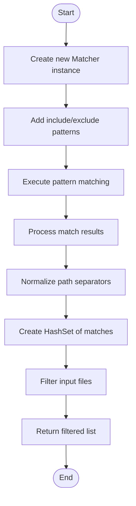
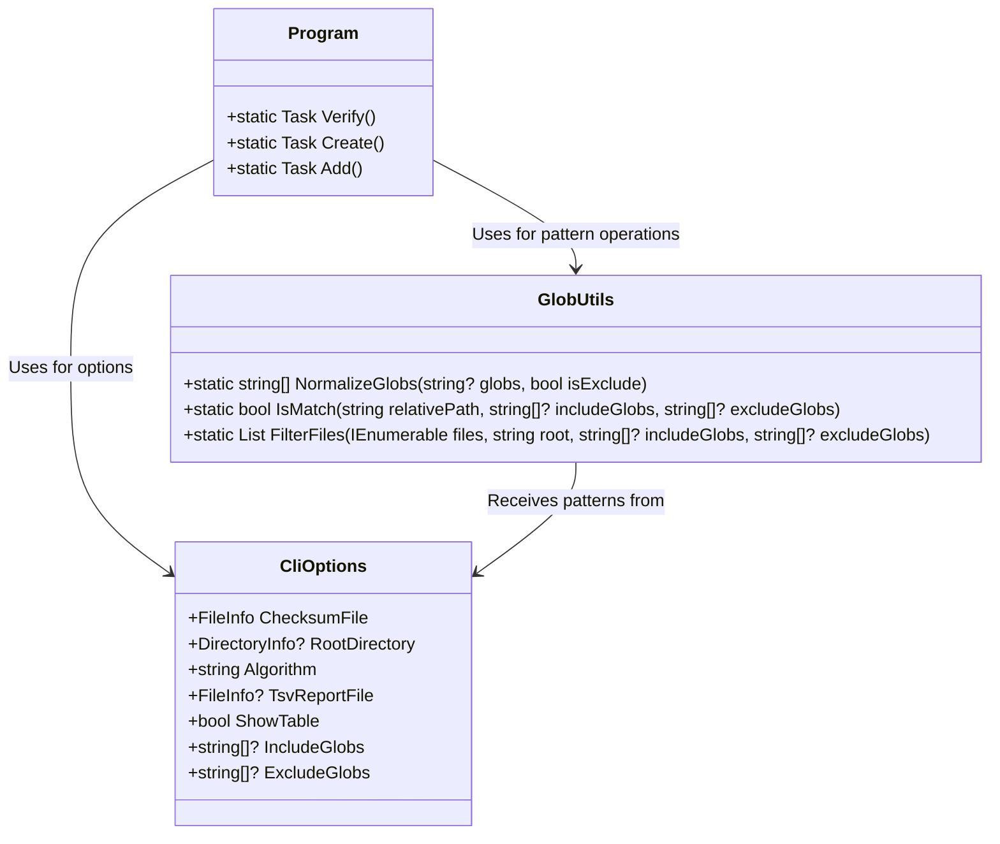

# Glob Pattern Support


## Table of Contents
1. [Introduction](#introduction)
2. [Glob Pattern Syntax](#glob-pattern-syntax)
3. [Implementation Details](#implementation-details)
4. [Usage Examples](#usage-examples)
5. [Performance Characteristics](#performance-characteristics)
6. [Common Pitfalls and Best Practices](#common-pitfalls-and-best-practices)
7. [Integration with Application Commands](#integration-with-application-commands)

## Introduction
The Verity application implements glob pattern filtering functionality through the `GlobUtils` class, which leverages the `Microsoft.Extensions.FileSystemGlobbing` library to provide flexible file filtering capabilities. This system allows users to include and exclude files based on pattern matching when performing operations like verification, manifest creation, and file addition. The glob patterns are specified through command-line parameters and processed to filter files according to user-defined criteria.

**Section sources**
- [GlobUtils.cs](file://Verity/Utilities/GlobUtils.cs#L1-L48)
- [Program.cs](file://Verity/Program.cs#L1-L425)

## Glob Pattern Syntax

### Supported Pattern Types
The glob pattern system supports several types of pattern matching syntax:

**Wildcards (*)**
- Matches any sequence of characters within a single directory level
- Example: `*.txt` matches all files with .txt extension in the current directory

**Double Wildcards (**)**
- Matches any sequence of characters across multiple directory levels
- Example: `**/*.txt` matches all .txt files in the current directory and all subdirectories

**Character Sets ([abc])**
- Matches any single character within the brackets
- Example: `file[123].txt` matches file1.txt, file2.txt, or file3.txt

**Negation Patterns (!)**
- Used in exclude patterns to omit files that match the specified pattern
- Implemented through separate exclude pattern arrays rather than ! prefix

### Pattern Separation
Patterns are separated by semicolons (`;`) when provided as input. The system normalizes these into arrays of individual patterns for processing.





**Diagram sources**
- [GlobUtils.cs](file://Verity/Utilities/GlobUtils.cs#L10-L15)

**Section sources**
- [GlobUtils.cs](file://Verity/Utilities/GlobUtils.cs#L10-L15)

## Implementation Details

### Normalization Process
The `NormalizeGlobs` method processes input strings into usable pattern arrays:


```csharp
public static string[] NormalizeGlobs(string? globs, bool isExclude = false)
{
  if (string.IsNullOrWhiteSpace(globs))
    return isExclude ? [] : ["**/*"];
  return globs.Split(';', StringSplitOptions.RemoveEmptyEntries | StringSplitOptions.TrimEntries);
}
```


This method handles edge cases such as null, empty, or whitespace-only inputs, providing appropriate defaults based on whether the patterns are for inclusion or exclusion.

### Matching Logic
The `IsMatch` method determines if a file path matches the provided include/exclude patterns:


```csharp
public static bool IsMatch(string relativePath, string[]? includeGlobs, string[]? excludeGlobs)
{
  var matcher = new Matcher(StringComparison.OrdinalIgnoreCase);
  if (includeGlobs is { Length: > 0 })
    matcher.AddIncludePatterns(includeGlobs);
  else
    matcher.AddInclude("*");
  if (excludeGlobs is { Length: > 0 })
    matcher.AddExcludePatterns(excludeGlobs);
  var matchResult = matcher.Match(relativePath);
  return matchResult.HasMatches;
}
```


The matching process follows these steps:
1. Create a matcher with case-insensitive comparison
2. Add include patterns if provided, otherwise default to "*" 
3. Add exclude patterns if provided
4. Execute matching and return whether matches exist

### File Filtering
The `FilterFiles` method applies patterns to a collection of files:


```csharp
public static List<string> FilterFiles(IEnumerable<string> files, string root, string[]? includeGlobs, string[]? excludeGlobs)
{
  var matcher = new Matcher(StringComparison.OrdinalIgnoreCase);
  if (includeGlobs is { Length: > 0 })
    matcher.AddIncludePatterns(includeGlobs);
  else
    matcher.AddInclude("**/*");
  if (excludeGlobs is { Length: > 0 })
    matcher.AddExcludePatterns(excludeGlobs);
  var dirInfo = new DirectoryInfoWrapper(new DirectoryInfo(root));
  var matchResult = matcher.Execute(dirInfo);
  // Normalize path separators for matching
  static string Normalize(string path) => path.Replace('/', Path.DirectorySeparatorChar).Replace('\\', Path.DirectorySeparatorChar);
  var matched = new HashSet<string>(matchResult.Files.Select(f => Normalize(f.Path)), StringComparer.OrdinalIgnoreCase);
  var relFiles = files.Select(f => Normalize(Path.GetRelativePath(root, f)));
  return [.. relFiles.Where(matched.Contains)];
}
```





**Diagram sources**
- [GlobUtils.cs](file://Verity/Utilities/GlobUtils.cs#L16-L48)

**Section sources**
- [GlobUtils.cs](file://Verity/Utilities/GlobUtils.cs#L16-L48)

## Usage Examples

### Common Pattern Scenarios
The following examples demonstrate practical applications of glob patterns in the Verity application:

**Excluding Temporary Files**

```
exclude: "*.tmp;*.temp;temp/**/*"
```

This pattern excludes all files with .tmp or .temp extensions, as well as all files in any temp directory and its subdirectories.

**Including Specific File Types**

```
include: "*.cs;*.csproj;*.sln"
```

This pattern includes only C# source files, project files, and solution files.

**Filtering by Directory Depth**

```
include: "src/**/*.cs;tests/*.cs"
```

This pattern includes all C# files in the src directory and its subdirectories, but only direct C# files in the tests directory (not subdirectories).

### Command-Line Integration
The glob patterns are integrated into all major commands:





**Diagram sources**
- [Program.cs](file://Verity/Program.cs#L25-L150)
- [Models.cs](file://Verity/Models.cs#L1-L8)

**Section sources**
- [Program.cs](file://Verity/Program.cs#L25-L150)
- [Models.cs](file://Verity/Models.cs#L1-L8)

## Performance Characteristics

### Pattern Compilation
Each call to `IsMatch` or `FilterFiles` creates a new `Matcher` instance with the provided patterns. This means patterns are compiled on each invocation rather than cached.

### Time Complexity
- **Normalization**: O(n) where n is the length of the input string
- **Matching**: Depends on pattern complexity and number of patterns
- **Filtering**: O(m) where m is the number of files, with additional overhead for pattern matching

### Optimization Considerations
The current implementation creates new matchers for each operation, which could be optimized by caching compiled patterns when the same patterns are used repeatedly.





**Diagram sources**
- [GlobUtils.cs](file://Verity/Utilities/GlobUtils.cs#L16-L48)

**Section sources**
- [GlobUtils.cs](file://Verity/Utilities/GlobUtils.cs#L16-L48)

## Common Pitfalls and Best Practices

### Case Sensitivity
The implementation uses `StringComparison.OrdinalIgnoreCase`, making all pattern matching case-insensitive across all platforms. This ensures consistent behavior regardless of the underlying operating system's file system characteristics.

### Path Separator Normalization
The system normalizes path separators to match the current platform:

```csharp
static string Normalize(string path) => path.Replace('/', Path.DirectorySeparatorChar).Replace('\\', Path.DirectorySeparatorChar);
```

This ensures patterns work correctly regardless of whether forward or backward slashes are used in the patterns or file paths.

### Default Behavior
- **Include patterns**: Default to `**/*` (all files in all directories) when null or empty
- **Exclude patterns**: Default to no exclusions (empty array) when null or empty

### Error Handling
Invalid patterns do not throw exceptions but result in no matches. For example, an unbalanced bracket pattern like `[invalid` will not cause an error but will fail to match any files.

### Evaluation Order
Include patterns are evaluated first, then exclude patterns are applied to the results. This means exclude patterns take precedence over include patterns when there are conflicts.

## Integration with Application Commands
The glob pattern functionality is integrated into all three main commands through the `CliOptions` record:


```csharp
public record struct CliOptions(
    FileInfo ChecksumFile,
    DirectoryInfo? RootDirectory,
    string Algorithm,
    FileInfo? TsvReportFile = null,
    bool ShowTable = false,
    string[]? IncludeGlobs = null,
    string[]? ExcludeGlobs = null
);
```


All commands (verify, create, add) accept include and exclude parameters, which are normalized and stored in the `CliOptions` instance for use throughout the operation.





**Diagram sources**
- [Models.cs](file://Verity/Models.cs#L1-L8)
- [GlobUtils.cs](file://Verity/Utilities/GlobUtils.cs#L1-L48)
- [Program.cs](file://Verity/Program.cs#L1-L425)

**Section sources**
- [Models.cs](file://Verity/Models.cs#L1-L8)
- [GlobUtils.cs](file://Verity/Utilities/GlobUtils.cs#L1-L48)
- [Program.cs](file://Verity/Program.cs#L1-L425)

**Referenced Files in This Document**   
- [GlobUtils.cs](file://Verity/Utilities/GlobUtils.cs#L1-L48)
- [GlobUtilsTests.cs](file://Verity.Tests/GlobUtilsTests.cs#L1-L136)
- [Program.cs](file://Verity/Program.cs#L1-L425)
- [Models.cs](file://Verity/Models.cs#L1-L44)